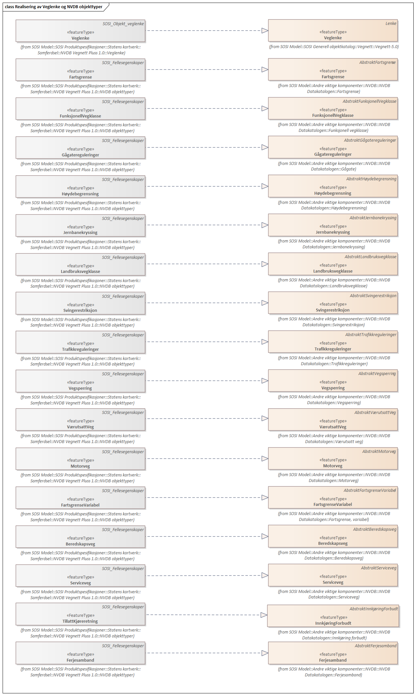
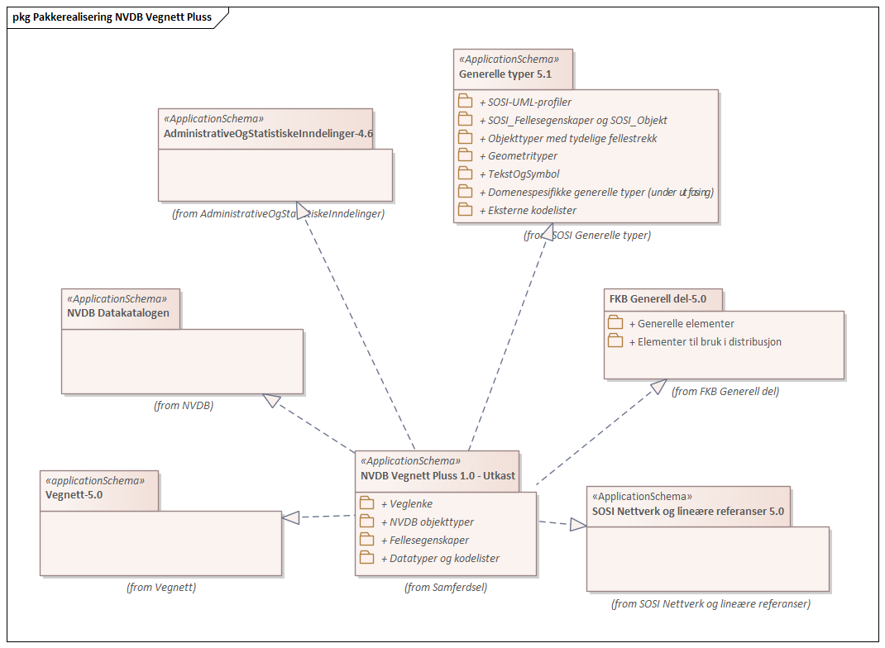
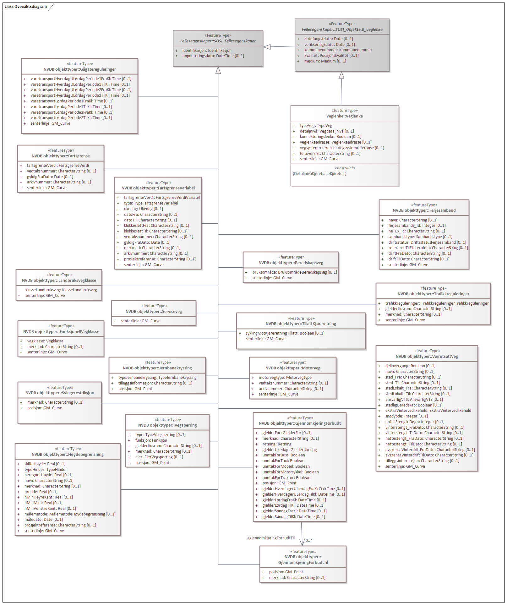
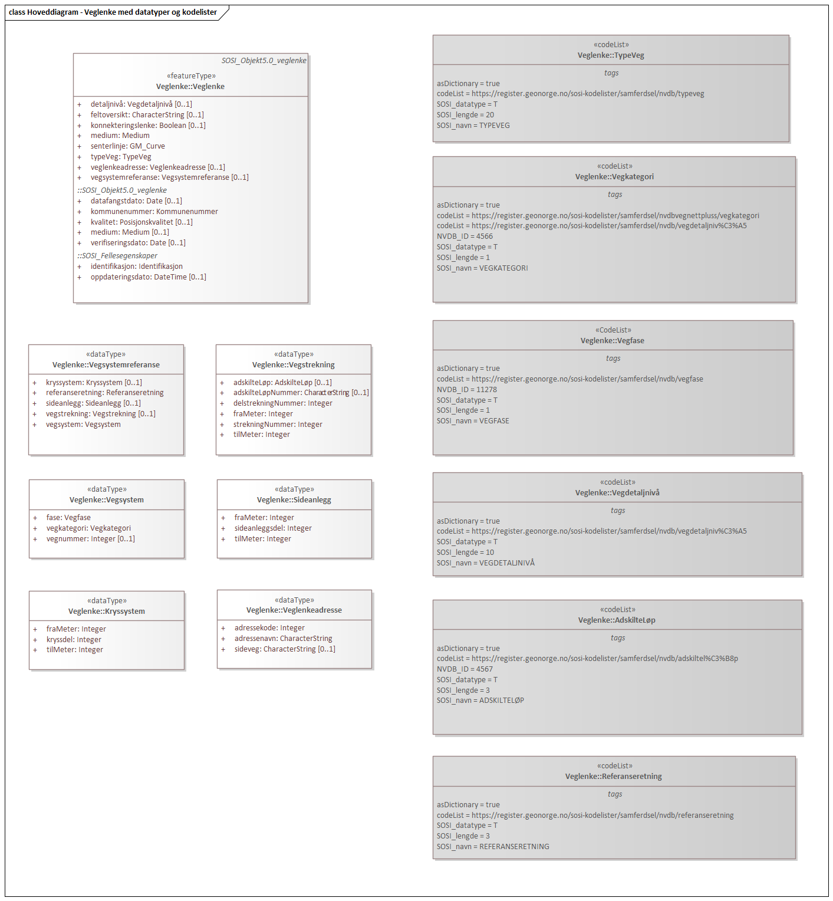
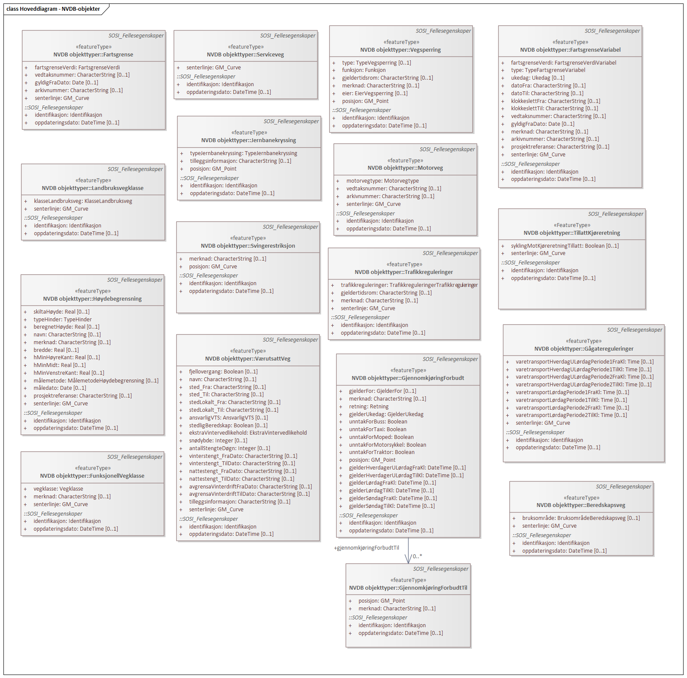
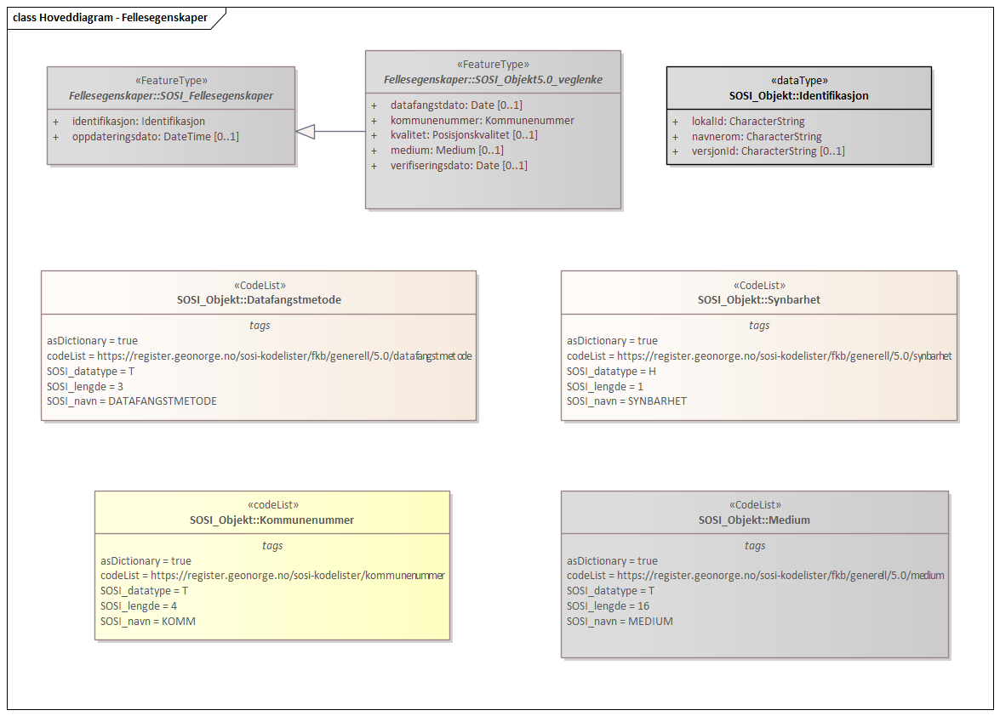
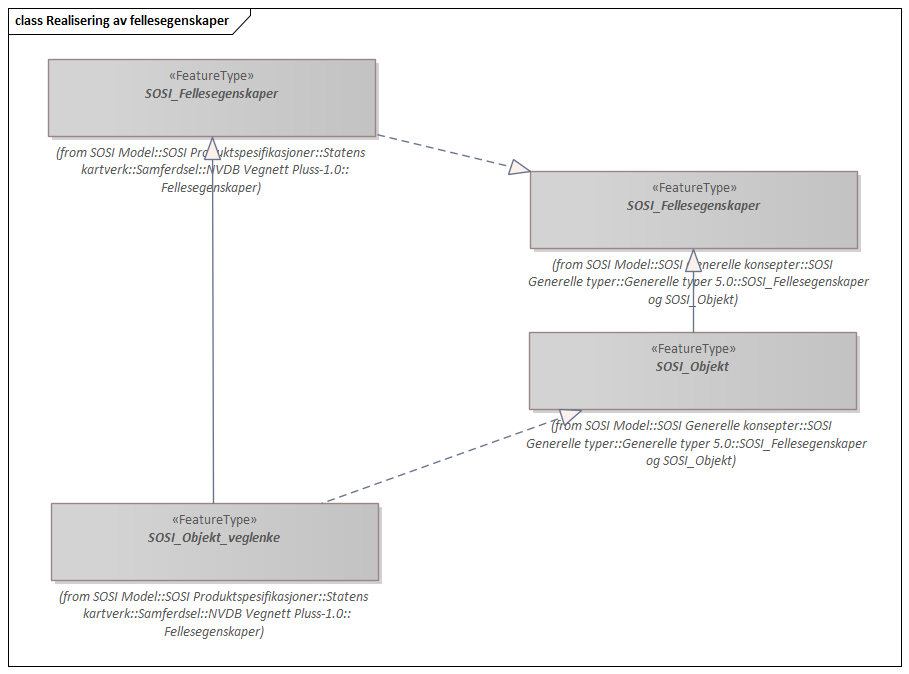
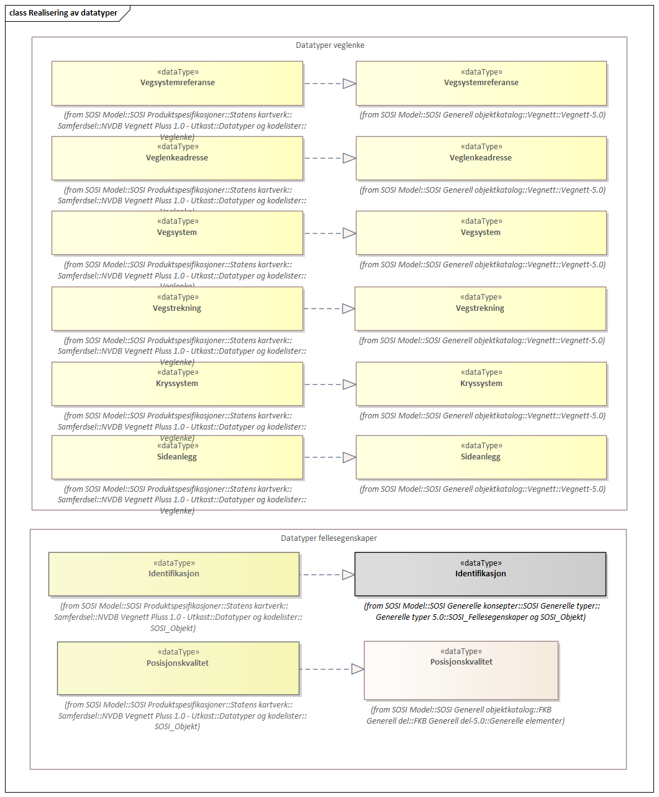
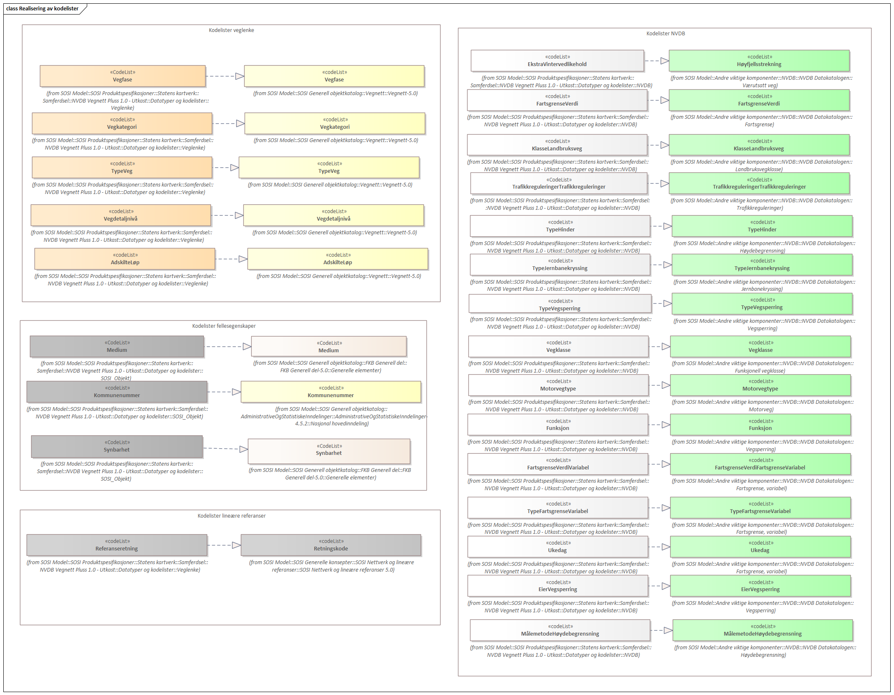
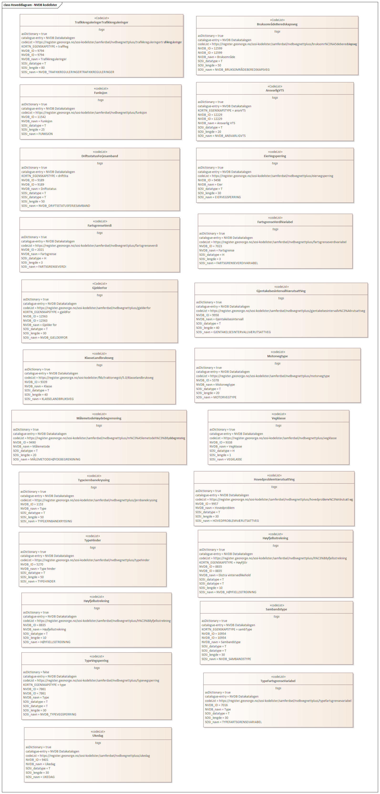

// Start of UML-model
=== Pakke: «ApplicationSchema» NVDB Vegnett Pluss
*Definisjon:* NVDB Vegnett Pluss inneholder informasjon om alle europa-, riks-, fylkes-, kommunale og skogsbilveger, samt alle private veger unntatt korte, private blindveger. Korte veger er veger med lengde mindre enn 50 m. Veger med unike adresser er med uansett lengde. Bilferjestrekninger skal være representert og gang- og sykkelveger kan være med. Vegnettet er strukturert som et nettverk av veglenker med restriksjoner i form av lineære referanser. 
Vegnettet ajourføres i Nasjonal Vegdatabank, NVDB.
 
[discrete]
==== Profilparametre i tagged values
[cols="20,80"]
|===
|designation
|"Product specification NVDB Vegnett Pluss 1.0"@en
 
|language
|no
 
|SOSI_kortnavn
|NVDBVegnettPluss
 
|SOSI_langnavn
|NVDB Vegnett Pluss
 
|SOSI_modellstatus
|utkast
 
|SOSI_presentasjonsnavn
|NVDB Vegnett Pluss
 
|SOSI_produktgruppe
|statenskartverk
 
|SOSI_spesifikasjonstype
|Produktspesifikasjon
 
|SOSI_versjon
|5.0
 
|targetNamespace
|http://skjema.geonorge.no/SOSI/produktspesifikasjon/NVDBVegnettPluss/1.0
 
|version
|1.0
 
|xmlns
|app
 
|xsdDocument
|NVDBVegnettPluss.xsd
 
|xsdEncodingRule
|sosi
 
|===
 
'''
 
.Realisering av Veglenke og NVDB objekttyper 

 
'''
 
.Pakkerealisering NVDB Vegnett Pluss 

 
'''
 
.Oversiktsdiagram 

 
'''
 
.Hoveddiagram - Veglenke med datatyper og kodelister 

 
'''
 
.Hoveddiagram - NVDB-objekter 

 
'''
 
.Hoveddiagram - Fellesegenskaper 

 
'''
 
.Realisering av fellesegenskaper 

 
'''
 
.Realisering av datatyper 

 
'''
 
.Realisering av kodelister 

<<<
'''
==== Pakke: Veglenke
*Definisjon:* Pakke med objekttypen som representerer lenker i vegnettet
 
'''
 
[[veglenke]]
===== «featureType» Veglenke
*Definisjon:* Objekttype som representerer lenker i vegnettet
Eksempel: NVDB Referanselenkedeler, NVDB Transportlenker
 
[discrete]
====== Egenskaper
[cols="20,80"]
|===
|*Navn:* 
|*typeVeg*
 
|Definisjon: 
|type veg (FormOfWay).
 
|Multiplisitet: 
|[1..1]
 
|Type: 
|<<typeveg,«codeList» TypeVeg>>
|Profilparametre i tagged values: 
|
defaultCodeSpace: https://register.geonorge.no/sosi-kodelister/samferdsel/nvdbvegnettpluss/typeveg + 
SOSI_navn: TYPEVEG + 
|===
[cols="20,80"]
|===
|*Navn:* 
|*detaljnivå*
 
|Definisjon: 
|Detaljnivå i vegnettet.
 
|Multiplisitet: 
|[0..1]
 
|Type: 
|<<vegdetaljnivå,«codeList» Vegdetaljnivå>>
|Profilparametre i tagged values: 
|
defaultCodeSpace: https://register.geonorge.no/sosi-kodelister/samferdsel/nvdbvegnettpluss/vegdetaljniv%C3%A5 + 
SOSI_navn: DETALJNIVÅ + 
|===
[cols="20,80"]
|===
|*Navn:* 
|*konnekteringslenke*
 
|Definisjon: 
|angir at en lenke kun eksisterer for å knytte sammen andre lenker.
Et kunstig objekt hvor senterlinjen representerer en konstruert linje som skjøter sammen lenker der det er hull i geometrien.
 
|Multiplisitet: 
|[0..1]
 
|Type: 
|<<boolean,Boolean>>
|Profilparametre i tagged values: 
|
SOSI_datatype: BOOLSK + 
SOSI_navn: KONNEKTERINGSLENKE + 
|===
[cols="20,80"]
|===
|*Navn:* 
|*veglenkeadresse*
 
|Definisjon: 
|sammensatt identifikator for veglenkeadresse.
Merknad: Komplett vegadresse består i tillegg av husnummer og bokstav
 
|Multiplisitet: 
|[0..1]
 
|Type: 
|<<veglenkeadresse,«dataType» Veglenkeadresse>>
|Profilparametre i tagged values: 
|
SOSI_navn: VEGLENKEADRESSE + 
|===
[cols="20,80"]
|===
|*Navn:* 
|*vegsystemreferanse*
 
|Definisjon: 
|sammensatt identifikator for vegreferanse
 
|Multiplisitet: 
|[0..1]
 
|Type: 
|<<vegsystemreferanse,«dataType» Vegsystemreferanse>>
|Profilparametre i tagged values: 
|
SOSI_navn: VEGSYSTEMREFERANSE + 
|===
[cols="20,80"]
|===
|*Navn:* 
|*feltoversikt*
 
|Definisjon: 
|kjørefeltnummer angir stedfesting i vegens tverretning
 
|Multiplisitet: 
|[0..1]
 
|Type: 
|<<characterstring,«dataType» CharacterString>>
|Profilparametre i tagged values: 
|
SOSI_datatype: T + 
SOSI_lengde: 50 + 
SOSI_navn: FELTOVERSIKT + 
|===
[cols="20,80"]
|===
|*Navn:* 
|*medium*
 
|Definisjon: 
|objektets beliggenhet i forhold til jordoverflaten
 
|Multiplisitet: 
|[1..1]
 
|Type: 
|<<medium,«CodeList» Medium>>
|Profilparametre i tagged values: 
|
defaultCodeSpace: https://register.geonorge.no/sosi-kodelister/fkb/generell/5.0/medium + 
SOSI_datatype: T + 
SOSI_lengde: 1 + 
SOSI_navn: MEDIUM + 
|===
[cols="20,80"]
|===
|*Navn:* 
|*senterlinje*
 
|Definisjon: 
|forløp som følger objektets sentrale del
 
|Multiplisitet: 
|[1..1]
 
|Type: 
|<<gm_curve,GM_Curve>>
|===
 
[discrete]
====== Arv og realiseringer
[cols="20,80"]
|===
|Supertype: 
|<<sosi_objekt5.0_veglenke,«FeatureType» SOSI_Objekt5.0_veglenke>>
 
|Realisering av: 
|«applicationSchema» Vegnett-5.0::«featureType» Veglenke +
|===
<<<
'''
==== Pakke: NVDB objekttyper
*Definisjon:* Pakke med objekter hentet ut fra NVDB objektkatalogen
 
'''
 
[[beredskapsveg]]
===== «featureType» Beredskapsveg
*Definisjon:* Vegstrekning som ikke er åpen for allmenn trafikk. Åpnes for å lede trafikk til en annen veg når hovedvegen stenges.
 
[discrete]
====== Profilparametre i tagged values
[cols="20,80"]
|===
|catalogue-entry
|NVDB Datakatalogen
 
|KjorefeltRelevant
|0
 
|KORTN_VOBJ_TYPE
|beredSkp
 
|NVDB_ID
|923
 
|NVDB_ID
|923
 
|NVDB_navn
|Beredskapsveg
 
|SideposisjonRelevant
|0
 
|SOSINVDB_navn
|Beredskapsveg_923
 
|Stedfesting
|strekning
 
|===
[discrete]
====== Egenskaper
[cols="20,80"]
|===
|*Navn:* 
|*bruksområde*
 
|Definisjon: 
|Angir hvilket bruksområde beredskapsvegen i hovedsak benyttes til.
 
|Multiplisitet: 
|[0..1]
 
|Type: 
|<<bruksområdeberedskapsveg,«CodeList» BruksområdeBeredskapsveg>>
|Profilparametre i tagged values: 
|
defaultCodeSpace: https://register.geonorge.no/sosi-kodelister/samferdsel/nvdbvegnettpluss/bruksomr%C3%A5deberedskapsveg + 
KORTN_EGENSKAPSTYPE: bruksomr + 
NVDB_ID: 12599 + 
NVDB_navn: Bruksområde + 
SOSI_datatype: T + 
SOSI_lengde: 50 + 
SOSI_navn: NVDB_BRUKSOMRÅDE + 
SOSINVDB_navn: Bruksområde_12599 + 
Viktighet: Opsjonell + 
|===
[cols="20,80"]
|===
|*Navn:* 
|*senterlinje*
 
|Definisjon: 
|Angivelse av objektets posisjon
 
|Multiplisitet: 
|[1..1]
 
|Type: 
|http://skjema.geonorge.no/SOSI/basistype/GM_Curve[GM_Curve]
|===
 
[discrete]
====== Restriksjoner
[cols="20,80"]
|===
|*Navn:* 
|*LineærPosisjon skal ha retning*
 
|Beskrivelse: 
|inv:count(self.lineærPosisjon.retning)=1
 
|===
[cols="20,80"]
|===
|*Navn:* 
|*Må ha minst en av stedfestingene lineærPosisjon og senterlinje*
 
|Beskrivelse: 
|inv:count(self.senterlinje)+count(self.lineærposisjon) 0
 
|===
 
[discrete]
====== Arv og realiseringer
[cols="20,80"]
|===
|Supertype: 
|<<sosi_fellesegenskaper,«FeatureType» SOSI_Fellesegenskaper>>
 
|Realisering av: 
|«ApplicationSchema» NVDB Datakatalogen/Beredskapsveg::«featureType» Beredskapsveg +
|===
 
'''
 
[[fartsgrense]]
===== «featureType» Fartsgrense
*Definisjon:* Høyeste tillatte hastighet på en vegstrekning.
 
[discrete]
====== Profilparametre i tagged values
[cols="20,80"]
|===
|byValuePropertyType
|false
 
|catalogue-entry
|NVDB Datakatalogen
 
|isCollection
|false
 
|noPropertyType
|false
 
|NVDB_ID
|105
 
|NVDB_navn
|Fartsgrense
 
|===
[discrete]
====== Egenskaper
[cols="20,80"]
|===
|*Navn:* 
|*fartsgrenseVerdi*
 
|Definisjon: 
|Fartsgrense
Enhet: Kilometer/time
 
|Multiplisitet: 
|[1..1]
 
|Type: 
|<<fartsgrenseverdi,«codeList» FartsgrenseVerdi>>
|Profilparametre i tagged values: 
|
defaultCodeSpace: https://register.geonorge.no/sosi-kodelister/samferdsel/nvdbvegnettpluss/fartsgrenseverdi + 
NVDB_ID: 2021 + 
NVDB_navn: Fartsgrense + 
SOSI_datatype: H + 
SOSI_lengde: 3 + 
SOSI_navn: FARTSGRENSEVERDI + 
|===
[cols="20,80"]
|===
|*Navn:* 
|*vedtaksnummer*
 
|Definisjon: 
|Angir vedtaksnummer
 
|Multiplisitet: 
|[0..1]
 
|Type: 
|<<characterstring,«dataType» CharacterString>>
|Profilparametre i tagged values: 
|
NVDB_ID: 1891 + 
NVDB_navn: Vedtaksnummer + 
SOSI_datatype: T + 
SOSI_lengde: 30 + 
SOSI_navn: VEDTAKSNUMMER + 
|===
[cols="20,80"]
|===
|*Navn:* 
|*gyldigFraDato*
 
|Definisjon: 
|Dato for når fartsgrense ble satt i drift.  Den dato skiltene ble "avduket".
 
|Multiplisitet: 
|[0..1]
 
|Type: 
|<<date,«dataType» Date>>
|Profilparametre i tagged values: 
|
NVDB_ID: 5127 + 
NVDB_navn: Gyldig fra dato + 
SOSI_datatype: DATO + 
SOSI_navn: GYLDIGFRADATO + 
|===
[cols="20,80"]
|===
|*Navn:* 
|*arkivnummer*
 
|Definisjon: 
|Gir referanse til relevant sak i vegeiers arkivsystem
 
|Multiplisitet: 
|[0..1]
 
|Type: 
|<<characterstring,«dataType» CharacterString>>
|Profilparametre i tagged values: 
|
NVDB_ID: 9155 + 
NVDB_navn: Arkivnummer + 
SOSI_datatype: T + 
SOSI_lengde: 250 + 
SOSI_navn: ARKIVNUMMER + 
|===
[cols="20,80"]
|===
|*Navn:* 
|*senterlinje*
 
|Definisjon: 
|Angivelse av objektets posisjon
 
|Multiplisitet: 
|[1..1]
 
|Type: 
|http://skjema.geonorge.no/SOSI/basistype/GM_Curve[GM_Curve]
|===
 
[discrete]
====== Restriksjoner
[cols="20,80"]
|===
|*Navn:* 
|*Må ha minst en av stedfestingene lineærPosisjon og senterlinje*
 
|Beskrivelse: 
|inv:count(self.senterlinje)+count(self.lineærposisjon) 0
 
|===
 
[discrete]
====== Arv og realiseringer
[cols="20,80"]
|===
|Supertype: 
|<<sosi_fellesegenskaper,«FeatureType» SOSI_Fellesegenskaper>>
 
|Realisering av: 
|«ApplicationSchema» NVDB Datakatalogen/Fartsgrense::«featureType» Fartsgrense +
|===
 
'''
 
[[fartsgrensevariabel]]
===== «featureType» FartsgrenseVariabel
*Definisjon:* Høyeste tillatte hastighet på en vegstrekning innenfor et avgrenset tidsrom.
 
[discrete]
====== Profilparametre i tagged values
[cols="20,80"]
|===
|byValuePropertyType
|false
 
|catalogue-entry
|NVDB Datakatalogen
 
|isCollection
|false
 
|noPropertyType
|false
 
|NVDB_ID
|721
 
|NVDB_navn
|Fartsgrense,variabel
 
|===
[discrete]
====== Egenskaper
[cols="20,80"]
|===
|*Navn:* 
|*fartsgrenseVerdi*
 
|Definisjon: 
|Verdien på fartsgrensen i angitt tidsrom
Enhet: Kilometer/time
 
|Multiplisitet: 
|[1..1]
 
|Type: 
|<<fartsgrenseverdivariabel,«codeList» FartsgrenseVerdiVariabel>>
|Profilparametre i tagged values: 
|
defaultCodeSpace: https://register.geonorge.no/sosi-kodelister/samferdsel/nvdbvegnettpluss/fartsgrenseverdivariabel + 
NVDB_ID: 7023 + 
NVDB_navn: Fartsgrense + 
SOSI_datatype: H + 
SOSI_lengde: 3 + 
SOSI_navn: FARTSGRENSEVERDI + 
|===
[cols="20,80"]
|===
|*Navn:* 
|*type*
 
|Definisjon: 
|Angir hvilken type variabel fartsgrense det er
 
|Multiplisitet: 
|[1..1]
 
|Type: 
|<<typefartsgrensevariabel,«codeList» TypeFartsgrenseVariabel>>
|Profilparametre i tagged values: 
|
defaultCodeSpace: https://register.geonorge.no/sosi-kodelister/samferdsel/nvdbvegnettpluss/typefartsgrensevariabel + 
NVDB_ID: 7016 + 
NVDB_navn: Type + 
SOSI_datatype: T + 
SOSI_lengde: 30 + 
SOSI_navn: TYPE + 
|===
[cols="20,80"]
|===
|*Navn:* 
|*ukedag*
 
|Definisjon: 
|Angir ukedager en variabel fartsgrense gjelder for.
 
|Multiplisitet: 
|[0..1]
 
|Type: 
|<<ukedag,«codeList» Ukedag>>
|Profilparametre i tagged values: 
|
defaultCodeSpace: https://register.geonorge.no/sosi-kodelister/samferdsel/nvdbvegnettpluss/ukedag + 
NVDB_ID: 9401 + 
NVDB_navn: Ukedag + 
SOSI_datatype: T + 
SOSI_lengde: 30 + 
SOSI_navn: UKEDAG + 
|===
[cols="20,80"]
|===
|*Navn:* 
|*datoFra*
 
|Definisjon: 
|Angir dato (mmdd) som variabel fartsgrense gjelder fra og med i et normalår.
 
|Multiplisitet: 
|[0..1]
 
|Type: 
|<<characterstring,«dataType» CharacterString>>
|Profilparametre i tagged values: 
|
NVDB_ID: 7019 + 
NVDB_navn: Dato, fra + 
SOSI_datatype: T + 
SOSI_lengde: 4 + 
SOSI_navn: DATOFRA + 
|===
[cols="20,80"]
|===
|*Navn:* 
|*datoTil*
 
|Definisjon: 
|Angir dato (mmdd) som variabel fartsgrense gjelder til og med i et normalår.
 
|Multiplisitet: 
|[0..1]
 
|Type: 
|<<characterstring,«dataType» CharacterString>>
|Profilparametre i tagged values: 
|
NVDB_ID: 7022 + 
NVDB_navn: Dato, til + 
SOSI_datatype: T + 
SOSI_lengde: 4 + 
SOSI_navn: DATOTIL + 
|===
[cols="20,80"]
|===
|*Navn:* 
|*klokkeslettFra*
 
|Definisjon: 
|Angir tidspunkt (hhmm) på døgnet som variabel fartsgrense gjelder fra.
 
|Multiplisitet: 
|[0..1]
 
|Type: 
|<<characterstring,«dataType» CharacterString>>
|Profilparametre i tagged values: 
|
NVDB_ID: 7017 + 
NVDB_navn: Klokkeslett, fra + 
SOSI_datatype: T + 
SOSI_lengde: 4 + 
SOSI_navn: KLOKKESLETTFRA + 
|===
[cols="20,80"]
|===
|*Navn:* 
|*klokkeslettTil*
 
|Definisjon: 
|Angir tidspunkt på døgnet (hhmm) som variabel fartsgrense gjelder til
 
|Multiplisitet: 
|[0..1]
 
|Type: 
|<<characterstring,«dataType» CharacterString>>
|Profilparametre i tagged values: 
|
NVDB_ID: 7018 + 
NVDB_navn: Klokkeslett, til + 
SOSI_datatype: T + 
SOSI_lengde: 4 + 
SOSI_navn: KLOKKESLETTTIL + 
|===
[cols="20,80"]
|===
|*Navn:* 
|*vedtaksnummer*
 
|Definisjon: 
|Angir vedtaksnummer
 
|Multiplisitet: 
|[0..1]
 
|Type: 
|<<characterstring,«dataType» CharacterString>>
|Profilparametre i tagged values: 
|
NVDB_ID: 9402 + 
NVDB_navn: Vedtaksnummer + 
SOSI_datatype: T + 
SOSI_lengde: 15 + 
SOSI_navn: VEDTAKSNUMMER + 
|===
[cols="20,80"]
|===
|*Navn:* 
|*gyldigFraDato*
 
|Definisjon: 
|Dato for når fartsgrense ble satt i drift.  Den dato skiltene ble "avduket".
 
|Multiplisitet: 
|[0..1]
 
|Type: 
|<<date,«dataType» Date>>
|Profilparametre i tagged values: 
|
NVDB_ID: 9400 + 
NVDB_navn: Gyldig fra dato + 
SOSI_datatype: DATO + 
SOSI_navn: GYLDIGFRADATO + 
|===
[cols="20,80"]
|===
|*Navn:* 
|*merknad*
 
|Definisjon: 
|Kan gi merknad i forhold til variabel fartsgrense.  F.eks spesifikasjon av gyldighet, retningslinjer for nedsetting av fartsgrense etc
 
|Multiplisitet: 
|[0..1]
 
|Type: 
|<<characterstring,«dataType» CharacterString>>
|Profilparametre i tagged values: 
|
NVDB_ID: 8829 + 
NVDB_navn: Merknad + 
SOSI_datatype: T + 
SOSI_lengde: 400 + 
SOSI_navn: MERKNAD + 
|===
[cols="20,80"]
|===
|*Navn:* 
|*arkivnummer*
 
|Definisjon: 
|Gir referanse til relevant sak i vegeiers arkivsystem
 
|Multiplisitet: 
|[0..1]
 
|Type: 
|<<characterstring,«dataType» CharacterString>>
|Profilparametre i tagged values: 
|
NVDB_ID: 9399 + 
NVDB_navn: Arkivnummer + 
SOSI_datatype: T + 
SOSI_lengde: 250 + 
SOSI_navn: ARKIVNUMMER + 
|===
[cols="20,80"]
|===
|*Navn:* 
|*prosjektreferanse*
 
|Definisjon: 
|Referanse til prosjekt. Benyttes for å lettere kunne skille nye data fra eksisterende data i NVDB
 
|Multiplisitet: 
|[0..1]
 
|Type: 
|<<characterstring,«dataType» CharacterString>>
|Profilparametre i tagged values: 
|
NVDB_ID: 11465 + 
NVDB_navn: Prosjektreferanse + 
SOSI_datatype: T + 
SOSI_lengde: 200 + 
SOSI_navn: PROSJEKTREFERANSE + 
|===
[cols="20,80"]
|===
|*Navn:* 
|*senterlinje*
 
|Definisjon: 
|Angivelse av objektets posisjon
 
|Multiplisitet: 
|[1..1]
 
|Type: 
|http://skjema.geonorge.no/SOSI/basistype/GM_Curve[GM_Curve]
|===
 
[discrete]
====== Restriksjoner
[cols="20,80"]
|===
|*Navn:* 
|*Må ha minst en av stedfestingene lineærPosisjon og senterlinje*
 
|Beskrivelse: 
|inv:count(self.senterlinje)+count(self.lineærposisjon) 0
 
|===
 
[discrete]
====== Arv og realiseringer
[cols="20,80"]
|===
|Supertype: 
|<<sosi_fellesegenskaper,«FeatureType» SOSI_Fellesegenskaper>>
 
|Realisering av: 
|«ApplicationSchema» NVDB Datakatalogen/Fartsgrense, variabel::«featureType» FartsgrenseVariabel +
|===
 
'''
 
[[ferjesamband]]
===== «featureType» Ferjesamband
*Definisjon:* Overfart som trafikkeres av bilferje. Kan ha to eller flere anløpssteder.
 
[discrete]
====== Profilparametre i tagged values
[cols="20,80"]
|===
|catalogue-entry
|NVDB Datakatalogen
 
|KjorefeltRelevant
|0
 
|KORTN_VOBJ_TYPE
|FerjeSmb
 
|NVDB_ID
|770
 
|NVDB_ID
|770
 
|NVDB_navn
|Ferjesamband
 
|SideposisjonRelevant
|0
 
|SOSINVDB_navn
|Ferjesamband_770
 
|Stedfesting
|strekning
 
|===
[discrete]
====== Egenskaper
[cols="20,80"]
|===
|*Navn:* 
|*navn*
 
|Definisjon: 
|Angir navn på ferjesambandet.
 
|Multiplisitet: 
|[0..1]
 
|Type: 
|<<characterstring,«dataType» CharacterString>>
|Profilparametre i tagged values: 
|
KORTN_EGENSKAPSTYPE: navn + 
NVDB_ID: 9186 + 
NVDB_navn: Navn + 
SOSI_datatype: T + 
SOSI_lengde: 70 + 
SOSI_navn: NVDB_NAVN + 
SOSINVDB_navn: Navn_9186 + 
Viktighet: Påkrevd ved nyregistrering + 
|===
[cols="20,80"]
|===
|*Navn:* 
|*ferjesambands_Id*
 
|Definisjon: 
|Unik ID for ferjesamband. Benyttes i Ferjedatabanken og i billetteringssystem.
 
|Multiplisitet: 
|[0..1]
 
|Type: 
|<<integer,«dataType» Integer>>
|Profilparametre i tagged values: 
|
KORTN_EGENSKAPSTYPE: FDBId + 
NVDB_ID: 9187 + 
NVDB_navn: Ferjesambands_Id + 
SOSI_datatype: H + 
SOSI_lengde: 6 + 
SOSI_navn: NVDB_FERJESAMBANDS_ID + 
SOSINVDB_navn: Ferjesambands_Id_9187 + 
Viktighet: Påkrevd ved nyregistrering + 
|===
[cols="20,80"]
|===
|*Navn:* 
|*neTEx_id*
 
|Definisjon: 
|Unik ID for ferjesambandet. ID skal være i henhold til NeTEx-format og være lik ferjesambandets ID i nasjonal rutebank/Entur. Eksempel: "MOR:Line:48"
 
|Multiplisitet: 
|[0..1]
 
|Type: 
|<<characterstring,«dataType» CharacterString>>
|Profilparametre i tagged values: 
|
KORTN_EGENSKAPSTYPE: Netexid + 
NVDB_ID: 12509 + 
NVDB_navn: NeTEx_id + 
SOSI_datatype: T + 
SOSI_lengde: 100 + 
SOSI_navn: NVDB_NETEX_ID + 
SOSINVDB_navn: NeTEx_id_12509 + 
Viktighet: Påkrevd ved nyregistrering + 
|===
[cols="20,80"]
|===
|*Navn:* 
|*sambandstype*
 
|Definisjon: 
|Angir hvilken type samband det er, dvs. om det er på stat-, fylke- eller kommunenivå.
 
|Multiplisitet: 
|[0..1]
 
|Type: 
|<<sambandstype,«codeList» Sambandstype>>
|Profilparametre i tagged values: 
|
KORTN_EGENSKAPSTYPE: sambType + 
NVDB_ID: 10954 + 
NVDB_navn: Sambandstype + 
SOSI_datatype: T + 
SOSI_lengde: 30 + 
SOSI_navn: NVDB_SAMBANDSTYPE + 
SOSINVDB_navn: Sambandstype_10954 + 
Viktighet: Påkrevd ved nyregistrering + 
|===
[cols="20,80"]
|===
|*Navn:* 
|*driftsstatus*
 
|Definisjon: 
|driftsstatus for ferjesamband
 
|Multiplisitet: 
|[0..1]
 
|Type: 
|<<driftsstatusferjesamband,«codeList» DriftsstatusFerjesamband>>
|Profilparametre i tagged values: 
|
KORTN_EGENSKAPSTYPE: driftSta + 
NVDB_ID: 9189 + 
NVDB_navn: Driftsstatus + 
SOSI_datatype: T + 
SOSI_lengde: 50 + 
SOSI_navn: NVDB_DRIFTSSTATUS + 
SOSINVDB_navn: Driftsstatus_9189 + 
Viktighet: Påkrevd ved nyregistrering + 
|===
[cols="20,80"]
|===
|*Navn:* 
|*referanseTilEksternInfo*
 
|Definisjon: 
|Gir referanse til ekstern informasjon. Angis i form av URL.
 
|Multiplisitet: 
|[0..1]
 
|Type: 
|<<characterstring,«dataType» CharacterString>>
|Profilparametre i tagged values: 
|
KORTN_EGENSKAPSTYPE: ekstRefr + 
NVDB_ID: 12145 + 
NVDB_navn: Referanse til ekstern info + 
SOSI_datatype: T + 
SOSI_lengde: 250 + 
SOSI_navn: NVDB_REFERANSETILEKSTERNINFO + 
SOSINVDB_navn: ReferanseTilEksternI_12145 + 
Viktighet: Opsjonell + 
|===
[cols="20,80"]
|===
|*Navn:* 
|*driftFraDato*
 
|Definisjon: 
|Angir dato (mmdd) når sommersambandet settes i drift i et normalår.
 
|Multiplisitet: 
|[0..1]
 
|Type: 
|<<characterstring,«dataType» CharacterString>>
|Profilparametre i tagged values: 
|
KORTN_EGENSKAPSTYPE: Sommer1 + 
NVDB_ID: 12597 + 
NVDB_navn: Drift fra dato + 
SOSI_datatype: T + 
SOSI_lengde: 4 + 
SOSI_navn: NVDB_DRIFTFRADATO + 
SOSINVDB_navn: DriftFraDato_12597 + 
Viktighet: Betinget + 
|===
[cols="20,80"]
|===
|*Navn:* 
|*driftTilDato*
 
|Definisjon: 
|Angir dato (mmdd) når sommersambandet tas ut av drift et normalår.
 
|Multiplisitet: 
|[0..1]
 
|Type: 
|<<characterstring,«dataType» CharacterString>>
|Profilparametre i tagged values: 
|
KORTN_EGENSKAPSTYPE: Sommer2 + 
NVDB_ID: 12598 + 
NVDB_navn: Drift til dato + 
SOSI_datatype: T + 
SOSI_lengde: 4 + 
SOSI_navn: NVDB_DRIFTTILDATO + 
SOSINVDB_navn: DriftTilDato_12598 + 
Viktighet: Betinget + 
|===
[cols="20,80"]
|===
|*Navn:* 
|*senterlinje*
 
|Definisjon: 
|Angivelse av objektets posisjon
 
|Multiplisitet: 
|[1..1]
 
|Type: 
|http://skjema.geonorge.no/SOSI/basistype/GM_Curve[GM_Curve]
|===
 
[discrete]
====== Arv og realiseringer
[cols="20,80"]
|===
|Supertype: 
|<<sosi_fellesegenskaper,«FeatureType» SOSI_Fellesegenskaper>>
 
|Realisering av: 
|«ApplicationSchema» NVDB Datakatalogen/Ferjesamband::«featureType» Ferjesamband +
|===
 
'''
 
[[funksjonellvegklasse]]
===== «featureType» FunksjonellVegklasse
*Definisjon:* En klassifisering basert på hvor viktig en veg er for det totale vegnettets forbindelsesmuligheter. Brukes blant annet for vekting i ruteplanlegging
 
[discrete]
====== Profilparametre i tagged values
[cols="20,80"]
|===
|byValuePropertyType
|false
 
|catalogue-entry
|NVDB Datakatalogen
 
|isCollection
|false
 
|noPropertyType
|false
 
|NVDB_ID
|821
 
|NVDB_navn
|Funksjonell vegklasse
 
|===
[discrete]
====== Egenskaper
[cols="20,80"]
|===
|*Navn:* 
|*vegklasse*
 
|Definisjon: 
|Angir funksjonell vegklasse
 
|Multiplisitet: 
|[1..1]
 
|Type: 
|<<vegklasse,«codeList» Vegklasse>>
|Profilparametre i tagged values: 
|
defaultCodeSpace: https://register.geonorge.no/sosi-kodelister/samferdsel/nvdbvegnettpluss/vegklasse + 
NVDB_ID: 9338 + 
NVDB_navn: Vegklasse + 
SOSI_datatype: H + 
SOSI_lengde: 1 + 
SOSI_navn: VEGKLASSE + 
|===
[cols="20,80"]
|===
|*Navn:* 
|*merknad*
 
|Definisjon: 
|Permanent merknad til aktuell forekomst.  Kan gi informasjoner som ikke er mulig å gi på annet vis.
 
|Multiplisitet: 
|[0..1]
 
|Type: 
|<<characterstring,«dataType» CharacterString>>
|Profilparametre i tagged values: 
|
NVDB_ID: 10183 + 
NVDB_navn: Merknad + 
SOSI_datatype: T + 
SOSI_lengde: 250 + 
SOSI_navn: MERKNAD + 
|===
[cols="20,80"]
|===
|*Navn:* 
|*senterlinje*
 
|Definisjon: 
|Angivelse av objektets posisjon
 
|Multiplisitet: 
|[1..1]
 
|Type: 
|http://skjema.geonorge.no/SOSI/basistype/GM_Curve[GM_Curve]
|===
 
[discrete]
====== Restriksjoner
[cols="20,80"]
|===
|*Navn:* 
|*Må ha minst en av stedfestingene lineærPosisjon og senterlinje*
 
|Beskrivelse: 
|inv:count(self.senterlinje)+count(self.lineærposisjon) 0
 
|===
 
[discrete]
====== Arv og realiseringer
[cols="20,80"]
|===
|Supertype: 
|<<sosi_fellesegenskaper,«FeatureType» SOSI_Fellesegenskaper>>
 
|Realisering av: 
|«ApplicationSchema» NVDB Datakatalogen/Funksjonell vegklasse::«featureType» FunksjonellVegklasse +
|===
 
'''
 
[[gjennomkjøringforbudt]]
===== «featureType» GjennomkjøringForbudt
*Definisjon:* Angir start av strekning eller et område med gjennomkjøring forbudt. Hvor det er forbudt å kjøre til angis med et assosiert GjennomkjøringForbudtTil-objekt. 
Kjørende kan ikke passere mellom et GjennomkjøringForbudt-punkt og et tilhørende GjennomkjøringForbudtTil-punkt uten planlagt stopp mellom dem.
 
[discrete]
====== Profilparametre i tagged values
[cols="20,80"]
|===
|catalogue-entry
|NVDB Datakatalogen
 
|KjorefeltRelevant
|0
 
|KORTN_VOBJ_TYPE
|vnettRes
 
|NVDB_ID
|913
 
|NVDB_ID
|913
 
|NVDB_navn
|Gjennomkjøring forbudt
 
|SideposisjonRelevant
|0
 
|SOSINVDB_navn
|GjennomkjøringForbudt_913
 
|Stedfesting
|flerepunkt
 
|===
[discrete]
====== Egenskaper
[cols="20,80"]
|===
|*Navn:* 
|*posisjon*
 
|Definisjon: 
|Angivelse av objektetsposisjon. Plasseres ved start av gjennomkjøring forbudt (ved gjennomkjøring forbudt skilt)
 
|Multiplisitet: 
|[1..1]
 
|Type: 
|http://skjema.geonorge.no/SOSI/basistype/GM_Point[GM_Point]
|===
[cols="20,80"]
|===
|*Navn:* 
|*gjelderFor*
 
|Definisjon: 
|Angir hva slags kjøretøy det er gjennomkjøring forbudt for
 
|Multiplisitet: 
|[0..1]
 
|Type: 
|<<gjelderfor,«CodeList» GjelderFor>>
|Profilparametre i tagged values: 
|
defaultCodeSpace: https://register.geonorge.no/sosi-kodelister/samferdsel/nvdbvegnettpluss/gjelderfor + 
KORTN_EGENSKAPSTYPE: gjeldFor + 
NVDB_ID: 12563 + 
NVDB_navn: Gjelder for + 
SOSI_datatype: T + 
SOSI_lengde: 30 + 
SOSI_navn: NVDB_GJELDERFOR + 
SOSINVDB_navn: GjelderFor_12563 + 
Viktighet: Påkrevd ved nyregistrering + 
|===
[cols="20,80"]
|===
|*Navn:* 
|*gjelderTidsrom*
 
|Definisjon: 
|Angir tidsrommet (hhmm-hhmm) eller (mnd-mnd) forbudet mot gjennomkjøring gjelder for.
 
|Multiplisitet: 
|[0..1]
 
|Type: 
|<<characterstring,«dataType» CharacterString>>
|Profilparametre i tagged values: 
|
KORTN_EGENSKAPSTYPE: gjeldTid + 
NVDB_ID: 12602 + 
NVDB_navn: Gjelder tidsrom + 
SOSI_datatype: T + 
SOSI_lengde: 9 + 
SOSI_navn: NVDB_GJELDERTIDSROM + 
Viktighet: Opsjonell + 
|===
[cols="20,80"]
|===
|*Navn:* 
|*merknad*
 
|Definisjon: 
|Gir merknad knyttet til gjennomkjøring forbudt.
 
|Multiplisitet: 
|[0..1]
 
|Type: 
|<<characterstring,«dataType» CharacterString>>
|Profilparametre i tagged values: 
|
KORTN_EGENSKAPSTYPE: beskriv + 
NVDB_ID: 11217 + 
NVDB_navn: Merknad + 
SOSI_datatype: T + 
SOSI_lengde: 250 + 
SOSI_navn: NVDB_MERKNAD + 
SOSINVDB_navn: Merknad_11217 + 
Viktighet: Opsjonell + 
|===
 
[discrete]
====== Roller
[cols="20,80"]
|===
|*Rollenavn:* 
|*gjennomkjøringForbudtTil*
 
|Multiplisitet: 
|[0..*]
 
|Til klasse
|<<gjennomkjøringforbudttil,«featureType» GjennomkjøringForbudtTil>>
|===
 
[discrete]
====== Arv og realiseringer
[cols="20,80"]
|===
|Supertype: 
|<<sosi_fellesegenskaper,«FeatureType» SOSI_Fellesegenskaper>>
 
|===
 
'''
 
[[gjennomkjøringforbudttil]]
===== «featureType» GjennomkjøringForbudtTil
*Definisjon:* Punkter som omslutter en strekning eller et område med gjennomkjøring forbudt. Kjørende kan ikke passere to punkter uten planlagt stopp mellom dem.
 
[discrete]
====== Egenskaper
[cols="20,80"]
|===
|*Navn:* 
|*posisjon*
 
|Definisjon: 
|
 
|Multiplisitet: 
|[1..1]
 
|Type: 
|http://skjema.geonorge.no/SOSI/basistype/GM_Point[GM_Point]
|===
[cols="20,80"]
|===
|*Navn:* 
|*merknad*
 
|Definisjon: 
|Gir merknad knyttet til gjennomkjøring forbudt.
 
|Multiplisitet: 
|[0..1]
 
|Type: 
|<<characterstring,«dataType» CharacterString>>
|Profilparametre i tagged values: 
|
KORTN_EGENSKAPSTYPE: beskriv + 
NVDB_ID: 11217 + 
NVDB_navn: Merknad + 
SOSI_datatype: T + 
SOSI_lengde: 250 + 
SOSI_navn: NVDB_MERKNAD + 
SOSINVDB_navn: Merknad_11217 + 
Viktighet: Opsjonell + 
|===
 
[discrete]
====== Arv og realiseringer
[cols="20,80"]
|===
|Supertype: 
|<<sosi_fellesegenskaper,«FeatureType» SOSI_Fellesegenskaper>>
 
|===
 
'''
 
[[gågatereguleringer]]
===== «featureType» Gågatereguleringer
*Definisjon:* Gate uten fortau reservert for gående hvor trafikkreglene for gågate gjelder.
 
[discrete]
====== Profilparametre i tagged values
[cols="20,80"]
|===
|catalogue-entry
|NVDB Datakatalogen
 
|KjorefeltRelevant
|0
 
|KORTN_VOBJ_TYPE
|gagate
 
|NVDB_ID
|813
 
|NVDB_ID
|813
 
|NVDB_navn
|Gågate
 
|SideposisjonRelevant
|0
 
|SOSINVDB_navn
|Gågate_813
 
|Stedfesting
|strekning
 
|===
[discrete]
====== Egenskaper
[cols="20,80"]
|===
|*Navn:* 
|*varetransportHverdagULørdagPeriode1FraKl*
 
|Definisjon: 
|Varetransport hverdag unntatt lørdag periode 1, fra klokkeslett.
 
|Multiplisitet: 
|[0..1]
 
|Type: 
|http://skjema.geonorge.no/SOSI/basistype/Time[Time]
|Profilparametre i tagged values: 
|
KORTN_EGENSKAPSTYPE: vare1Fra + 
NVDB_ID: 9314 + 
NVDB_navn: Varetransport hverdag u. lørdag periode 1 fra kl. + 
SOSI_datatype: T + 
SOSI_lengde: 4 + 
SOSI_navn: NVDB_VARETRANSPORTHVERDAGULØRDAGPERIODE1FRAKL + 
SOSINVDB_navn: VaretransportHverdagU_9314 + 
Viktighet: Betinget + 
|===
[cols="20,80"]
|===
|*Navn:* 
|*varetransportHverdagULørdagPeriode1TilKl*
 
|Definisjon: 
|Varetransport hverdag unntatt lørdag periode 1, til klokkeslett.
 
|Multiplisitet: 
|[0..1]
 
|Type: 
|http://skjema.geonorge.no/SOSI/basistype/Time[Time]
|Profilparametre i tagged values: 
|
KORTN_EGENSKAPSTYPE: vare1Til + 
NVDB_ID: 9315 + 
NVDB_navn: Varetransport hverdag u. lørdag periode 1 til kl. + 
SOSI_datatype: T + 
SOSI_lengde: 4 + 
SOSI_navn: NVDB_VARETRANSPORTHVERDAGULØRDAGPERIODE1TILKL + 
SOSINVDB_navn: VaretransportHverdagU_9315 + 
Viktighet: Betinget + 
|===
[cols="20,80"]
|===
|*Navn:* 
|*varetransportHverdagULørdagPeriode2FraKl*
 
|Definisjon: 
|Varetransport hverdag unntatt lørdag periode 2, fra klokkeslett.
 
|Multiplisitet: 
|[0..1]
 
|Type: 
|http://skjema.geonorge.no/SOSI/basistype/Time[Time]
|Profilparametre i tagged values: 
|
KORTN_EGENSKAPSTYPE: vare2Fra + 
NVDB_ID: 9316 + 
NVDB_navn: Varetransport hverdag u. lørdag periode 2 fra kl. + 
SOSI_datatype: T + 
SOSI_lengde: 4 + 
SOSI_navn: NVDB_VARETRANSPORTHVERDAGULØRDAGPERIODE2FRAKL + 
SOSINVDB_navn: VaretransportHverdagU_9316 + 
Viktighet: Betinget + 
|===
[cols="20,80"]
|===
|*Navn:* 
|*varetransportHverdagULørdagPeriode2TilKl*
 
|Definisjon: 
|Varetransport hverdag unntatt lørdag periode 2, til klokkeslett.
 
|Multiplisitet: 
|[0..1]
 
|Type: 
|http://skjema.geonorge.no/SOSI/basistype/Time[Time]
|Profilparametre i tagged values: 
|
KORTN_EGENSKAPSTYPE: vare2Til + 
NVDB_ID: 9317 + 
NVDB_navn: Varetransport hverdag u. lørdag periode 2 til kl. + 
SOSI_datatype: T + 
SOSI_lengde: 4 + 
SOSI_navn: NVDB_VARETRANSPORTHVERDAGULØRDAGPERIODE2TILKL + 
SOSINVDB_navn: VaretransportHverdagU_9317 + 
Viktighet: Betinget + 
|===
[cols="20,80"]
|===
|*Navn:* 
|*varetransportLørdagPeriode1FraKl*
 
|Definisjon: 
|Varetransport lørdag periode 1, fra klokkeslett.
 
|Multiplisitet: 
|[0..1]
 
|Type: 
|http://skjema.geonorge.no/SOSI/basistype/Time[Time]
|Profilparametre i tagged values: 
|
KORTN_EGENSKAPSTYPE: var1LFra + 
NVDB_ID: 11537 + 
NVDB_navn: Varetransport lørdag periode 1 fra kl. + 
SOSI_datatype: T + 
SOSI_lengde: 4 + 
SOSI_navn: NVDB_VARETRANSPORTLØRDAGPERIODE1FRAKL + 
SOSINVDB_navn: VaretransportLørdagP_11537 + 
Viktighet: Betinget + 
|===
[cols="20,80"]
|===
|*Navn:* 
|*varetransportLørdagPeriode1TilKl*
 
|Definisjon: 
|Varetransport lørdag periode 1, til klokkeslett.
 
|Multiplisitet: 
|[0..1]
 
|Type: 
|http://skjema.geonorge.no/SOSI/basistype/Time[Time]
|Profilparametre i tagged values: 
|
KORTN_EGENSKAPSTYPE: var1LTil + 
NVDB_ID: 11538 + 
NVDB_navn: Varetransport lørdag periode 1 til kl. + 
SOSI_datatype: T + 
SOSI_lengde: 4 + 
SOSI_navn: NVDB_VARETRANSPORTLØRDAGPERIODE1TILKL + 
SOSINVDB_navn: VaretransportLørdagP_11538 + 
Viktighet: Betinget + 
|===
[cols="20,80"]
|===
|*Navn:* 
|*varetransportLørdagPeriode2FraKl*
 
|Definisjon: 
|Varetransport lørdag periode 2, fra klokkeslett.
 
|Multiplisitet: 
|[0..1]
 
|Type: 
|http://skjema.geonorge.no/SOSI/basistype/Time[Time]
|Profilparametre i tagged values: 
|
KORTN_EGENSKAPSTYPE: var2LFra + 
NVDB_ID: 11539 + 
NVDB_navn: Varetransport lørdag periode 2 fra kl. + 
SOSI_datatype: T + 
SOSI_lengde: 4 + 
SOSI_navn: NVDB_VARETRANSPORTLØRDAGPERIODE2FRAKL + 
SOSINVDB_navn: VaretransportLørdagP_11539 + 
Viktighet: Betinget + 
|===
[cols="20,80"]
|===
|*Navn:* 
|*varetransportLørdagPeriode2TilKl*
 
|Definisjon: 
|Varetransport lørdag periode 2, til klokkeslett.
 
|Multiplisitet: 
|[0..1]
 
|Type: 
|http://skjema.geonorge.no/SOSI/basistype/Time[Time]
|Profilparametre i tagged values: 
|
KORTN_EGENSKAPSTYPE: var2LTil + 
NVDB_ID: 11540 + 
NVDB_navn: Varetransport lørdag periode 2 til kl. + 
SOSI_datatype: T + 
SOSI_lengde: 4 + 
SOSI_navn: NVDB_VARETRANSPORTLØRDAGPERIODE2TILKL + 
SOSINVDB_navn: VaretransportLørdagP_11540 + 
Viktighet: Betinget + 
|===
[cols="20,80"]
|===
|*Navn:* 
|*kjøringTilEiendommeneTillatt*
 
|Definisjon: 
|
 
|Multiplisitet: 
|[1..1]
 
|Type: 
|http://skjema.geonorge.no/SOSI/basistype/Boolean[Boolean]
|Profilparametre i tagged values: 
|
SOSI_datatype: T + 
SOSI_navn: KJØRINGTILEIENDOMMENETILLATT + 
|===
[cols="20,80"]
|===
|*Navn:* 
|*senterlinje*
 
|Definisjon: 
|Linje/kurve er manus for å etablere vegobjektets stedfesting på vegnettet. Geometrien benyttes kun i forbindelse med etablering av vegobjektet og skal normalt ikke lagres i NVDB.
 
|Multiplisitet: 
|[1..1]
 
|Type: 
|http://skjema.geonorge.no/SOSI/basistype/GM_Curve[GM_Curve]
|Profilparametre i tagged values: 
|
KORTN_EGENSKAPSTYPE: GeoHlpLi + 
NVDB_ID: 9322 + 
NVDB_navn: Geometri, hjelpelinje + 
SOSI_datatype: KURVE + 
SOSI_navn: NVDB_SENTERLINJE + 
SOSINVDB_navn: GeometriHjelpelinje_9322 + 
Viktighet: Spesialinfo + 
|===
 
[discrete]
====== Restriksjoner
[cols="20,80"]
|===
|*Navn:* 
|*Må ha minst en av stedfestingene lineærPosisjon og senterlinje*
 
|Beskrivelse: 
|inv:count(self.senterlinje)+count(self.lineærposisjon) 0
 
|===
 
[discrete]
====== Arv og realiseringer
[cols="20,80"]
|===
|Supertype: 
|<<sosi_fellesegenskaper,«FeatureType» SOSI_Fellesegenskaper>>
 
|Realisering av: 
|«ApplicationSchema» NVDB Datakatalogen/Gågate::«featureType» Gågatereguleringer +
|===
 
'''
 
[[høydebegrensning]]
===== «featureType» Høydebegrensning
*Definisjon:* Strekning i vegnettet hvor kjøretøy kan komme i konflikt med overliggende hinder
 
[discrete]
====== Profilparametre i tagged values
[cols="20,80"]
|===
|byValuePropertyType
|false
 
|catalogue-entry
|NVDB Datakatalogen
 
|isCollection
|false
 
|noPropertyType
|false
 
|NVDB_ID
|591
 
|NVDB_navn
|Høydebegrensning
 
|===
[discrete]
====== Egenskaper
[cols="20,80"]
|===
|*Navn:* 
|*skiltaHøyde*
 
|Definisjon: 
|Angir skilta høyde i forbindelse med høydebegrensningen. Håndbok N300 (050) beskriver hvordan verdier beregnes ut fra målte høyder
Enhet: Meter
 
|Multiplisitet: 
|[0..1]
 
|Type: 
|<<real,«dataType» Real>>
|Profilparametre i tagged values: 
|
NVDB_ID: 5277 + 
NVDB_navn: Skilta høyde + 
SOSI_datatype: D + 
SOSI_lengde: 3 + 
SOSI_navn: SKILTAHØYDE + 
|===
[cols="20,80"]
|===
|*Navn:* 
|*typeHinder*
 
|Definisjon: 
|Angir hvilken type hinder det er tale om
 
|Multiplisitet: 
|[1..1]
 
|Type: 
|<<typehinder,«codeList» TypeHinder>>
|Profilparametre i tagged values: 
|
defaultCodeSpace: https://register.geonorge.no/sosi-kodelister/samferdsel/nvdbvegnettpluss/typehinder + 
NVDB_ID: 5270 + 
NVDB_navn: Type hinder + 
SOSI_datatype: T + 
SOSI_lengde: 50 + 
SOSI_navn: TYPEHINDER + 
|===
[cols="20,80"]
|===
|*Navn:* 
|*beregnetHøyde*
 
|Definisjon: 
|Minste målte høyde minus sikkerhetsmargin, avrundet ned til nærmeste desimeter (ref. regelverk i håndbok N300, tidl. Hb 050)
Enhet: Meter
 
|Multiplisitet: 
|[0..1]
 
|Type: 
|<<real,«dataType» Real>>
|Profilparametre i tagged values: 
|
NVDB_ID: 10247 + 
NVDB_navn: Beregnet høyde + 
SOSI_datatype: D + 
SOSI_lengde: 5 + 
SOSI_navn: BEREGNETHØYDE + 
|===
[cols="20,80"]
|===
|*Navn:* 
|*navn*
 
|Definisjon: 
|Gir navn tilknyttet høydebegrensning
 
|Multiplisitet: 
|[0..1]
 
|Type: 
|<<characterstring,«dataType» CharacterString>>
|Profilparametre i tagged values: 
|
NVDB_ID: 5778 + 
NVDB_navn: Navn + 
SOSI_datatype: T + 
SOSI_lengde: 50 + 
SOSI_navn: NAVN + 
|===
[cols="20,80"]
|===
|*Navn:* 
|*merknad*
 
|Definisjon: 
|Merknad som gjelder for den bestemte forekomsten uavhengig av tid
 
|Multiplisitet: 
|[0..1]
 
|Type: 
|<<characterstring,«dataType» CharacterString>>
|Profilparametre i tagged values: 
|
NVDB_ID: 5285 + 
NVDB_navn: Merknad + 
SOSI_datatype: T + 
SOSI_lengde: 50 + 
SOSI_navn: MERKNAD + 
|===
[cols="20,80"]
|===
|*Navn:* 
|*bredde*
 
|Definisjon: 
|Angir minste bredde mellom høydemåling for venstre og høyre side.
Enhet: Meter
 
|Multiplisitet: 
|[0..1]
 
|Type: 
|<<real,«dataType» Real>>
|Profilparametre i tagged values: 
|
NVDB_ID: 3846 + 
NVDB_navn: Bredde + 
SOSI_datatype: D + 
SOSI_lengde: 5 + 
SOSI_navn: BREDDE + 
|===
[cols="20,80"]
|===
|*Navn:* 
|*hMinHøyreKant*
 
|Definisjon: 
|Angir minste høyde for høydebegrensningens høyre kjørebanekant.  Høyre og venstre bestemmes ut fra at en er vendt i retning av vegens metreringsretning.
Enhet: Meter
 
|Multiplisitet: 
|[0..1]
 
|Type: 
|<<real,«dataType» Real>>
|Profilparametre i tagged values: 
|
NVDB_ID: 3868 + 
NVDB_navn: H-min, høyre kant + 
SOSI_datatype: D + 
SOSI_lengde: 5 + 
SOSI_navn: HMINHØYREKANT + 
|===
[cols="20,80"]
|===
|*Navn:* 
|*hMinMidt*
 
|Definisjon: 
|Angir minste høyde innenfor et 3-metersbelte vanligvis plassert i midten av høydebegrensningen.
Enhet: Meter
 
|Multiplisitet: 
|[0..1]
 
|Type: 
|<<real,«dataType» Real>>
|Profilparametre i tagged values: 
|
NVDB_ID: 3869 + 
NVDB_navn: H-min, midt + 
SOSI_datatype: D + 
SOSI_lengde: 5 + 
SOSI_navn: HMINMIDT + 
|===
[cols="20,80"]
|===
|*Navn:* 
|*hMinVenstreKant*
 
|Definisjon: 
|Angir minste høyde for høydebegrensningens venstre kjørebanekant.  Høyre og venstre bestemmes ut fra at en er vendt i retning av vegens metreringsretning.
Enhet: Meter
 
|Multiplisitet: 
|[0..1]
 
|Type: 
|<<real,«dataType» Real>>
|Profilparametre i tagged values: 
|
NVDB_ID: 3870 + 
NVDB_navn: H-min, venstre kant + 
SOSI_datatype: D + 
SOSI_lengde: 5 + 
SOSI_navn: HMINVENSTREKANT + 
|===
[cols="20,80"]
|===
|*Navn:* 
|*målemetode*
 
|Definisjon: 
|Angir målemetode som er brukt for å måle høyder
 
|Multiplisitet: 
|[0..1]
 
|Type: 
|<<målemetodehøydebegrensning,«codeList» MålemetodeHøydebegrensning>>
|Profilparametre i tagged values: 
|
defaultCodeSpace: https://register.geonorge.no/sosi-kodelister/samferdsel/nvdbvegnettpluss/m%C3%A5lemetodeh%C3%B8ydebegrensning + 
NVDB_ID: 9490 + 
NVDB_navn: Målemetode + 
SOSI_datatype: T + 
SOSI_lengde: 20 + 
SOSI_navn: MÅLEMETODEHØYDEBEGRENSNING + 
|===
[cols="20,80"]
|===
|*Navn:* 
|*måledato*
 
|Definisjon: 
|Angir dato når innmåling er gjort
 
|Multiplisitet: 
|[0..1]
 
|Type: 
|<<date,«dataType» Date>>
|Profilparametre i tagged values: 
|
NVDB_ID: 9489 + 
NVDB_navn: Måledato + 
SOSI_datatype: DATO + 
SOSI_navn: MÅLEDATO + 
|===
[cols="20,80"]
|===
|*Navn:* 
|*prosjektreferanse*
 
|Definisjon: 
|Referanse til prosjekt. Benyttes for å lettere kunne skille nye data fra eksisterende data i NVDB
 
|Multiplisitet: 
|[0..1]
 
|Type: 
|<<characterstring,«dataType» CharacterString>>
|Profilparametre i tagged values: 
|
NVDB_ID: 11149 + 
NVDB_navn: Prosjektreferanse + 
SOSI_datatype: T + 
SOSI_lengde: 200 + 
SOSI_navn: PROSJEKTREFERANSE + 
|===
[cols="20,80"]
|===
|*Navn:* 
|*senterlinje*
 
|Definisjon: 
|Gir linje/kurve som geometrisk representerer objektet.
 
|Multiplisitet: 
|[1..1]
 
|Type: 
|http://skjema.geonorge.no/SOSI/basistype/GM_Curve[GM_Curve]
|Profilparametre i tagged values: 
|
NVDB_ID: 6924 + 
NVDB_navn: Geometri, linje + 
SOSI_datatype: KURVE + 
SOSI_navn: SENTERLINJE + 
|===
 
[discrete]
====== Restriksjoner
[cols="20,80"]
|===
|*Navn:* 
|*Må ha minst en av stedfestingene lineærPosisjon og senterlinje*
 
|Beskrivelse: 
|inv:count(self.senterlinje)+count(self.lineærposisjon) 0
 
|===
 
[discrete]
====== Arv og realiseringer
[cols="20,80"]
|===
|Supertype: 
|<<sosi_fellesegenskaper,«FeatureType» SOSI_Fellesegenskaper>>
 
|Realisering av: 
|«ApplicationSchema» NVDB Datakatalogen/Høydebegrensning::«featureType» Høydebegrensning +
|===
 
'''
 
[[jernbanekryssing]]
===== «featureType» Jernbanekryssing
*Definisjon:* Sted i vegnettet hvor veg og jernbane krysses
 
[discrete]
====== Profilparametre i tagged values
[cols="20,80"]
|===
|byValuePropertyType
|false
 
|catalogue-entry
|NVDB Datakatalogen
 
|isCollection
|false
 
|noPropertyType
|false
 
|NVDB_ID
|100
 
|NVDB_navn
|Jernbanekryssing
 
|===
[discrete]
====== Egenskaper
[cols="20,80"]
|===
|*Navn:* 
|*typeJernbanekryssing*
 
|Definisjon: 
|Angir hvilken type vegobjektet er av
 
|Multiplisitet: 
|[1..1]
 
|Type: 
|<<typejernbanekryssing,«codeList» TypeJernbanekryssing>>
|Profilparametre i tagged values: 
|
defaultCodeSpace: https://register.geonorge.no/sosi-kodelister/samferdsel/nvdbvegnettpluss/jernbanekryssing + 
NVDB_ID: 1153 + 
NVDB_navn: Type + 
SOSI_datatype: T + 
SOSI_lengde: 50 + 
SOSI_navn: TYPEJERNBANEKRYSSING + 
|===
[cols="20,80"]
|===
|*Navn:* 
|*tilleggsinformasjon*
 
|Definisjon: 
|Supplerende informasjon om vegobjektet som ikke framkommer direkte av andre egenskapstyper
 
|Multiplisitet: 
|[0..1]
 
|Type: 
|<<characterstring,«dataType» CharacterString>>
|Profilparametre i tagged values: 
|
NVDB_ID: 11576 + 
NVDB_navn: Tilleggsinformasjon + 
SOSI_datatype: T + 
SOSI_lengde: 250 + 
SOSI_navn: TILLEGGSINFORMASJON + 
|===
[cols="20,80"]
|===
|*Navn:* 
|*posisjon*
 
|Definisjon: 
|Gir punkt som geometrisk representerer objektet.
 
|Multiplisitet: 
|[1..1]
 
|Type: 
|http://skjema.geonorge.no/SOSI/basistype/GM_Point[GM_Point]
|Profilparametre i tagged values: 
|
NVDB_ID: 4799 + 
NVDB_navn: Geometri, punkt + 
SOSI_datatype: PUNKT + 
SOSI_navn: POSISJON + 
|===
 
[discrete]
====== Restriksjoner
[cols="20,80"]
|===
|*Navn:* 
|*Må ha minst en av stedfestingene lineærPosisjon og posisjon*
 
|Beskrivelse: 
|inv:count(self.posisjon)+count(self.lineærPosisjon) 0
 
|===
 
[discrete]
====== Arv og realiseringer
[cols="20,80"]
|===
|Supertype: 
|<<sosi_fellesegenskaper,«FeatureType» SOSI_Fellesegenskaper>>
 
|Realisering av: 
|«ApplicationSchema» NVDB Datakatalogen/Jernbanekryssing::«featureType» Jernbanekryssing +
|===
 
'''
 
[[landbruksvegklasse]]
===== «featureType» Landbruksvegklasse
*Definisjon:* Landbruksmyndighetene sin inndeling av landbruksveger, ut i fra støtteordninger
 
[discrete]
====== Profilparametre i tagged values
[cols="20,80"]
|===
|byValuePropertyType
|false
 
|catalogue-entry
|NVDB Datakatalogen
 
|isCollection
|false
 
|noPropertyType
|false
 
|NVDB_ID
|822
 
|NVDB_navn
|Landbruksvegklasse
 
|===
[discrete]
====== Egenskaper
[cols="20,80"]
|===
|*Navn:* 
|*klasseLandbruksveg*
 
|Definisjon: 
|Klasse landbruksveg ihht. Landbruksmyndighetenes normaler
 
|Multiplisitet: 
|[1..1]
 
|Type: 
|<<klasselandbruksveg,«codeList» KlasseLandbruksveg>>
|Profilparametre i tagged values: 
|
defaultCodeSpace: https://register.geonorge.no/sosi-kodelister/fkb/traktorvegsti/5.0/klasselandbruksveg + 
NVDB_ID: 9339 + 
NVDB_navn: Klasse + 
SOSI_datatype: T + 
SOSI_lengde: 40 + 
SOSI_navn: KLASSELANDBRUKSVEG + 
|===
[cols="20,80"]
|===
|*Navn:* 
|*senterlinje*
 
|Definisjon: 
|Angivelse av objektets posisjon
 
|Multiplisitet: 
|[1..1]
 
|Type: 
|http://skjema.geonorge.no/SOSI/basistype/GM_Curve[GM_Curve]
|===
 
[discrete]
====== Restriksjoner
[cols="20,80"]
|===
|*Navn:* 
|*Må ha minst en av stedfestingene lineærPosisjon og senterlinje*
 
|Beskrivelse: 
|inv:count(self.senterlinje)+count(self.lineærposisjon) 0
 
|===
 
[discrete]
====== Arv og realiseringer
[cols="20,80"]
|===
|Supertype: 
|<<sosi_fellesegenskaper,«FeatureType» SOSI_Fellesegenskaper>>
 
|Realisering av: 
|«ApplicationSchema» NVDB Datakatalogen/Landbruksvegklasse::«featureType» Landbruksvegklasse +
|===
 
'''
 
[[motorveg]]
===== «featureType» Motorveg
*Definisjon:* Strekninger som har vedtatt status motorveg.
 
[discrete]
====== Profilparametre i tagged values
[cols="20,80"]
|===
|byValuePropertyType
|false
 
|catalogue-entry
|NVDB Datakatalogen
 
|isCollection
|false
 
|noPropertyType
|false
 
|NVDB_ID
|595
 
|NVDB_navn
|Motorveg
 
|===
[discrete]
====== Egenskaper
[cols="20,80"]
|===
|*Navn:* 
|*motorvegtype*
 
|Definisjon: 
|Angir hvilken type motorveg det er tale om
 
|Multiplisitet: 
|[1..1]
 
|Type: 
|<<motorvegtype,«codeList» Motorvegtype>>
|Profilparametre i tagged values: 
|
defaultCodeSpace: https://register.geonorge.no/sosi-kodelister/samferdsel/nvdbvegnettpluss/motorvegtype + 
NVDB_ID: 5378 + 
NVDB_navn: Motorvegtype + 
SOSI_datatype: T + 
SOSI_lengde: 20 + 
SOSI_navn: MOTORVEGTYPE + 
|===
[cols="20,80"]
|===
|*Navn:* 
|*vedtaksnummer*
 
|Definisjon: 
|Angir vedtaksnummer
 
|Multiplisitet: 
|[0..1]
 
|Type: 
|<<characterstring,«dataType» CharacterString>>
|Profilparametre i tagged values: 
|
NVDB_ID: 5376 + 
NVDB_navn: Vedtaksnummer + 
SOSI_datatype: T + 
SOSI_lengde: 15 + 
SOSI_navn: VEDTAKSNUMMER + 
|===
[cols="20,80"]
|===
|*Navn:* 
|*arkivnummer*
 
|Definisjon: 
|Gir referanse til relevant sak i vegeiers arkivsystem
 
|Multiplisitet: 
|[0..1]
 
|Type: 
|<<characterstring,«dataType» CharacterString>>
|Profilparametre i tagged values: 
|
NVDB_ID: 9485 + 
NVDB_navn: Arkivnummer + 
SOSI_datatype: T + 
SOSI_lengde: 250 + 
SOSI_navn: ARKIVNUMMER + 
|===
[cols="20,80"]
|===
|*Navn:* 
|*senterlinje*
 
|Definisjon: 
|Gir linje/kurve som geometrisk representerer objektet.
 
|Multiplisitet: 
|[1..1]
 
|Type: 
|http://skjema.geonorge.no/SOSI/basistype/GM_Curve[GM_Curve]
|Profilparametre i tagged values: 
|
NVDB_ID: 6908 + 
NVDB_navn: Geometri, linje + 
SOSI_datatype: KURVE + 
SOSI_navn: SENTERLINJE + 
|===
 
[discrete]
====== Restriksjoner
[cols="20,80"]
|===
|*Navn:* 
|*Må ha minst en av stedfestingene lineærPosisjon og senterlinje*
 
|Beskrivelse: 
|inv:count(self.senterlinje)+count(self.lineærposisjon) 0
 
|===
 
[discrete]
====== Arv og realiseringer
[cols="20,80"]
|===
|Supertype: 
|<<sosi_fellesegenskaper,«FeatureType» SOSI_Fellesegenskaper>>
 
|Realisering av: 
|«ApplicationSchema» NVDB Datakatalogen/Motorveg::«featureType» Motorveg +
|===
 
'''
 
[[serviceveg]]
===== «featureType» Serviceveg
*Definisjon:* Vegstrekning som ikke er åpen for allmenn trafikk, men som benyttes for å komme til tekniske anlegg el.l.
 
[discrete]
====== Profilparametre i tagged values
[cols="20,80"]
|===
|byValuePropertyType
|false
 
|catalogue-entry
|NVDB Datakatalogen
 
|isCollection
|false
 
|noPropertyType
|false
 
|NVDB_ID
|924
 
|NVDB_navn
|Serviceveg
 
|===
[discrete]
====== Egenskaper
[cols="20,80"]
|===
|*Navn:* 
|*senterlinje*
 
|Definisjon: 
|Angivelse av objektets posisjon
 
|Multiplisitet: 
|[1..1]
 
|Type: 
|http://skjema.geonorge.no/SOSI/basistype/GM_Curve[GM_Curve]
|===
 
[discrete]
====== Restriksjoner
[cols="20,80"]
|===
|*Navn:* 
|*LineærPosisjon skal ha retning*
 
|Beskrivelse: 
|inv:count(self.lineærPosisjon.retning)=1
 
|===
[cols="20,80"]
|===
|*Navn:* 
|*Må ha minst en av stedfestingene lineærPosisjon og senterlinje*
 
|Beskrivelse: 
|inv:count(self.senterlinje)+count(self.lineærposisjon) 0
 
|===
 
[discrete]
====== Arv og realiseringer
[cols="20,80"]
|===
|Supertype: 
|<<sosi_fellesegenskaper,«FeatureType» SOSI_Fellesegenskaper>>
 
|Realisering av: 
|«ApplicationSchema» NVDB Datakatalogen/Serviceveg::«featureType» Serviceveg +
|===
 
'''
 
[[svingerestriksjon]]
===== «featureType» Svingerestriksjon
*Definisjon:* Angir svingerestriksjon
 
[discrete]
====== Profilparametre i tagged values
[cols="20,80"]
|===
|byValuePropertyType
|false
 
|catalogue-entry
|NVDB Datakatalogen
 
|isCollection
|false
 
|noPropertyType
|false
 
|NVDB_ID
|573
 
|NVDB_navn
|Svingerestriksjon
 
|===
[discrete]
====== Egenskaper
[cols="20,80"]
|===
|*Navn:* 
|*merknad*
 
|Definisjon: 
|Kan gi permanent merknad.  F.eks "høyresving forbudt"
 
|Multiplisitet: 
|[0..1]
 
|Type: 
|<<characterstring,«dataType» CharacterString>>
|Profilparametre i tagged values: 
|
NVDB_ID: 5294 + 
NVDB_navn: Merknad + 
SOSI_datatype: T + 
SOSI_lengde: 200 + 
SOSI_navn: MERKNAD + 
|===
[cols="20,80"]
|===
|*Navn:* 
|*posisjon*
 
|Definisjon: 
|Kurve som skal bestå av 3 punkter og angi hvor det er forbudt å svinge
 
|Multiplisitet: 
|[1..1]
 
|Type: 
|http://skjema.geonorge.no/SOSI/basistype/GM_Curve[GM_Curve]
|Profilparametre i tagged values: 
|
NVDB_ID: 8875 + 
NVDB_navn: Geometri, punkt + 
SOSI_datatype: PUNKT + 
SOSI_navn: POSISJON + 
|===
[cols="20,80"]
|===
|*Navn:* 
|*svingeforbudFra*
 
|Definisjon: 
|angir hvilken lenke svingerestriksjonen gjelder fra. Merknad: Egenskapen finnes ikke i NVDB, men avledes ut fra stedfesting på referanselenkene
 
|Multiplisitet: 
|[1..1]
 
|Type: 
|http://skjema.geonorge.no/SOSI/basistype/LineærPosisjonPunkt[LineærPosisjonPunkt]
|Profilparametre i tagged values: 
|
SOSI_navn: SVINGEFORBUDFRA + 
|===
[cols="20,80"]
|===
|*Navn:* 
|*svingeforbudTil*
 
|Definisjon: 
|angir hvilken lenke svingerestriksjonen gjelder til. Merknad: Egenskapen finnes ikke i NVDB, men avledes ut fra stedfesting på referanselenkene
 
|Multiplisitet: 
|[1..1]
 
|Type: 
|http://skjema.geonorge.no/SOSI/basistype/LineærPosisjonPunkt[LineærPosisjonPunkt]
|Profilparametre i tagged values: 
|
SOSI_navn: SVINGEFORBUDTIL + 
|===
 
[discrete]
====== Restriksjoner
[cols="20,80"]
|===
|*Navn:* 
|*Lineære posisjoner skal ha retning*
 
|Beskrivelse: 
|inv:count(self.svingeforbudFra.retning)=1 and count(self.svingeforbudTil.retning)=1
 
|===
 
[discrete]
====== Arv og realiseringer
[cols="20,80"]
|===
|Supertype: 
|<<sosi_fellesegenskaper,«FeatureType» SOSI_Fellesegenskaper>>
 
|Realisering av: 
|«ApplicationSchema» NVDB Datakatalogen/Svingerestriksjon::«featureType» Svingerestriksjon +
|===
 
'''
 
[[tillattkjøreretning]]
===== «FeatureType» TillattKjøreretning
*Definisjon:* Erstatter VT 606 "Innkjøring forbudt", men objektene stedfestes i motsatt retning.
 
[discrete]
====== Profilparametre i tagged values
[cols="20,80"]
|===
|catalogue-entry
|NVDB Datakatalogen
 
|KjorefeltRelevant
|0
 
|KORTN_VOBJ_TYPE
|TillKjor
 
|NVDB_ID
|977
 
|NVDB_ID
|977
 
|NVDB_navn
|Tillatt kjøreretning
 
|RetningsRelevant
|true
 
|SideposisjonRelevant
|0
 
|SOSINVDB_navn
|TillattKjøreretning_977
 
|Stedfesting
|strekning
 
|===
[discrete]
====== Egenskaper
[cols="20,80"]
|===
|*Navn:* 
|*syklingMotKjøreretningTillatt*
 
|Definisjon: 
|Angir om det er lov å sykle mot kjøreretning.
 
|Multiplisitet: 
|[0..1]
 
|Type: 
|http://skjema.geonorge.no/SOSI/basistype/Boolean[Boolean]
|Profilparametre i tagged values: 
|
KORTN_EGENSKAPSTYPE: SyMotTil + 
NVDB_ID: 12600 + 
NVDB_navn: Sykling mot kjøreretning tillatt + 
SOSI_datatype: T + 
SOSI_lengde: 3 + 
SOSI_navn: NVDB_SYKLINGMOTKJØRERETNINGTILLATT + 
SOSINVDB_navn: SyklingMotKjøreretni_12600 + 
Viktighet: Betinget + 
|===
[cols="20,80"]
|===
|*Navn:* 
|*merknad*
 
|Definisjon: 
|Informasjon som ikke framkommer av øvrige egenskaper.
 
|Multiplisitet: 
|[0..1]
 
|Type: 
|<<characterstring,«dataType» CharacterString>>
|Profilparametre i tagged values: 
|
KORTN_EGENSKAPSTYPE: mrk + 
NVDB_ID: 12601 + 
NVDB_navn: Merknad + 
SOSI_datatype: T + 
SOSI_lengde: 200 + 
SOSI_navn: NVDB_MERKNAD + 
SOSINVDB_navn: Merknad_12601 + 
Viktighet: Opsjonell + 
|===
[cols="20,80"]
|===
|*Navn:* 
|*senterlinje*
 
|Definisjon: 
|plassering av tillatt kjøreretning
 
|Multiplisitet: 
|[1..1]
 
|Type: 
|http://skjema.geonorge.no/SOSI/basistype/GM_Curve[GM_Curve]
|===
 
[discrete]
====== Restriksjoner
[cols="20,80"]
|===
|*Navn:* 
|*Må ha minst en av stedfestingene lineærPosisjon og senterlinje*
 
|Beskrivelse: 
|inv:count(self.senterlinje)+count(self.lineærposisjon) 0
 
|===
 
[discrete]
====== Arv og realiseringer
[cols="20,80"]
|===
|Supertype: 
|<<sosi_fellesegenskaper,«FeatureType» SOSI_Fellesegenskaper>>
 
|Realisering av: 
|«ApplicationSchema» NVDB Vegnett Pluss::«» TillattKjøreretning +
|===
 
'''
 
[[trafikkreguleringer]]
===== «featureType» Trafikkreguleringer
*Definisjon:* Strekning hvor det er restriksjoner for motortrafikk eller gående og syklende.
 
[discrete]
====== Profilparametre i tagged values
[cols="20,80"]
|===
|catalogue-entry
|NVDB Datakatalogen
 
|KjorefeltRelevant
|1
 
|KORTN_VOBJ_TYPE
|trafReg
 
|NVDB_ID
|856
 
|NVDB_ID
|856
 
|NVDB_navn
|Trafikkreguleringer
 
|SideposisjonRelevant
|0
 
|SOSINVDB_navn
|Trafikkreguleringer_856
 
|Stedfesting
|strekning
 
|===
[discrete]
====== Egenskaper
[cols="20,80"]
|===
|*Navn:* 
|*trafikkreguleringer*
 
|Definisjon: 
|Angir eventuelle restriksjoner for motortrafikk, gående og syklende.
 
|Multiplisitet: 
|[1..1]
 
|Type: 
|<<trafikkreguleringertrafikkreguleringer,«CodeList» TrafikkreguleringerTrafikkreguleringer>>
|Profilparametre i tagged values: 
|
defaultCodeSpace: https://register.geonorge.no/sosi-kodelister/samferdsel/nvdbvegnettpluss/trafikkreguleringer + 
KORTN_EGENSKAPSTYPE: trafReg + 
NVDB_ID: 9794 + 
NVDB_navn: Trafikkreguleringer + 
SOSI_datatype: T + 
SOSI_lengde: 80 + 
SOSI_navn: NVDB_TRAFIKKREGULERINGER + 
SOSINVDB_navn: Trafikkreguleringer_9794 + 
Viktighet: Påkrevd i database + 
|===
[cols="20,80"]
|===
|*Navn:* 
|*gjeldertidsrom*
 
|Definisjon: 
|Angir tidsrommet (hhmm-hhmm) eller (mnd-mnd) trafikkreguleringen gjelder.
 
|Multiplisitet: 
|[0..1]
 
|Type: 
|<<characterstring,«dataType» CharacterString>>
|Profilparametre i tagged values: 
|
KORTN_EGENSKAPSTYPE: gjeldTid + 
NVDB_ID: 11541 + 
NVDB_navn: Gjelder tidsrom + 
SOSI_datatype: T + 
SOSI_lengde: 9 + 
SOSI_navn: NVDB_GJELDERTIDSROM + 
SOSINVDB_navn: GjelderTidsrom_11541 + 
Viktighet: Opsjonell + 
|===
[cols="20,80"]
|===
|*Navn:* 
|*merknad*
 
|Definisjon: 
|Angir eventuelle unntak for tidspunkt, kjøretøytyper, m.m.
 
|Multiplisitet: 
|[0..1]
 
|Type: 
|<<characterstring,«dataType» CharacterString>>
|Profilparametre i tagged values: 
|
KORTN_EGENSKAPSTYPE: merknad + 
NVDB_ID: 10782 + 
NVDB_navn: Merknad + 
SOSI_datatype: T + 
SOSI_lengde: 290 + 
SOSI_navn: NVDB_MERKNAD + 
SOSINVDB_navn: Merknad_10782 + 
Viktighet: Opsjonell + 
|===
[cols="20,80"]
|===
|*Navn:* 
|*senterlinje*
 
|Definisjon: 
|Angivelse av objektets posisjon
 
|Multiplisitet: 
|[1..1]
 
|Type: 
|http://skjema.geonorge.no/SOSI/basistype/GM_Curve[GM_Curve]
|===
 
[discrete]
====== Restriksjoner
[cols="20,80"]
|===
|*Navn:* 
|*Må ha minst en av stedfestingene lineærPosisjon og senterlinje*
 
|Beskrivelse: 
|inv:count(self.senterlinje)+count(self.lineærposisjon) 0
 
|===
 
[discrete]
====== Arv og realiseringer
[cols="20,80"]
|===
|Supertype: 
|<<sosi_fellesegenskaper,«FeatureType» SOSI_Fellesegenskaper>>
 
|Realisering av: 
|«ApplicationSchema» NVDB Datakatalogen/Trafikkreguleringer::«featureType» Trafikkreguleringer +
|===
 
'''
 
[[vegsperring]]
===== «featureType» Vegsperring
*Definisjon:* Angir at veg er fysisk sperret.
 
[discrete]
====== Profilparametre i tagged values
[cols="20,80"]
|===
|byValuePropertyType
|false
 
|catalogue-entry
|NVDB Datakatalogen
 
|isCollection
|false
 
|noPropertyType
|false
 
|NVDB_ID
|607
 
|NVDB_navn
|Vegsperring
 
|===
[discrete]
====== Egenskaper
[cols="20,80"]
|===
|*Navn:* 
|*type*
 
|Definisjon: 
|Angir hvilken type sperring det er tale om
 
|Multiplisitet: 
|[0..1]
 
|Type: 
|<<typevegsperring,«codeList» TypeVegsperring>>
|Profilparametre i tagged values: 
|
defaultCodeSpace: https://register.geonorge.no/sosi-kodelister/samferdsel/nvdbvegnettpluss/typevegsperring + 
NVDB_ID: 7861 + 
NVDB_navn: Type + 
SOSI_datatype: T + 
SOSI_lengde: 30 + 
SOSI_navn: TYPE + 
|===
[cols="20,80"]
|===
|*Navn:* 
|*funksjon*
 
|Definisjon: 
|Angir hvilken funksjon sperringen har
 
|Multiplisitet: 
|[1..1]
 
|Type: 
|<<funksjon,«codeList» Funksjon>>
|Profilparametre i tagged values: 
|
defaultCodeSpace: https://register.geonorge.no/sosi-kodelister/samferdsel/nvdbvegnettpluss/funksjon + 
NVDB_ID: 11542 + 
NVDB_navn: Funksjon + 
SOSI_datatype: T + 
SOSI_lengde: 25 + 
SOSI_navn: FUNKSJON + 
|===
[cols="20,80"]
|===
|*Navn:* 
|*gjeldertidsrom*
 
|Definisjon: 
|Angir tidsrommet (hhmm-hhmm) eller (mnd-mnd) vegsperringen gjelder
 
|Multiplisitet: 
|[0..1]
 
|Type: 
|<<characterstring,«dataType» CharacterString>>
|Profilparametre i tagged values: 
|
NVDB_ID: 11543 + 
NVDB_navn: Gjelder tidsrom + 
SOSI_datatype: T + 
SOSI_lengde: 9 + 
SOSI_navn: GJELDERTIDSROM + 
|===
[cols="20,80"]
|===
|*Navn:* 
|*merknad*
 
|Definisjon: 
|Opplysning om spesielle forhold knyttet til fysisk sperring.
 
|Multiplisitet: 
|[0..1]
 
|Type: 
|<<characterstring,«dataType» CharacterString>>
|Profilparametre i tagged values: 
|
NVDB_ID: 5478 + 
NVDB_navn: Merknad + 
SOSI_datatype: T + 
SOSI_lengde: 200 + 
SOSI_navn: MERKNAD + 
|===
[cols="20,80"]
|===
|*Navn:* 
|*eier*
 
|Definisjon: 
|Angir hvem som er eier av vegobjektet
 
|Multiplisitet: 
|[0..1]
 
|Type: 
|<<eiervegsperring,«codeList» EierVegsperring>>
|Profilparametre i tagged values: 
|
defaultCodeSpace: https://register.geonorge.no/sosi-kodelister/samferdsel/nvdbvegnettpluss/eiervegsperring + 
NVDB_ID: 9498 + 
NVDB_navn: Eier + 
SOSI_datatype: T + 
SOSI_lengde: 30 + 
SOSI_navn: EIER + 
|===
[cols="20,80"]
|===
|*Navn:* 
|*posisjon*
 
|Definisjon: 
|Gir punkt som geometrisk representerer objektet.
 
|Multiplisitet: 
|[1..1]
 
|Type: 
|http://skjema.geonorge.no/SOSI/basistype/GM_Point[GM_Point]
|Profilparametre i tagged values: 
|
NVDB_ID: 7930 + 
NVDB_navn: Geometri, punkt + 
SOSI_datatype: PUNKT + 
SOSI_navn: POSISJON + 
|===
 
[discrete]
====== Restriksjoner
[cols="20,80"]
|===
|*Navn:* 
|*Må ha minst en av stedfestingene lineærPosisjon og posisjon*
 
|Beskrivelse: 
|inv:count(self.posisjon)+count(self.lineærPosisjon) 0
 
|===
 
[discrete]
====== Arv og realiseringer
[cols="20,80"]
|===
|Supertype: 
|<<sosi_fellesegenskaper,«FeatureType» SOSI_Fellesegenskaper>>
 
|Realisering av: 
|«ApplicationSchema» NVDB Datakatalogen/Vegsperring::«featureType» Vegsperring +
|===
 
'''
 
[[værutsattveg]]
===== «featureType» VærutsattVeg
*Definisjon:* Vegstrekning som er spesielt utsatt for uvær, og av den grunn kan ha begrenset åpningstid. Strekning defineres fra stengningspunkt til stengningspunkt (gjerne fastmonterte vegbommer). Kortere lokale strekninger med konkrete problemstillinger registreres som Naturfare (VT 957).
 
[discrete]
====== Profilparametre i tagged values
[cols="20,80"]
|===
|catalogue-entry
|NVDB Datakatalogen
 
|KjorefeltRelevant
|0
 
|KORTN_VOBJ_TYPE
|varutsat
 
|NVDB_ID
|107
 
|NVDB_ID
|107
 
|NVDB_navn
|Værutsatt veg
 
|SideposisjonRelevant
|0
 
|SOSINVDB_navn
|VærutsattVeg_107
 
|Stedfesting
|strekning
 
|===
[discrete]
====== Egenskaper
[cols="20,80"]
|===
|*Navn:* 
|*fjellovergang*
 
|Definisjon: 
|Angir om værutsatt veg regnes som en offisiell fjellovergang. Fjelloverganger er lengre strekninger utenfor bebyggelse som er særlig utsatt for stengning og problemer på vinterstid pga. snø og dårlig vær. Hoveddelen av en fjellovergang ligger over tregrensa. Værutsatte veger som ikke regnes som offisielle fjelloverganger er gjerne korte, har lite trafikk og mangler utrustning som bommer etc.
 
|Multiplisitet: 
|[0..1]
 
|Type: 
|http://skjema.geonorge.no/SOSI/basistype/Boolean[Boolean]
|Profilparametre i tagged values: 
|
KORTN_EGENSKAPSTYPE: fjellOvg + 
NVDB_ID: 12228 + 
NVDB_navn: Fjellovergang + 
SOSI_datatype: T + 
SOSI_lengde: 20 + 
SOSI_navn: NVDB_FJELLOVERGANG + 
SOSINVDB_navn: Fjellovergang_12228 + 
Viktighet: Påkrevd ved nyregistrering + 
|===
[cols="20,80"]
|===
|*Navn:* 
|*navn*
 
|Definisjon: 
|Angir navn på værutsatt veg/fjellovergang.
 
|Multiplisitet: 
|[0..1]
 
|Type: 
|<<characterstring,«dataType» CharacterString>>
|Profilparametre i tagged values: 
|
KORTN_EGENSKAPSTYPE: Navn + 
NVDB_ID: 1082 + 
NVDB_navn: Navn + 
SOSI_datatype: T + 
SOSI_lengde: 40 + 
SOSI_navn: NVDB_NAVN + 
SOSINVDB_navn: Navn_1082 + 
Viktighet: Påkrevd ved nyregistrering + 
|===
[cols="20,80"]
|===
|*Navn:* 
|*sted_Fra*
 
|Definisjon: 
|Offisielt stedsnavn der strekning starter. Her benyttes stedsnavn på tettsted/område. Det skal benyttes stedsnavn fra TMC-Location Table.
 
|Multiplisitet: 
|[0..1]
 
|Type: 
|<<characterstring,«dataType» CharacterString>>
|Profilparametre i tagged values: 
|
KORTN_EGENSKAPSTYPE: stedFra + 
NVDB_ID: 12220 + 
NVDB_navn: Sted, fra + 
SOSI_datatype: T + 
SOSI_lengde: 75 + 
SOSI_navn: NVDB_STED_FRA + 
SOSINVDB_navn: StedFra_12220 + 
Viktighet: Betinget + 
|===
[cols="20,80"]
|===
|*Navn:* 
|*sted_Til*
 
|Definisjon: 
|Offisielt stedsnavn der strekning slutter. Her benyttes stedsnavn på tettsted/område. Det skal benyttes stedsnavn fra TMC-Location Table.
 
|Multiplisitet: 
|[0..1]
 
|Type: 
|<<characterstring,«dataType» CharacterString>>
|Profilparametre i tagged values: 
|
KORTN_EGENSKAPSTYPE: stedFra + 
NVDB_ID: 12221 + 
NVDB_navn: Sted, til + 
SOSI_datatype: T + 
SOSI_lengde: 75 + 
SOSI_navn: NVDB_STED_TIL + 
SOSINVDB_navn: StedTil_12221 + 
Viktighet: Betinget + 
|===
[cols="20,80"]
|===
|*Navn:* 
|*stedLokalt_Fra*
 
|Definisjon: 
|Lokalt stedsnavn der strekning starter. Her benyttes stedsnavn der bom er plassert. Det skal benyttes stedsnavn fra TMC-Location Table.
 
|Multiplisitet: 
|[0..1]
 
|Type: 
|<<characterstring,«dataType» CharacterString>>
|Profilparametre i tagged values: 
|
KORTN_EGENSKAPSTYPE: stedFra + 
NVDB_ID: 12222 + 
NVDB_navn: Sted lokalt, fra + 
SOSI_datatype: T + 
SOSI_lengde: 75 + 
SOSI_navn: NVDB_STEDLOKALT_FRA + 
SOSINVDB_navn: StedLokaltFra_12222 + 
Viktighet: Betinget + 
|===
[cols="20,80"]
|===
|*Navn:* 
|*stedLokalt_Til*
 
|Definisjon: 
|Lokalt stedsnavn der strekning slutter. Her benyttes stedsnavn der bom er plassert. Det skal benyttes stedsnavn fra TMC-Location Table.
 
|Multiplisitet: 
|[0..1]
 
|Type: 
|<<characterstring,«dataType» CharacterString>>
|Profilparametre i tagged values: 
|
KORTN_EGENSKAPSTYPE: stedFra + 
NVDB_ID: 12223 + 
NVDB_navn: Sted lokalt, til + 
SOSI_datatype: T + 
SOSI_lengde: 75 + 
SOSI_navn: NVDB_STEDLOKALT_TIL + 
SOSINVDB_navn: StedLokaltTil_12223 + 
Viktighet: Betinget + 
|===
[cols="20,80"]
|===
|*Navn:* 
|*ansvarligVTS*
 
|Definisjon: 
|Angir ansvarlig vegtrafikksentral for strekningen.
 
|Multiplisitet: 
|[0..1]
 
|Type: 
|<<ansvarligvts,«CodeList» AnsvarligVTS>>
|Profilparametre i tagged values: 
|
KORTN_EGENSKAPSTYPE: ansvVTS + 
NVDB_ID: 12229 + 
NVDB_navn: Ansvarlig VTS + 
SOSI_datatype: T + 
SOSI_lengde: 20 + 
SOSI_navn: NVDB_ANSVARLIGVTS + 
SOSINVDB_navn: AnsvarligVTS_12229 + 
Viktighet: Påkrevd ved nyregistrering + 
|===
[cols="20,80"]
|===
|*Navn:* 
|*stedligBeredskap*
 
|Definisjon: 
|Angir om det er stedlig beredskap knyttet til vegstrekningen, dvs. at brøytemannskap bor på brøytestasjon knyttet til strekningen.
 
|Multiplisitet: 
|[0..1]
 
|Type: 
|http://skjema.geonorge.no/SOSI/basistype/Boolean[Boolean]
|Profilparametre i tagged values: 
|
KORTN_EGENSKAPSTYPE: StedlBer + 
NVDB_ID: 3107 + 
NVDB_navn: Stedlig beredskap + 
SOSI_datatype: T + 
SOSI_lengde: 3 + 
SOSI_navn: NVDB_STEDLIGBEREDSKAP + 
SOSINVDB_navn: StedligBeredskap_3107 + 
Viktighet: Påkrevd ved nyregistrering + 
|===
[cols="20,80"]
|===
|*Navn:* 
|*høyfjellsstrekning*
 
|Definisjon: 
|Angir om denne vegstrekningen krever ekstra vintervedlikehold utover standard vinterdrift. Informasjon benyttes i forbindelse med beregning av vedlikeholdsmidler i MOTIV.
 
|Multiplisitet: 
|[1..1]
 
|Type: 
|<<høyfjellsstrekning,«codeList» Høyfjellsstrekning>>
|Profilparametre i tagged values: 
|
defaultCodeSpace: https://register.geonorge.no/sosi-kodelister/samferdsel/nvdbvegnettpluss/h%C3%B8yfjellsstrekning + 
KORTN_EGENSKAPSTYPE: HøyFjStr + 
NVDB_ID: 8835 + 
NVDB_navn: Ekstra vintervedlikehold + 
SOSI_datatype: T + 
SOSI_lengde: 10 + 
SOSI_navn: NVDB_HØYFJELLSSTREKNING + 
SOSINVDB_navn: EkstraVintervedlikeho_8835 + 
Viktighet: Påkrevd i database + 
|===
[cols="20,80"]
|===
|*Navn:* 
|*snødybde*
 
|Definisjon: 
|Angir snødybde ved åpning av vegstrekningen. Gjelder høyfjellsstrekninger.
 
|Multiplisitet: 
|[0..1]
 
|Type: 
|<<integer,«dataType» Integer>>
|Profilparametre i tagged values: 
|
ANTALL_DESIMALER: 0 + 
Enhet: Centimeter + 
KORTN_EGENSKAPSTYPE: SnoDybde + 
NVDB_ID: 2103 + 
NVDB_navn: Snødybde + 
SOSI_datatype: H + 
SOSI_lengde: 4 + 
SOSI_navn: NVDB_SNØDYBDE + 
SOSINVDB_navn: Snødybde_2103 + 
Viktighet: Opsjonell + 
|===
[cols="20,80"]
|===
|*Navn:* 
|*antallStengteDøgn*
 
|Definisjon: 
|Angir hvor mange døgn pr år vegstrekningen normalt er stengt.
 
|Multiplisitet: 
|[0..1]
 
|Type: 
|<<integer,«dataType» Integer>>
|Profilparametre i tagged values: 
|
ANTALL_DESIMALER: 0 + 
KORTN_EGENSKAPSTYPE: #StgtDgn + 
NVDB_ID: 1917 + 
NVDB_navn: Antall stengte døgn + 
SOSI_datatype: H + 
SOSI_lengde: 3 + 
SOSI_navn: NVDB_ANTALLSTENGTEDØGN + 
SOSINVDB_navn: AntallStengteDøgn_1917 + 
Viktighet: Påkrevd ved nyregistrering + 
|===
[cols="20,80"]
|===
|*Navn:* 
|*vinterstengt_FraDato*
 
|Definisjon: 
|Angir dato (mmdd) for når vinterstengning starter et normalår.
 
|Multiplisitet: 
|[0..1]
 
|Type: 
|<<characterstring,«dataType» CharacterString>>
|Profilparametre i tagged values: 
|
KORTN_EGENSKAPSTYPE: VintStg1 + 
NVDB_ID: 2074 + 
NVDB_navn: Vinterstengt, fra dato + 
SOSI_datatype: T + 
SOSI_lengde: 4 + 
SOSI_navn: NVDB_VINTERSTENGT_FRADATO + 
SOSINVDB_navn: VinterstengtFraDato_2074 + 
Viktighet: Betinget + 
|===
[cols="20,80"]
|===
|*Navn:* 
|*vinterstengt_TilDato*
 
|Definisjon: 
|Angir dato (mmdd) for når vinterstengning opphører i et normalår.
 
|Multiplisitet: 
|[0..1]
 
|Type: 
|<<characterstring,«dataType» CharacterString>>
|Profilparametre i tagged values: 
|
KORTN_EGENSKAPSTYPE: VintStg2 + 
NVDB_ID: 2223 + 
NVDB_navn: Vinterstengt, til dato + 
SOSI_datatype: T + 
SOSI_lengde: 4 + 
SOSI_navn: NVDB_VINTERSTENGT_TILDATO + 
SOSINVDB_navn: VinterstengtTilDato_2223 + 
Viktighet: Betinget + 
|===
[cols="20,80"]
|===
|*Navn:* 
|*nattestengt_FraDato*
 
|Definisjon: 
|Angir dato (mmdd) for når nattestengning starter i et normalår.
 
|Multiplisitet: 
|[0..1]
 
|Type: 
|<<characterstring,«dataType» CharacterString>>
|Profilparametre i tagged values: 
|
KORTN_EGENSKAPSTYPE: NattStg1 + 
NVDB_ID: 2073 + 
NVDB_navn: Nattestengt, fra dato + 
SOSI_datatype: T + 
SOSI_lengde: 4 + 
SOSI_navn: NVDB_NATTESTENGT_FRADATO + 
SOSINVDB_navn: NattestengtFraDato_2073 + 
Viktighet: Betinget + 
|===
[cols="20,80"]
|===
|*Navn:* 
|*nattestengt_TilDato*
 
|Definisjon: 
|Angir dato (mmdd) for når nattestengning avsluttes i et normalår.
 
|Multiplisitet: 
|[0..1]
 
|Type: 
|<<characterstring,«dataType» CharacterString>>
|Profilparametre i tagged values: 
|
KORTN_EGENSKAPSTYPE: NattStg2 + 
NVDB_ID: 2222 + 
NVDB_navn: Nattestengt, til dato + 
SOSI_datatype: T + 
SOSI_lengde: 4 + 
SOSI_navn: NVDB_NATTESTENGT_TILDATO + 
SOSINVDB_navn: NattestengtTilDato_2222 + 
Viktighet: Betinget + 
|===
[cols="20,80"]
|===
|*Navn:* 
|*avgrensaVinterdriftFraDato*
 
|Definisjon: 
|Angir dato (mmdd) for når avgrensa vinterdrift starter et normalår. Med avgrenset vinterdrift menes at det er spesielle kriterier knyttet til når vegen skal åpnes og stenges.
 
|Multiplisitet: 
|[0..1]
 
|Type: 
|<<characterstring,«dataType» CharacterString>>
|Profilparametre i tagged values: 
|
KORTN_EGENSKAPSTYPE: AvgrVin1 + 
NVDB_ID: 8836 + 
NVDB_navn: Avgrensa vinterdrift, fra dato + 
SOSI_datatype: T + 
SOSI_lengde: 4 + 
SOSI_navn: NVDB_AVGRENSAVINTERDRIFTFRADATO + 
SOSINVDB_navn: AvgrensaVinterdriftFr_8836 + 
Viktighet: Betinget + 
|===
[cols="20,80"]
|===
|*Navn:* 
|*avgrensaVinterdriftTilDato*
 
|Definisjon: 
|Angir dato (mmdd) for når avgrensa vinterdrift avsluttes et normalår. Med avgrenset vinterdrift menes at det er spesielle kriterier knyttet til når vegen skal åpnes og stenges. Det kan innenfor denne perioden være gitt en periode hvor vegen er helt vinterstengt (se egne ET).
 
|Multiplisitet: 
|[0..1]
 
|Type: 
|<<characterstring,«dataType» CharacterString>>
|Profilparametre i tagged values: 
|
KORTN_EGENSKAPSTYPE: AvgrVin2 + 
NVDB_ID: 8837 + 
NVDB_navn: Avgrensa vinterdrift, til dato + 
SOSI_datatype: T + 
SOSI_lengde: 4 + 
SOSI_navn: NVDB_AVGRENSAVINTERDRIFTTILDATO + 
SOSINVDB_navn: AvgrensaVinterdriftTi_8837 + 
Viktighet: Betinget + 
|===
[cols="20,80"]
|===
|*Navn:* 
|*tilleggsinformasjon*
 
|Definisjon: 
|Supplerende informasjon om vegobjektet som ikke framkommer direkte av andre egenskapstyper, f.eks. mer detaljer om problemene.
 
|Multiplisitet: 
|[0..1]
 
|Type: 
|<<characterstring,«dataType» CharacterString>>
|Profilparametre i tagged values: 
|
KORTN_EGENSKAPSTYPE: tilInfo + 
NVDB_ID: 10765 + 
NVDB_navn: Tilleggsinformasjon + 
SOSI_datatype: T + 
SOSI_lengde: 400 + 
SOSI_navn: NVDB_TILLEGGSINFORMASJON + 
SOSINVDB_navn: Tilleggsinformasjon_10765 + 
Viktighet: Opsjonell + 
|===
[cols="20,80"]
|===
|*Navn:* 
|*senterlinje*
 
|Definisjon: 
|Angivelse av objektets posisjon
 
|Multiplisitet: 
|[1..1]
 
|Type: 
|http://skjema.geonorge.no/SOSI/basistype/GM_Curve[GM_Curve]
|===
 
[discrete]
====== Arv og realiseringer
[cols="20,80"]
|===
|Supertype: 
|<<sosi_fellesegenskaper,«FeatureType» SOSI_Fellesegenskaper>>
 
|Realisering av: 
|«ApplicationSchema» NVDB Datakatalogen/Værutsatt veg::«featureType» VærutsattVeg +
|===
<<<
'''
==== Pakke: Fellesegenskaper
*Definisjon:* Pakke med abstrakte objekter som inneholder fellesegenskaper som arves ut i objektene
 
'''
 
[[sosi_fellesegenskaper]]
===== «FeatureType» SOSI_Fellesegenskaper (abstrakt)
*Definisjon:* abstrakt objekttype som bærer sentrale egenskaper som er anbefalt for bruk i produktspesifikasjoner.
 
[discrete]
====== Egenskaper
[cols="20,80"]
|===
|*Navn:* 
|*identifikasjon*
 
|Definisjon: 
|unik identifikasjon av et objekt
 
|Multiplisitet: 
|[1..1]
 
|Type: 
|<<identifikasjon,«dataType» Identifikasjon>>
|Profilparametre i tagged values: 
|
SOSI_navn: IDENT + 
|===
[cols="20,80"]
|===
|*Navn:* 
|*oppdateringsdato*
 
|Definisjon: 
|dato for siste endring på objektetdataene 

Merknad: 
Oppdateringsdato kan være forskjellig fra Datafangsdato ved at data som er registrert kan bufres en kortere eller lengre periode før disse legges inn i datasystemet (databasen).
 
|Multiplisitet: 
|[0..1]
 
|Type: 
|http://skjema.geonorge.no/SOSI/basistype/DateTime[DateTime]
|Profilparametre i tagged values: 
|
definition: "Date and time at which this version of the spatial object was inserted or changed in the spatial data set."@en + 
SOSI_datatype: DATOTID + 
SOSI_navn: OPPDATERINGSDATO + 
|===
 
[discrete]
====== Arv og realiseringer
[cols="20,80"]
|===
|Subtyper:
|<<sosi_objekt5.0_veglenke,«FeatureType» SOSI_Objekt5.0_veglenke>> +
<<funksjonellvegklasse,«featureType» FunksjonellVegklasse>> +
<<motorveg,«featureType» Motorveg>> +
<<høydebegrensning,«featureType» Høydebegrensning>> +
<<jernbanekryssing,«featureType» Jernbanekryssing>> +
<<ferjesamband,«featureType» Ferjesamband>> +
<<beredskapsveg,«featureType» Beredskapsveg>> +
<<gågatereguleringer,«featureType» Gågatereguleringer>> +
<<tillattkjøreretning,«FeatureType» TillattKjøreretning>> +
<<værutsattveg,«featureType» VærutsattVeg>> +
<<svingerestriksjon,«featureType» Svingerestriksjon>> +
<<vegsperring,«featureType» Vegsperring>> +
<<fartsgrensevariabel,«featureType» FartsgrenseVariabel>> +
<<trafikkreguleringer,«featureType» Trafikkreguleringer>> +
<<fartsgrense,«featureType» Fartsgrense>> +
<<serviceveg,«featureType» Serviceveg>> +
<<gjennomkjøringforbudttil,«featureType» GjennomkjøringForbudtTil>> +
<<gjennomkjøringforbudt,«featureType» GjennomkjøringForbudt>> +
<<landbruksvegklasse,«featureType» Landbruksvegklasse>> +
|Realisering av: 
|«ApplicationSchema» Generelle typer 5.0/SOSI_Fellesegenskaper og SOSI_Objekt::«FeatureType» SOSI_Fellesegenskaper +
|===
 
'''
 
[[sosi_objekt5.0_veglenke]]
===== «FeatureType» SOSI_Objekt5.0_veglenke (abstrakt)
*Definisjon:* abstrakt objekttype som bærer en rekke egenskaper som er fagområde-uavhengige og kan benyttes for alle objekttyper

Merknad:
Spesielt i produktspesifikasjonsarbeid vil en velge egenskaper og av grensningslinjer fra denne klassen.
 
[discrete]
====== Egenskaper
[cols="20,80"]
|===
|*Navn:* 
|*datafangstdato*
 
|Definisjon: 
|dato når objektet siste gang ble registrert/observert/målt i terrenget

Merknad: I mange tilfeller er denne forskjellig fra Oppdateringsdato, da registrerte endringer kan bufres i en kortere eller lengre periode før disse legges inn i databasen.
Ved førstegangsregistrering settes Datafangstdato lik førsteDatafangstdato.
 
|Multiplisitet: 
|[0..1]
 
|Type: 
|<<date,«dataType» Date>>
|Profilparametre i tagged values: 
|
SOSI_datatype: DATOTID + 
SOSI_navn: DATAFANGSTDATO + 
|===
[cols="20,80"]
|===
|*Navn:* 
|*verifiseringsdato*
 
|Definisjon: 
|dato når dataene er fastslått å være i samsvar med virkeligheten

Merknad: Verifiseringsdato er identisk med ..DATO i tidligere versjoner av SOSI
 
|Multiplisitet: 
|[0..1]
 
|Type: 
|<<date,«dataType» Date>>
|Profilparametre i tagged values: 
|
SOSI_datatype: DATOTID + 
SOSI_navn: VERIFISERINGSDATO + 
|===
[cols="20,80"]
|===
|*Navn:* 
|*kommunenummer*
 
|Definisjon: 
|Kommunenummer.
 
|Multiplisitet: 
|[1..1]
 
|Type: 
|<<kommunenummer,«codeList» Kommunenummer>>
|Profilparametre i tagged values: 
|
defaultCodeSpace: https://register.geonorge.no/sosi-kodelister/kommunenummer.xml + 
SOSI_navn: KOMM + 
|===
[cols="20,80"]
|===
|*Navn:* 
|*kvalitet*
 
|Definisjon: 
|beskrivelse av kvaliteten på stedfestingen

Merknad: Denne er identisk med ..KVALITET i tidligere versjoner av SOSI.
 
|Multiplisitet: 
|[0..1]
 
|Type: 
|<<posisjonskvalitet,«dataType» Posisjonskvalitet>>
|Profilparametre i tagged values: 
|
SOSI_navn: KVALITET + 
|===
[cols="20,80"]
|===
|*Navn:* 
|*medium*
 
|Definisjon: 
|objektets beliggenhet i forhold til jordoverflaten

Eksempel:
På bro, i tunnel, inne i et bygningsmessig anlegg, etc.
 
|Multiplisitet: 
|[0..1]
 
|Type: 
|<<medium,«CodeList» Medium>>
|Profilparametre i tagged values: 
|
SOSI_navn: MEDIUM + 
|===
 
[discrete]
====== Arv og realiseringer
[cols="20,80"]
|===
|Supertype: 
|<<sosi_fellesegenskaper,«FeatureType» SOSI_Fellesegenskaper>>
 
|Subtyper:
|<<veglenke,«featureType» Veglenke>> +
|Realisering av: 
|«ApplicationSchema» Generelle typer 5.0/SOSI_Fellesegenskaper og SOSI_Objekt::«FeatureType» SOSI_Objekt +
|===
<<<
'''
==== Pakke: Datatyper og kodelister
*Definisjon:* Pakke med alle datatyper og kodelister som brukes i datasettet
<<<
'''
=====  Underpakke:Veglenke
*Definisjon:* Pakke med datatyper og kodelister som hører til vegklenke-objektet
 
'''
 
[[veglenkeadresse]]
===== Veglenke::«dataType» Veglenkeadresse
*Definisjon:* sammensatt identifikator for veglenkeadresse. 
Merknad: Komplett vegadresse består i tillegg av husnummer og bokstav . 
 
[discrete]
======= Profilparametre i tagged values
[cols="20,80"]
|===
|SOSI_navn
|VEGLENKEADRESSE
 
|===
[discrete]
======= Egenskaper
[cols="20,80"]
|===
|*Navn:* 
|*adressekode*
 
|Definisjon: 
|nummer som entydig identifiserer adresserbare veglenker i matrikkelen. For hvert adressenavn skal det således foreligge en adressekode, jf. matrikkelforskriften § 51.2. 
Merknad: Adressekode er unik innenfor kommunen
 
|Multiplisitet: 
|[1..1]
 
|Type: 
|<<integer,«dataType» Integer>>
|Profilparametre i tagged values: 
|
SOSI_datatype: H + 
SOSI_lengde: 5 + 
SOSI_navn: ADRESSEKODE + 
|===
[cols="20,80"]
|===
|*Navn:* 
|*adressenavn*
 
|Definisjon: 
|navn på veglenke i matrikkelen (matrikkelforskriften § 2e).
 
|Multiplisitet: 
|[1..1]
 
|Type: 
|<<characterstring,«dataType» CharacterString>>
|Profilparametre i tagged values: 
|
SOSI_datatype: T + 
SOSI_lengde: 30 + 
SOSI_navn: ADRESSENAVN + 
|===
[cols="20,80"]
|===
|*Navn:* 
|*sideveg*
 
|Definisjon: 
|angir om en veglenke er sideveg og dermed bruker adresser fra lenka den er sideveg fra.
Dersom ikke oppgitt, gir det "Nei"-alternativet, dvs "Ikke sideveg"
 
|Multiplisitet: 
|[0..1]
 
|Type: 
|<<characterstring,«dataType» CharacterString>>
|Profilparametre i tagged values: 
|
SOSI_datatype: T + 
SOSI_lengde: 3 + 
SOSI_navn: SIDEVEG + 
|===
[discrete]
======= Arv og realiseringer
[cols="20,80"]
|===
|Realisering av: 
|«applicationSchema» Vegnett-5.0::«dataType» Veglenkeadresse +
|===
 
'''
 
[[kryssystem]]
===== Veglenke::«dataType» Kryssystem
*Definisjon:* angir hvilke deler av et kryss som forvaltningsmessig sett hører sammen
 
[discrete]
======= Profilparametre i tagged values
[cols="20,80"]
|===
|SOSI_navn
|KRYSSYSTEM
 
|===
[discrete]
======= Egenskaper
[cols="20,80"]
|===
|*Navn:* 
|*kryssdel*
 
|Definisjon: 
|de enkelte delene et kryssystem består av, f.eks. ramper eller deler av en rundkjøring
 
|Multiplisitet: 
|[1..1]
 
|Type: 
|<<integer,«dataType» Integer>>
|Profilparametre i tagged values: 
|
SOSI_datatype: H + 
SOSI_lengde: 3 + 
SOSI_navn: KRYSSDEL + 
|===
[cols="20,80"]
|===
|*Navn:* 
|*fraMeter*
 
|Definisjon: 
|meterverdi ved start kryssdel
 
|Multiplisitet: 
|[1..1]
 
|Type: 
|<<integer,«dataType» Integer>>
|Profilparametre i tagged values: 
|
SOSI_datatype: H + 
SOSI_lengde: 5 + 
SOSI_navn: FRAMETER + 
|===
[cols="20,80"]
|===
|*Navn:* 
|*tilMeter*
 
|Definisjon: 
|meterverdi ved slutt kryssdel
 
|Multiplisitet: 
|[1..1]
 
|Type: 
|<<integer,«dataType» Integer>>
|Profilparametre i tagged values: 
|
SOSI_datatype: H + 
SOSI_lengde: 5 + 
SOSI_navn: TILMETER + 
|===
[discrete]
======= Arv og realiseringer
[cols="20,80"]
|===
|Realisering av: 
|«applicationSchema» Vegnett-5.0::«dataType» Kryssystem +
|===
 
'''
 
[[sideanlegg]]
===== Veglenke::«dataType» Sideanlegg
*Definisjon:* sideanlegg som trenger egne referanselenker forvaltningsmessig sett fordi disse ikke er en del av vegen for øvrig
 
[discrete]
======= Profilparametre i tagged values
[cols="20,80"]
|===
|SOSI_navn
|SIDEANLEGG
 
|===
[discrete]
======= Egenskaper
[cols="20,80"]
|===
|*Navn:* 
|*sideanleggsdel*
 
|Definisjon: 
|De enkelte delene et sideanlegg består av
 
|Multiplisitet: 
|[1..1]
 
|Type: 
|<<integer,«dataType» Integer>>
|Profilparametre i tagged values: 
|
SOSI_datatype: H + 
SOSI_lengde: 3 + 
SOSI_navn: SIDEANLEGGSDEL + 
|===
[cols="20,80"]
|===
|*Navn:* 
|*fraMeter*
 
|Definisjon: 
|meterverdi ved start sideanleggsdel
 
|Multiplisitet: 
|[1..1]
 
|Type: 
|<<integer,«dataType» Integer>>
|Profilparametre i tagged values: 
|
SOSI_datatype: H + 
SOSI_lengde: 5 + 
SOSI_navn: FRAMETER + 
|===
[cols="20,80"]
|===
|*Navn:* 
|*tilMeter*
 
|Definisjon: 
|meterverdi ved slutt sideanleggsdel
 
|Multiplisitet: 
|[1..1]
 
|Type: 
|<<integer,«dataType» Integer>>
|Profilparametre i tagged values: 
|
SOSI_datatype: H + 
SOSI_lengde: 5 + 
SOSI_navn: TILMETER + 
|===
[discrete]
======= Arv og realiseringer
[cols="20,80"]
|===
|Realisering av: 
|«applicationSchema» Vegnett-5.0::«dataType» Sideanlegg +
|===
 
'''
 
[[vegstrekning]]
===== Veglenke::«dataType» Vegstrekning
*Definisjon:* deler inn vegsystemet i praktisk håndterbare størrelser nummerert i stigende rekkefølge i vegens retning
 
[discrete]
======= Profilparametre i tagged values
[cols="20,80"]
|===
|SOSI_navn
|VEGSTREKNING
 
|===
[discrete]
======= Egenskaper
[cols="20,80"]
|===
|*Navn:* 
|*strekningNummer*
 
|Definisjon: 
|nummer for den enkelte strekning i et vegsystem
 
|Multiplisitet: 
|[1..1]
 
|Type: 
|<<integer,«dataType» Integer>>
|Profilparametre i tagged values: 
|
SOSI_datatype: H + 
SOSI_lengde: 3 + 
SOSI_navn: STREKNINGNUMMER + 
|===
[cols="20,80"]
|===
|*Navn:* 
|*delstrekningNummer*
 
|Definisjon: 
|inndeling av Strekning i forhold til delstrekningens funksjon, f.eks. hovedløp, armer, gang- og sykkelveger. Nummeret er unikt innenfor strekningen.
 
|Multiplisitet: 
|[1..1]
 
|Type: 
|<<integer,«dataType» Integer>>
|Profilparametre i tagged values: 
|
SOSI_datatype: H + 
SOSI_lengde: 3 + 
SOSI_navn: DELSTREKNINGNUMMER + 
|===
[cols="20,80"]
|===
|*Navn:* 
|*fraMeter*
 
|Definisjon: 
|meterverdi ved start veglenke
 
|Multiplisitet: 
|[1..1]
 
|Type: 
|<<integer,«dataType» Integer>>
|Profilparametre i tagged values: 
|
SOSI_datatype: H + 
SOSI_lengde: 5 + 
SOSI_navn: FRAMETER + 
|===
[cols="20,80"]
|===
|*Navn:* 
|*tilMeter*
 
|Definisjon: 
|meterverdi ved slutt veglenke
 
|Multiplisitet: 
|[1..1]
 
|Type: 
|<<integer,«dataType» Integer>>
|Profilparametre i tagged values: 
|
SOSI_datatype: H + 
SOSI_lengde: 5 + 
SOSI_navn: TILMETER + 
|===
[cols="20,80"]
|===
|*Navn:* 
|*adskilteLøp*
 
|Definisjon: 
|angir at delstrekningen har så fysisk adskilte løp eller kjørebaner at disse referansemessig må håndteres hver for seg
 
|Multiplisitet: 
|[0..1]
 
|Type: 
|<<adskilteløp,«codeList» AdskilteLøp>>
|Profilparametre i tagged values: 
|
defaultCodeSpace: https://register.geonorge.no/sosi-kodelister/samferdsel/nvdbvegnettpluss/adskiltel%C3%B8p + 
SOSI_datatype: T + 
SOSI_lengde: 3 + 
SOSI_navn: ADSKILTELØP + 
|===
[cols="20,80"]
|===
|*Navn:* 
|*adskilteLøpNummer*
 
|Definisjon: 
|unik nummerering innenfor strekningen for adskilte løp som hører sammen, f.eks. 1-1, 1-2
 
|Multiplisitet: 
|[0..1]
 
|Type: 
|http://skjema.geonorge.no/SOSI/basistype/CharacterString[CharacterString]
|Profilparametre i tagged values: 
|
SOSI_datatype: T + 
SOSI_lengde: 1 + 
SOSI_navn: ADSKILTELØPNUMMER + 
|===
 
[discrete]
======= Restriksjoner
[cols="20,80"]
|===
|*Navn:* 
|*retning er påkrevd dersom metrering er angitt*
 
|Beskrivelse: 
|inv: count (self.fraMeter) + count(self.tilMeter) &gt; 0 implies count(self.retning) = 1
 
|===
[discrete]
======= Arv og realiseringer
[cols="20,80"]
|===
|Realisering av: 
|«applicationSchema» Vegnett-5.0::«dataType» Vegstrekning +
|===
 
'''
 
[[vegsystem]]
===== Veglenke::«dataType» Vegsystem
*Definisjon:* hvilke deler av vegnettet som forvaltningsmessig hører sammen.
 
[discrete]
======= Profilparametre i tagged values
[cols="20,80"]
|===
|SOSI_navn
|VEGSYSTEM
 
|===
[discrete]
======= Egenskaper
[cols="20,80"]
|===
|*Navn:* 
|*vegkategori*
 
|Definisjon: 
|kategorisering som angir på hvilket nivå vegmyndigheten for strekningen ligger
 
|Multiplisitet: 
|[1..1]
 
|Type: 
|<<vegkategori,«codeList» Vegkategori>>
|Profilparametre i tagged values: 
|
defaultCodeSpace: https://register.geonorge.no/sosi-kodelister/samferdsel/nvdbvegnettpluss/vegkategori + 
SOSI_navn: VEGKATEGORI + 
|===
[cols="20,80"]
|===
|*Navn:* 
|*fase*
 
|Definisjon: 
|vegens fase i livet
 
|Multiplisitet: 
|[1..1]
 
|Type: 
|http://skjema.geonorge.no/SOSI/basistype/Vegfase[Vegfase]
|Profilparametre i tagged values: 
|
defaultCodeSpace: https://register.geonorge.no/sosi-kodelister/samferdsel/nvdbvegnettpluss/vegfase + 
SOSI_navn: VEGFASE + 
|===
[cols="20,80"]
|===
|*Navn:* 
|*vegnummer*
 
|Definisjon: 
|angir hvilke deler av vegnettet som rutemessig hører sammen
 
|Multiplisitet: 
|[0..1]
 
|Type: 
|<<integer,«dataType» Integer>>
|Profilparametre i tagged values: 
|
SOSI_datatype: H + 
SOSI_lengde: 5 + 
SOSI_navn: VEGNUMMER + 
|===
[discrete]
======= Arv og realiseringer
[cols="20,80"]
|===
|Realisering av: 
|«applicationSchema» Vegnett-5.0::«dataType» Vegsystem +
|===
 
'''
 
[[vegsystemreferanse]]
===== Veglenke::«dataType» Vegsystemreferanse
*Definisjon:* sammensatt identifikator for vegsystemreferanse
 
[discrete]
======= Profilparametre i tagged values
[cols="20,80"]
|===
|SOSI_navn
|VEGSYSTEMREFERANSE
 
|===
[discrete]
======= Egenskaper
[cols="20,80"]
|===
|*Navn:* 
|*vegsystem*
 
|Definisjon: 
|hvilke deler av vegnettet som forvaltningsmessig hører sammen
 
|Multiplisitet: 
|[1..1]
 
|Type: 
|<<vegsystem,«dataType» Vegsystem>>
|Profilparametre i tagged values: 
|
SOSI_navn: VEGSYSTEM + 
|===
[cols="20,80"]
|===
|*Navn:* 
|*vegstrekning*
 
|Definisjon: 
|deler inn vegsystemet i praktisk håndterbare størrelser nummerert i stigende rekkefølge i vegens retning
 
|Multiplisitet: 
|[0..1]
 
|Type: 
|<<vegstrekning,«dataType» Vegstrekning>>
|Profilparametre i tagged values: 
|
SOSI_navn: VEGSTREKNING + 
|===
[cols="20,80"]
|===
|*Navn:* 
|*sideanlegg*
 
|Definisjon: 
|sideanlegg som trenger egne referanselenker forvaltningsmessig sett fordi disse ikke er en del av vegen for øvrig
 
|Multiplisitet: 
|[0..1]
 
|Type: 
|<<sideanlegg,«dataType» Sideanlegg>>
|Profilparametre i tagged values: 
|
SOSI_navn: SIDEANLEGG + 
|===
[cols="20,80"]
|===
|*Navn:* 
|*kryssystem*
 
|Definisjon: 
|angir hvilke deler av et kryss som forvaltningsmessig sett hører sammen
 
|Multiplisitet: 
|[0..1]
 
|Type: 
|<<kryssystem,«dataType» Kryssystem>>
|Profilparametre i tagged values: 
|
SOSI_navn: KRYSSYSTEM + 
|===
[cols="20,80"]
|===
|*Navn:* 
|*referanseretning*
 
|Definisjon: 
|retning for metrering, med eller mot koordinatrekkefølgen. Merknad: Egenskapen finnes ikke i NVDB, men avledes ut fra stedfesting og lenkenes geometri.
 
|Multiplisitet: 
|[1..1]
 
|Type: 
|<<referanseretning,«codeList» Referanseretning>>
|Profilparametre i tagged values: 
|
defaultCodeSpace: https://register.geonorge.no/sosi-kodelister/samferdsel/nvdbvegnettpluss/referanseretning + 
SOSI_datatype: T + 
SOSI_lengde: 1 + 
SOSI_navn: REFERANSERETNING + 
|===
 
[discrete]
======= Restriksjoner
[cols="20,80"]
|===
|*Navn:* 
|*vegstrekning er påkrevd dersom sideanlegg og/eller kryssystem er angitt*
 
|Beskrivelse: 
|inv:count(self.sideanlegg) + count(self.kryssystem) &gt; 0 implies count(self.vegstrekning)=1
 
|===
[discrete]
======= Arv og realiseringer
[cols="20,80"]
|===
|Realisering av: 
|«applicationSchema» Vegnett-5.0::«dataType» Vegsystemreferanse +
|===
 
'''
 
[[referanseretning]]
===== Veglenke::«codeList» Referanseretning
*Definisjon:* Kodeliste for å angi retning i forrhold til nettverkselementets geometri.
 
[discrete]
======= Profilparametre i tagged values
[cols="20,80"]
|===
|asDictionary
|true
 
|codeList
|https://register.geonorge.no/sosi-kodelister/samferdsel/nvdbvegnettpluss/referanseretning
 
|SOSI_datatype
|T
 
|SOSI_lengde
|3
 
|SOSI_navn
|REFERANSERETNING
 
|===
 
'''
 
[[typeveg]]
===== Veglenke::«codeList» TypeVeg
*Definisjon:* Type veg (FormOfWay).
 
[discrete]
======= Profilparametre i tagged values
[cols="20,80"]
|===
|asDictionary
|true
 
|codeList
|https://register.geonorge.no/sosi-kodelister/samferdsel/nvdbvegnettpluss/typeveg
 
|SOSI_datatype
|T
 
|SOSI_lengde
|20
 
|SOSI_navn
|TYPEVEG
 
|===
 
'''
 
[[vegdetaljnivå]]
===== Veglenke::«codeList» Vegdetaljnivå
*Definisjon:* Detaljnivå i vegnettet. Dersom verdi ikke er angitt representerer lenka både vegtrase og kjørebane.
 
[discrete]
======= Profilparametre i tagged values
[cols="20,80"]
|===
|codeList
|https://register.geonorge.no/sosi-kodelister/samferdsel/nvdbvegnettpluss/vegdetaljniv%C3%A5
 
|SOSI_datatype
|T
 
|SOSI_lengde
|10
 
|SOSI_navn
|VEGDETALJNIVÅ
 
|===
 
'''
 
[[vegkategori]]
===== Veglenke::«codeList» Vegkategori
*Definisjon:* Angir vegkategori
 
[discrete]
======= Profilparametre i tagged values
[cols="20,80"]
|===
|asDictionary
|true
 
|catalogue-entry
|NVDB Datakatalogen
 
|codeList
|https://register.geonorge.no/sosi-kodelister/samferdsel/nvdbvegnettpluss/vegkategori
 
|NVDB_ID
|4566
 
|NVDB_navn
|Vegkategori
 
|SOSI_datatype
|T
 
|SOSI_lengde
|1
 
|SOSI_navn
|VEGKATEGORI
 
|===
 
'''
 
[[adskilteløp]]
===== Veglenke::«codeList» AdskilteLøp
*Definisjon:* angir at delstrekningen har så fysisk adskilte løp eller kjørebaner at disse referansemessig må håndteres hver for seg
 
[discrete]
======= Profilparametre i tagged values
[cols="20,80"]
|===
|asDictionary
|true
 
|catalogue-entry
|NVDB Datakatalogen
 
|codeList
|https://register.geonorge.no/sosi-kodelister/samferdsel/nvdbvegnettpluss/adskiltel%C3%B8p
 
|NVDB_ID
|4567
 
|NVDB_navn
|Vegstatus
 
|SOSI_datatype
|T
 
|SOSI_lengde
|3
 
|SOSI_navn
|ADSKILTELØP
 
|===
 
'''
 
[[vegfase]]
===== Veglenke::«CodeList» Vegfase
*Definisjon:* Angir vegens fase i livet.
 
[discrete]
======= Profilparametre i tagged values
[cols="20,80"]
|===
|asDictionary
|true
 
|catalogue-entry
|NVDB Datakatalogen
 
|codeList
|https://register.geonorge.no/sosi-kodelister/samferdsel/nvdbvegnettpluss/vegfase
 
|KORTN_EGENSKAPSTYPE
|fase
 
|NVDB_ID
|11278
 
|NVDB_ID
|11278
 
|NVDB_navn
|Fase
 
|SOSI_datatype
|T
 
|===
<<<
'''
=====  Underpakke:SOSI_Objekt
*Definisjon:* Pakke med datatyper og kodelister som hører til SOSI-Objektet
 
'''
 
[[identifikasjon]]
===== SOSI_Objekt::«dataType» Identifikasjon
*Definisjon:* Unik identifikasjon av et objekt i et datasett, forvaltet av den ansvarlige produsent/forvalter, og kan benyttes av eksterne applikasjoner som stabil referanse til objektet. 

Merknad 1: Denne objektidentifikasjonen må ikke forveksles med en tematisk objektidentifikasjon, slik som f.eks bygningsnummer. 

Merknad 2: Denne unike identifikatoren vil ikke endres i løpet av objektets levetid, og ikke gjenbrukes i andre objekt.
 
[discrete]
======= Profilparametre i tagged values
[cols="20,80"]
|===
|SOSI_navn
|IDENT
 
|===
[discrete]
======= Egenskaper
[cols="20,80"]
|===
|*Navn:* 
|*lokalId*
 
|Definisjon: 
|lokal identifikator av et objekt

Merknad: Det er dataleverendørens ansvar å sørge for at den lokale identifikatoren er unik innenfor navnerommet.
 
|Multiplisitet: 
|[1..1]
 
|Type: 
|http://skjema.geonorge.no/SOSI/basistype/CharacterString[CharacterString]
|Profilparametre i tagged values: 
|
SOSI_datatype: T + 
SOSI_lengde: 100 + 
SOSI_navn: LOKALID + 
|===
[cols="20,80"]
|===
|*Navn:* 
|*navnerom*
 
|Definisjon: 
|navnerom som unikt identifiserer datakilden til et objekt, anbefales å være en http-URI

Eksempel:http://register.geonorge.no/navnerom/https-data-geonorge-no-sosi-stedsnavn/e696eb95-9a00-42fe-ab28-3ec6272c9108

Merknad : Verdien for nanverom vil eies av den dataprodusent som har ansvar for de unike identifikatorene og må være registrert i data.geonorge.no eller data.norge.no
 
|Multiplisitet: 
|[1..1]
 
|Type: 
|http://skjema.geonorge.no/SOSI/basistype/CharacterString[CharacterString]
|Profilparametre i tagged values: 
|
SOSI_datatype: T + 
SOSI_lengde: 100 + 
SOSI_navn: NAVNEROM + 
|===
[cols="20,80"]
|===
|*Navn:* 
|*versjonId*
 
|Definisjon: 
|identifikasjon av en spesiell versjon av et geografisk objekt (instans)
 
|Multiplisitet: 
|[0..1]
 
|Type: 
|http://skjema.geonorge.no/SOSI/basistype/CharacterString[CharacterString]
|Profilparametre i tagged values: 
|
SOSI_datatype: T + 
SOSI_lengde: 100 + 
SOSI_navn: VERSJONID + 
|===
[discrete]
======= Arv og realiseringer
[cols="20,80"]
|===
|Realisering av: 
|«ApplicationSchema» Generelle typer 5.0/SOSI_Fellesegenskaper og SOSI_Objekt::«dataType» Identifikasjon +
|===
 
'''
 
[[posisjonskvalitet]]
===== SOSI_Objekt::«dataType» Posisjonskvalitet
*Definisjon:* beskrivelse av kvaliteten på stedfestingen.

Merknad:
Posisjonskvalitet er ikke konform med  kvalitetsmodellen i ISO slik den er defineret i ISO19157:2013, men er en videreføring av tidligere brukte kvalitetsegenskaper i SOSI. FKB 5.0 innfører en egen variant av datatypen Posisjonskvalitet der kodeliste målemetode er byttet ut med den mer generelle kodelista Datafangstmetode.
 
[discrete]
======= Profilparametre i tagged values
[cols="20,80"]
|===
|SOSI_navn
|KVALITET
 
|===
[discrete]
======= Egenskaper
[cols="20,80"]
|===
|*Navn:* 
|*datafangstmetode*
 
|Definisjon: 
|metode for datafangst. 
Egenskapen beskriver datafangstmetode for grunnrisskoordinater (x,y), eller for både grunnriss og høyde (x,y,z) dersom det ikke er oppgitt noen verdi for datafangstmetodeHøyde.
 
|Multiplisitet: 
|[1..1]
 
|Type: 
|<<datafangstmetode,«CodeList» Datafangstmetode>>
|Profilparametre i tagged values: 
|
defaultCodeSpace: https://register.geonorge.no/sosi-kodelister/fkb/generell/5.0/datafangstmetode + 
SOSI_datatype: T + 
SOSI_lengde: 3 + 
SOSI_navn: DATAFANGSTMETODE + 
|===
[cols="20,80"]
|===
|*Navn:* 
|*nøyaktighet*
 
|Definisjon: 
|standardavviket til posisjoneringa av objektet oppgitt i cm

I de aller fleste sammenhenger benyttes en anslått eller forventet verdi for standardavvik, men dersom man har en beregnet verdi skal denne benyttes. 

For objekter med punktgeometri benyttes verdi for punktstandardavvik. For objekter med kurvegeometri benyttes standardavviket for tverravviket fra kurva. For objekter med overflate- eller volumgeometri er forståelsen at standardavviket beregnes ut fra (3D) avvikene mellom sann posisjon og nærmeste punkt på overflata. 

Merknad:

Verdien er ment å beskrive nøyaktigheten til objektet sammenlignet med sann verdi. Standardavvik er i utgangspunktet et mål på det tilfeldige avviket og det innebærer at vi forutsetter at det systematiske avviket i liten grad påvirker nøyaktigheten til posisjoneringa. For fotogrammetriske data settes som hovedregel verdien lik kravet til standardavvik ved datafangst. Se standarden Geodatakvalitet for nærmere definisjon av standardavvik og hvordan dette defineres, beregnes og kontrolleres.

 
|Multiplisitet: 
|[0..1]
 
|Type: 
|http://skjema.geonorge.no/SOSI/basistype/Integer[Integer]
|Profilparametre i tagged values: 
|
SOSI_datatype: H + 
SOSI_lengde: 6 + 
SOSI_navn: NØYAKTIGHET + 
|===
[cols="20,80"]
|===
|*Navn:* 
|*synbarhet*
 
|Definisjon: 
|beskrivelse av hvor godt objektene framgår i datagrunnlaget for posisjonering (f.eks. flybildene).
 
|Multiplisitet: 
|[0..1]
 
|Type: 
|<<synbarhet,«CodeList» Synbarhet>>
|Profilparametre i tagged values: 
|
defaultCodeSpace: https://register.geonorge.no/sosi-kodelister/fkb/generell/5.0/synbarhet + 
SOSI_datatype: H + 
SOSI_lengde: 1 + 
SOSI_navn: SYNBARHET + 
|===
[cols="20,80"]
|===
|*Navn:* 
|*datafangstmetodeHøyde*
 
|Definisjon: 
|metoden brukt for høyderegistrering av posisjon.

Det er bare nødvending å angi en verdi for egenskapen dersom datafangstmetode for høyde avviker fra datafangstmetode for grunnriss.

 
|Multiplisitet: 
|[0..1]
 
|Type: 
|<<datafangstmetode,«CodeList» Datafangstmetode>>
|Profilparametre i tagged values: 
|
defaultCodeSpace: https://register.geonorge.no/sosi-kodelister/fkb/generell/5.0/datafangstmetode + 
SOSI_datatype: T + 
SOSI_lengde: 3 + 
SOSI_navn: DATAFANGSTMETODEHØYDE + 
|===
[cols="20,80"]
|===
|*Navn:* 
|*nøyaktighetHøyde*
 
|Definisjon: 
|standardavviket til posisjoneringa av objektet oppgitt i cm

I de aller fleste sammenhenger benyttes en anslått eller forventet verdi for standardavvik, men dersom man har en beregnet verdi skal denne benyttes. 

For objekter med punktgeometri benyttes verdi for punktstandardavvik. For objekter med kurvegeometri benyttes standardavviket for tverravviket fra kurva. For objekter med overflate- eller volumgeometri er forståelsen at standardavviket beregnes ut fra (3D) avvikene mellom sann posisjon og nærmeste punkt på overflata. 

Merknad:

Verdien er ment å beskrive nøyaktigheten til objektet sammenlignet med sann verdi. Standardavvik er i utgangspunktet et mål på det tilfeldige avviket og det innebærer at vi forutsetter at det systematiske avviket i liten grad påvirker nøyaktigheten til posisjoneringa. For fotogrammetriske data settes som hovedregel verdien lik kravet til standardavvik ved datafangst. Se standarden Geodatakvalitet for nærmere definisjon av standardavvik og hvordan dette defineres, beregnes og kontrolleres.

 
|Multiplisitet: 
|[0..1]
 
|Type: 
|http://skjema.geonorge.no/SOSI/basistype/Integer[Integer]
|Profilparametre i tagged values: 
|
SOSI_datatype: H + 
SOSI_lengde: 6 + 
SOSI_navn: H-NØYAKTIGHET + 
|===
 
[discrete]
======= Restriksjoner
[cols="20,80"]
|===
|*Navn:* 
|*ugyldige datafangstmetoder for høyde*
 
|Beskrivelse: 
|inv: self.datafangstmetodeHøyde &lt;&gt; 'dig'

--Datafangstmetode Digitalisert skal ikke brukes på egenskapen datafangstmetodeHøyde
 
|===
[discrete]
======= Arv og realiseringer
[cols="20,80"]
|===
|Realisering av: 
|«ApplicationSchema» Generelle typer 5.0/SOSI_Fellesegenskaper og SOSI_Objekt::«dataType» Posisjonskvalitet +
[discrete]
======= Arv og realiseringer
[cols="20,80"]
|===
|Realisering av: 
|«ApplicationSchema» Generelle typer 5.1/SOSI_Fellesegenskaper og SOSI_Objekt::«dataType» Posisjonskvalitet +
|===
 
'''
 
[[kommunenummer]]
===== SOSI_Objekt::«codeList» Kommunenummer
*Definisjon:* nummerering av kommuner i henhold til Statistisk sentralbyrå sin offisielle liste samt et utvalg av utgåtte numre.
 
[discrete]
======= Profilparametre i tagged values
[cols="20,80"]
|===
|asDictionary
|true
 
|codeList
|https://register.geonorge.no/sosi-kodelister/kommunenummer
 
|SOSI_datatype
|T
 
|SOSI_lengde
|4
 
|SOSI_navn
|KOMM
 
|===
 
'''
 
[[synbarhet]]
===== SOSI_Objekt::«CodeList» Synbarhet
*Definisjon:* synbarhet beskriver hvor godt objektene framgår i datagrunnlaget for posisjonering (f.eks. flybildene).
 
[discrete]
======= Profilparametre i tagged values
[cols="20,80"]
|===
|asDictionary
|true
 
|codeList
|https://register.geonorge.no/sosi-kodelister/fkb/generell/5.0/synbarhet
 
|SOSI_datatype
|H
 
|SOSI_lengde
|1
 
|SOSI_navn
|SYNBARHET
 
|===
 
'''
 
[[datafangstmetode]]
===== SOSI_Objekt::«CodeList» Datafangstmetode
*Definisjon:* metode for datafangst. 

Datafangstmetoden beskriver hvordan selve vektordataene er posisjonert fra et datagrunnlag (observasjoner med landmålingsutstyr, fotogrammetrisk stereomodell, digital terrengmodell etc.) og ikke prosessen med å innhente det bakenforliggende datagrunnlaget.
 
[discrete]
======= Profilparametre i tagged values
[cols="20,80"]
|===
|asDictionary
|true
 
|codeList
|https://register.geonorge.no/sosi-kodelister/fkb/generell/5.0/datafangstmetode
 
|SOSI_datatype
|T
 
|SOSI_lengde
|3
 
|SOSI_navn
|DATAFANGSTMETODE
 
|===
 
'''
 
[[medium]]
===== SOSI_Objekt::«CodeList» Medium
*Definisjon:* objektets beliggenhet i forhold til jordoverflaten

Eksempel:
Veg på bro, i tunnel, inne i et bygningsmessig anlegg, etc.
 
[discrete]
======= Profilparametre i tagged values
[cols="20,80"]
|===
|asDictionary
|true
 
|codeList
|https://register.geonorge.no/sosi-kodelister/fkb/generell/5.0/medium
 
|SOSI_datatype
|T
 
|SOSI_lengde
|16
 
|SOSI_navn
|MEDIUM
 
|===
<<<
'''
=====  Underpakke:NVDB
*Definisjon:* Pakke med datatyper og kodelister som hører til NVDB-objekter
 
'''
 
.Hoveddiagram - NVDB kodelister 

 
'''
 
[[bruksområdeberedskapsveg]]
===== NVDB::«CodeList» BruksområdeBeredskapsveg
*Definisjon:* Angir hvilket bruksområde beredskapsvegen i hovedsak benyttes til.
 
[discrete]
======= Profilparametre i tagged values
[cols="20,80"]
|===
|asDictionary
|true
 
|catalogue-entry
|NVDB Datakatalogen
 
|codeList
|https://register.geonorge.no/sosi-kodelister/samferdsel/nvdbvegnettpluss/bruksomr%C3%A5deberedskapsveg
 
|NVDB_ID
|12599
 
|NVDB_ID
|12599
 
|NVDB_navn
|Bruksområde
 
|SOSI_datatype
|T
 
|SOSI_lengde
|50
 
|SOSI_navn
|NVDB_BRUKSOMRÅDEBEREDSKAPSVEG
 
|===
 
'''
 
[[funksjon]]
===== NVDB::«codeList» Funksjon
*Definisjon:* Angir hvilken funksjon sperringen har
 
[discrete]
======= Profilparametre i tagged values
[cols="20,80"]
|===
|asDictionary
|true
 
|catalogue-entry
|NVDB Datakatalogen
 
|codeList
|https://register.geonorge.no/sosi-kodelister/samferdsel/nvdbvegnettpluss/funksjon
 
|NVDB_ID
|11542
 
|NVDB_navn
|Funksjon
 
|SOSI_datatype
|T
 
|SOSI_lengde
|25
 
|SOSI_navn
|FUNKSJON
 
|===
 
'''
 
[[ansvarligvts]]
===== NVDB::«CodeList» AnsvarligVTS
*Definisjon:* Angir ansvarlig vegtrafikksentral for strekningen.
 
[discrete]
======= Profilparametre i tagged values
[cols="20,80"]
|===
|asDictionary
|true
 
|catalogue-entry
|NVDB Datakatalogen
 
|KORTN_EGENSKAPSTYPE
|ansvVTS
 
|NVDB_ID
|12229
 
|NVDB_ID
|12229
 
|NVDB_navn
|Ansvarlig VTS
 
|SOSI_datatype
|T
 
|SOSI_lengde
|20
 
|SOSI_navn
|NVDB_ANSVARLIGVTS
 
|===
 
'''
 
[[driftsstatusferjesamband]]
===== NVDB::«codeList» DriftsstatusFerjesamband
*Definisjon:* driftsstatus for ferjesamband
 
[discrete]
======= Profilparametre i tagged values
[cols="20,80"]
|===
|asDictionary
|true
 
|catalogue-entry
|NVDB Datakatalogen
 
|KORTN_EGENSKAPSTYPE
|driftSta
 
|NVDB_ID
|9189
 
|NVDB_ID
|9189
 
|NVDB_navn
|Driftsstatus
 
|SOSI_datatype
|T
 
|SOSI_datatype
|T
 
|SOSI_lengde
|50
 
|SOSI_navn
|NVDB_DRIFTSSTATUSFERJESAMBAND
 
|===
 
'''
 
[[eiervegsperring]]
===== NVDB::«codeList» EierVegsperring
*Definisjon:* Angir hvem som er eier av vegobjektet
 
[discrete]
======= Profilparametre i tagged values
[cols="20,80"]
|===
|asDictionary
|true
 
|catalogue-entry
|NVDB Datakatalogen
 
|codeList
|https://register.geonorge.no/sosi-kodelister/samferdsel/nvdbvegnettpluss/eiervegsperring
 
|NVDB_ID
|9498
 
|NVDB_navn
|Eier
 
|SOSI_datatype
|T
 
|SOSI_lengde
|30
 
|SOSI_navn
|EIERVEGSPERRING
 
|===
 
'''
 
[[fartsgrenseverdi]]
===== NVDB::«codeList» FartsgrenseVerdi
*Definisjon:* Fartsgrense
 
[discrete]
======= Profilparametre i tagged values
[cols="20,80"]
|===
|asDictionary
|true
 
|catalogue-entry
|NVDB Datakatalogen
 
|codeList
|https://register.geonorge.no/sosi-kodelister/samferdsel/nvdbvegnettpluss/fartsgrenseverdi
 
|NVDB_ID
|2021
 
|NVDB_navn
|Fartsgrense
 
|SOSI_datatype
|H
 
|SOSI_lengde
|3
 
|SOSI_navn
|FARTSGRENSEVERDI
 
|===
 
'''
 
[[fartsgrenseverdivariabel]]
===== NVDB::«codeList» FartsgrenseVerdiVariabel
*Definisjon:* Verdien på fartsgrensen i angitt tidsrom
 
[discrete]
======= Profilparametre i tagged values
[cols="20,80"]
|===
|asDictionary
|true
 
|catalogue-entry
|NVDB Datakatalogen
 
|codeList
|https://register.geonorge.no/sosi-kodelister/samferdsel/nvdbvegnettpluss/fartsgrenseverdivariabel
 
|NVDB_ID
|7023
 
|NVDB_navn
|Fartsgrense
 
|SOSI_datatype
|H
 
|SOSI_lengde
|3
 
|SOSI_navn
|FARTSGRENSEVERDIVARIABEL
 
|===
 
'''
 
[[gjelderfor]]
===== NVDB::«CodeList» GjelderFor
*Definisjon:* angir hva slags kjøretøy det er gjennomkjøring forbudt for
 
[discrete]
======= Profilparametre i tagged values
[cols="20,80"]
|===
|asDictionary
|true
 
|catalogue-entry
|NVDB Datakatalogen
 
|codeList
|https://register.geonorge.no/sosi-kodelister/samferdsel/nvdbvegnettpluss/gjelderfor
 
|KORTN_EGENSKAPSTYPE
|gjeldFor
 
|NVDB_ID
|12563
 
|NVDB_ID
|12563
 
|NVDB_navn
|Gjelder for
 
|SOSI_datatype
|T
 
|SOSI_lengde
|30
 
|SOSI_navn
|NVDB_GJELDERFOR
 
|===
 
'''
 
[[gjentakelsesintervallværutsattveg]]
===== NVDB::«codeList» GjentakelsesintervallVærutsattVeg
*Definisjon:* Angir hvor ofte dette problemet statistisk sett oppstår. Det defineres som at problemet har inntruffet ikke bare om vegen blir stengt, men også om det er behov for økt beredskap og enkelte restriksjoner som f.eks nedsatt hastighet, sperring av ett kjørefe
 
[discrete]
======= Profilparametre i tagged values
[cols="20,80"]
|===
|asDictionary
|true
 
|catalogue-entry
|NVDB Datakatalogen
 
|codeList
|https://register.geonorge.no/sosi-kodelister/samferdsel/nvdbvegnettpluss/gjentakelsesintervallv%C3%A6rutsattveg
 
|NVDB_ID
|9958
 
|NVDB_navn
|Gjentakelsesintervall
 
|SOSI_datatype
|T
 
|SOSI_lengde
|40
 
|SOSI_navn
|GJENTAKELSESINTERVALLVÆRUTSATTVEG
 
|===
 
'''
 
[[klasselandbruksveg]]
===== NVDB::«codeList» KlasseLandbruksveg
*Definisjon:* Angir landbruksvegklasse
 
[discrete]
======= Profilparametre i tagged values
[cols="20,80"]
|===
|asDictionary
|true
 
|catalogue-entry
|NVDB Datakatalogen
 
|codeList
|https://register.geonorge.no/sosi-kodelister/fkb/traktorvegsti/5.0/klasselandbruksveg
 
|NVDB_ID
|9339
 
|NVDB_navn
|Klasse
 
|SOSI_datatype
|T
 
|SOSI_lengde
|40
 
|SOSI_navn
|KLASSELANDBRUKSVEG
 
|===
 
'''
 
[[motorvegtype]]
===== NVDB::«codeList» Motorvegtype
*Definisjon:* Angir hvilken type motorveg det er tale om
 
[discrete]
======= Profilparametre i tagged values
[cols="20,80"]
|===
|asDictionary
|true
 
|catalogue-entry
|NVDB Datakatalogen
 
|codeList
|https://register.geonorge.no/sosi-kodelister/samferdsel/nvdbvegnettpluss/motorvegtype
 
|NVDB_ID
|5378
 
|NVDB_navn
|Motorvegtype
 
|SOSI_datatype
|T
 
|SOSI_lengde
|20
 
|SOSI_navn
|MOTORVEGTYPE
 
|===
 
'''
 
[[målemetodehøydebegrensning]]
===== NVDB::«codeList» MålemetodeHøydebegrensning
*Definisjon:* Angir målemetode som er brukt for å måle høyder
 
[discrete]
======= Profilparametre i tagged values
[cols="20,80"]
|===
|asDictionary
|true
 
|catalogue-entry
|NVDB Datakatalogen
 
|codeList
|https://register.geonorge.no/sosi-kodelister/samferdsel/nvdbvegnettpluss/m%C3%A5lemetodeh%C3%B8ydebegrensning
 
|NVDB_ID
|9490
 
|NVDB_navn
|Målemetode
 
|SOSI_datatype
|T
 
|SOSI_lengde
|20
 
|SOSI_navn
|MÅLEMETODEHØYDEBEGRENSNING
 
|===
 
'''
 
[[trafikkreguleringertrafikkreguleringer]]
===== NVDB::«CodeList» TrafikkreguleringerTrafikkreguleringer
*Definisjon:* Angir eventuelle restriksjoner for motortrafikk, gående og syklende.
 
[discrete]
======= Profilparametre i tagged values
[cols="20,80"]
|===
|asDictionary
|true
 
|catalogue-entry
|NVDB Datakatalogen
 
|codeList
|https://register.geonorge.no/sosi-kodelister/samferdsel/nvdbvegnettpluss/trafikkreguleringer
 
|KORTN_EGENSKAPSTYPE
|trafReg
 
|NVDB_ID
|9794
 
|NVDB_ID
|9794
 
|NVDB_navn
|Trafikkreguleringer
 
|SOSI_datatype
|T
 
|SOSI_lengde
|80
 
|SOSI_navn
|NVDB_TRAFIKKREGULERINGERTRAFIKKREGULERINGER
 
|===
 
'''
 
[[typejernbanekryssing]]
===== NVDB::«codeList» TypeJernbanekryssing
*Definisjon:* Angir hvilken type vegobjektet er av
 
[discrete]
======= Profilparametre i tagged values
[cols="20,80"]
|===
|asDictionary
|true
 
|catalogue-entry
|NVDB Datakatalogen
 
|codeList
|https://register.geonorge.no/sosi-kodelister/samferdsel/nvdbvegnettpluss/jernbanekryssing
 
|NVDB_ID
|1153
 
|NVDB_navn
|Type
 
|SOSI_datatype
|T
 
|SOSI_lengde
|50
 
|SOSI_navn
|TYPEJERNBANEKRYSSING
 
|===
 
'''
 
[[vegklasse]]
===== NVDB::«codeList» Vegklasse
*Definisjon:* Angir funksjonell vegklasse
 
[discrete]
======= Profilparametre i tagged values
[cols="20,80"]
|===
|asDictionary
|true
 
|catalogue-entry
|NVDB Datakatalogen
 
|codeList
|https://register.geonorge.no/sosi-kodelister/samferdsel/nvdbvegnettpluss/vegklasse
 
|NVDB_ID
|9338
 
|NVDB_navn
|Vegklasse
 
|SOSI_datatype
|H
 
|SOSI_lengde
|1
 
|SOSI_navn
|VEGKLASSE
 
|===
 
'''
 
[[hovedproblemværutsattveg]]
===== NVDB::«codeList» HovedproblemVærutsattVeg
*Definisjon:* Angir hva som er hovedproblem for værutsatt veg.
 
[discrete]
======= Profilparametre i tagged values
[cols="20,80"]
|===
|asDictionary
|true
 
|catalogue-entry
|NVDB Datakatalogen
 
|codeList
|https://register.geonorge.no/sosi-kodelister/samferdsel/nvdbvegnettpluss/hovedproblemv%C3%A6rutsattveg
 
|NVDB_ID
|9957
 
|NVDB_navn
|Hovedproblem
 
|SOSI_datatype
|T
 
|SOSI_lengde
|30
 
|SOSI_navn
|HOVEDPROBLEMVÆRUTSATTVEG
 
|===
 
'''
 
[[høyfjellsstrekning]]
===== NVDB::«codeList» Høyfjellsstrekning
*Definisjon:* Angir om denne vegstrekningen krever ekstra vintervedlikehold utover standard vinterdrift. Informasjon benyttes i forbindelse med beregning av vedlikeholdsmidler i MOTIV.
 
[discrete]
======= Profilparametre i tagged values
[cols="20,80"]
|===
|asDictionary
|true
 
|catalogue-entry
|NVDB Datakatalogen
 
|codeList
|https://register.geonorge.no/sosi-kodelister/samferdsel/nvdbvegnettpluss/h%C3%B8yfjellsstrekning
 
|KORTN_EGENSKAPSTYPE
|HøyFjStr
 
|NVDB_ID
|8835
 
|NVDB_ID
|8835
 
|NVDB_navn
|Ekstra vintervedlikehold
 
|SOSI_datatype
|T
 
|SOSI_datatype
|T
 
|SOSI_lengde
|10
 
|SOSI_navn
|NVDB_HØYFJELLSSTREKNING
 
|===
 
'''
 
[[sambandstype]]
===== NVDB::«codeList» Sambandstype
*Definisjon:* Angir hvilken type samband det er, dvs. om det er på stat-, fylke- eller kommunenivå.
 
[discrete]
======= Profilparametre i tagged values
[cols="20,80"]
|===
|asDictionary
|true
 
|catalogue-entry
|NVDB Datakatalogen
 
|KORTN_EGENSKAPSTYPE
|sambType
 
|NVDB_ID
|10954
 
|NVDB_ID
|10954
 
|NVDB_navn
|Sambandstype
 
|SOSI_datatype
|T
 
|SOSI_datatype
|T
 
|SOSI_lengde
|30
 
|SOSI_navn
|NVDB_SAMBANDSTYPE
 
|===
 
'''
 
[[typefartsgrensevariabel]]
===== NVDB::«codeList» TypeFartsgrenseVariabel
*Definisjon:* Angir hvilken type variabel fartsgrense det er
 
[discrete]
======= Profilparametre i tagged values
[cols="20,80"]
|===
|asDictionary
|true
 
|catalogue-entry
|NVDB Datakatalogen
 
|codeList
|https://register.geonorge.no/sosi-kodelister/samferdsel/nvdbvegnettpluss/typefartsgrensevariabel
 
|NVDB_ID
|7016
 
|NVDB_navn
|Type
 
|SOSI_datatype
|T
 
|SOSI_lengde
|30
 
|SOSI_navn
|TYPEFARTSGRENSEVARIABEL
 
|===
 
'''
 
[[typehinder]]
===== NVDB::«codeList» TypeHinder
*Definisjon:* Angir hvilken type hinder det er tale om
 
[discrete]
======= Profilparametre i tagged values
[cols="20,80"]
|===
|asDictionary
|true
 
|catalogue-entry
|NVDB Datakatalogen
 
|codeList
|https://register.geonorge.no/sosi-kodelister/samferdsel/nvdbvegnettpluss/typehinder
 
|NVDB_ID
|5270
 
|NVDB_navn
|Type hinder
 
|SOSI_datatype
|T
 
|SOSI_lengde
|50
 
|SOSI_navn
|TYPEHINDER
 
|===
 
'''
 
[[høyfjellsstrekning]]
===== NVDB::«codeList» Høyfjellsstrekning
*Definisjon:* Angir om denne vegstrekningen kan kategoriseres som høgfjellsstrekning eller ikke.  Med høgfjellsstrekning menes: Veger ekstra utsatt for snø og vind.  De behøver ikke ligge høyt over havet, men er over tregrensen.
 
[discrete]
======= Profilparametre i tagged values
[cols="20,80"]
|===
|asDictionary
|true
 
|catalogue-entry
|NVDB Datakatalogen
 
|codeList
|https://register.geonorge.no/sosi-kodelister/samferdsel/nvdbvegnettpluss/h%C3%B8yfjellsstrekning
 
|NVDB_ID
|8835
 
|NVDB_navn
|Høyfjellsstrekning
 
|SOSI_datatype
|T
 
|SOSI_lengde
|10
 
|SOSI_navn
|HØYFJELLSSTREKNING
 
|===
 
'''
 
[[typevegsperring]]
===== NVDB::«codeList» TypeVegsperring
*Definisjon:* Angir hvilken type sperring det er tale om.
 
[discrete]
======= Profilparametre i tagged values
[cols="20,80"]
|===
|asDictionary
|false
 
|catalogue-entry
|NVDB Datakatalogen
 
|codeList
|https://register.geonorge.no/sosi-kodelister/samferdsel/nvdbvegnettpluss/typevegsperring
 
|KORTN_EGENSKAPSTYPE
|type
 
|NVDB_ID
|7861
 
|NVDB_ID
|7861
 
|NVDB_navn
|Type
 
|SOSI_datatype
|T
 
|SOSI_datatype
|T
 
|SOSI_lengde
|30
 
|SOSI_navn
|NVDB_TYPEVEGSPERRING
 
|===
 
'''
 
[[ukedag]]
===== NVDB::«codeList» Ukedag
*Definisjon:* Angir ukedager en variabel fartsgrense gjelder for.
 
[discrete]
======= Profilparametre i tagged values
[cols="20,80"]
|===
|asDictionary
|true
 
|catalogue-entry
|NVDB Datakatalogen
 
|codeList
|https://register.geonorge.no/sosi-kodelister/samferdsel/nvdbvegnettpluss/ukedag
 
|NVDB_ID
|9401
 
|NVDB_navn
|Ukedag
 
|SOSI_datatype
|T
 
|SOSI_lengde
|30
 
|SOSI_navn
|UKEDAG
 
|===
// End of UML-model
