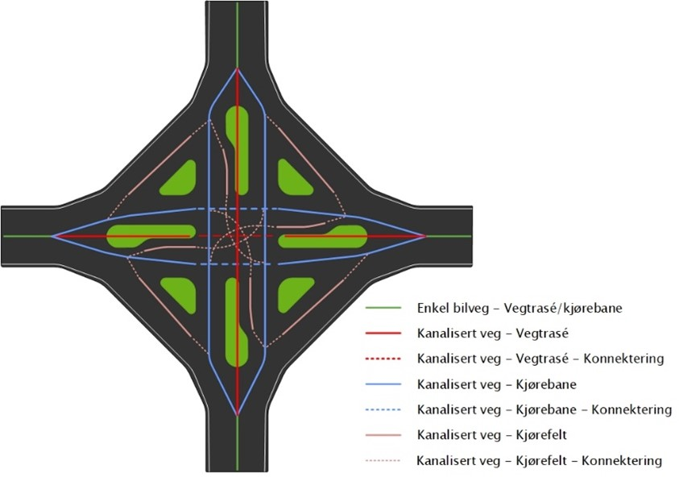
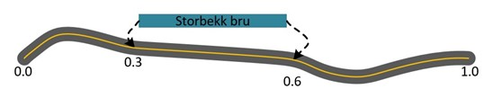
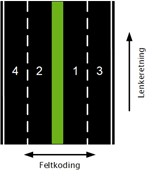

:datasett: NVDB Rutedatasett
:kortnavn: NVDB Rutedatasett
:versjon: 2.0
:skjemaversjon: {versjon}
:underversjon: 2025-01-01
:publisert: 2025-01-01
:metadata-url: https://kartkatalog.geonorge.no/metadata/elveg-20/77944f7e-3d75-4f6d-ae04-c528cc72e8f6
:dokumentstatus: 2
// All informasjon i hode over denne linja må fylles ut for hvert datasett. Øvrige parametere settes i adoc_parametere.adoc
include::inkluder/filhode.adoc[]

== Innledning, historikk og endringslogg

=== Innledning

NVDB Rutedatasett er et verktøyuavhengig rutedatasett som benyttes til navigasjon. Normalt sett tilgjengeliggjøres nye versjoner på Geonorge minimum 10 ganger i året.

Datagrunnlaget er hentet fra Nasjonal vegdatabank (NVDB). Vegnettet segmenteres i forhold til egenskapene til strekningsobjektene som er med i datasettet. Dette er objekttyper som

* angir hvor «en veg» går, og hvilke deler av vegnettet som hører til denne. F.eks. er E6 «en veg». Denne informasjonen omtales som vegsystemreferanse (https://www.vegvesen.no/globalassets/fag/handboker/hb-v830-nasjonalt-vegreferansesystem.pdf[Nasjonalt vegreferansesystem, Håndbok V830])    
* angir hvor «en https://datakatalogen.atlas.vegvesen.no/#/538/[adresse]» er, f.eks. hvor Storgata i en kommune ligger.
* angir hvilken https://datakatalogen.atlas.vegvesen.no/#/821/[funksjonell vegklasse]lenkene representerer, denne skal bidra til foretrukket rute i en
  ruteplanlegger.
* beskriver https://datakatalogen.atlas.vegvesen.no/#/856/[trafikkreguleringer], f.eks. der kjøring på gang- og sykkelveger er lov når det er eneste mulighet til  å kjøre til en eiendom.
* gir informasjon om https://datakatalogen.atlas.vegvesen.no/#/595/[motorveg], https://datakatalogen.atlas.vegvesen.no/#/105/[fartsgrenser], https://datakatalogen.atlas.vegvesen.no/#/591/[høyderestriksjoner] og https://datakatalogen.atlas.vegvesen.no/#/813/[gågatereguleringer].
* angir andre kjørerestriksjoner som https://datakatalogen.atlas.vegvesen.no/#/977/[tillatt kjøreretning].
* utvalgte bruksklasseverdier for spesialtransport og tømmertransport.
* https://datakatalogen.atlas.vegvesen.no/#/607/[Vegsperringer], https://datakatalogen.atlas.vegvesen.no/#/573/[svingerestriksjoner] og https://datakatalogen.atlas.vegvesen.no/#/913/[gjennomkjøring forbudt] med sin https://datakatalogen.atlas.vegvesen.no/#/979/[avgrensning] 
leveres som egne objekter.

Kun utvalgte egenskaper for de forskjellige objekttypene er med i NVDB Rutedatasett i forhold til hva som er definert som egenskaper i https://datakatalogen.atlas.vegvesen.no/[NVDB sin Datakatalog].

Geometri for gangveg, fortau og gangfelt er i stor grad etablert, og er også med i datasettet. Traktorveger og stier vil fra 2025 etableres i NVDB, og dermed også bli med i dette datasettet. Det må påregnes en lengre innsamlingsperiode før disse dataene er fullstendige. 

Datasettet leveres på kjørefeltnivå fra NVDB. Dette betyr at veglenker for bl.a. svingefelt også er med i datasettet.

Der veglenkene er på rent kjørebanenivå, ligger det også informasjon på lenkene om hvilken vegtrase-lenke kjørebanelenken hører til. Dette benevnes som «superstedfesting». Selve vegtraselenken det vises til er ikke med ut i datasettet.  

=== Historikk

NVDB Rutedatasett ble utviklet i 2021.

=== Endringslogg

.Endringslog
[cols="4*"]
|===

|*Dato*|*Utført av*|*Versjon*|*Kommentar*
|01.07.2021|Statens vegvesen|0.8|NVDB Rutedatasett tilgjengeliggjøres som testversjon. 
|01.11.2021|Statens vegvesen|1.0|NVDB Rutedatasett tilgjengelig som versjon 1.0. Informasjon om felt og snudde lenker er nå med i datasettet.
|01.03.2022|Statens vegvesen|1.1|Etter ønsker fra brukere er datasettet utvidet med veglenker for kjørefeltnivå.
|01.01.2025|Statens vegvesen|2.0 a|Navn på en rekke egenskaper er skrevet om. I tillegg er bruken av «_» erstattet med stor bokstav.

Endring på veglenka:

* Fartsgrense angis nå med verdi med veglenkeretningen og verdi mot veglenkeretning. Dette fordi fartsgrensen kan være forskjellig i de to retningene.
* Ny egenskap på beredskapsveg viser bruksområde. 
* For gågate er egenskap for kjøring til eiendommene tillatt tatt ut, dette dekkes av Trafikkregulering. Varetransport lørdag fra/til er tatt ut, og dekkes av Varetransport lørdag sine perioder.
* Trafikkregulering: Egenskapstyper for gjennomkjøring forbudt og sykling mot kjøreretning tillatt er tatt ut. Dekkes av nye objekttyper for Gjennomkjøring forbudt, og egenskap for kjøreretning for sykkel.
* Nye egenskaper for ferjesamband for å tydeliggjøre begrenset drift. 
* Noen bruksklasseverdier for tømmertransport er tatt med i datasettet.

Endringer på svingerestriksjon:

* Egenskapen for gjelder tidsrom er erstattet med spesifikke egenskaper for ukedager. 

Ny objekttype for gjennomkjøring forbudt:

* Egenskaper viser i hvilken retning fra et punkt og til et punkt det ikke er lov å kjøre. Egenskaper viser også unntak og andre begrensninger. 
 
|=== 

 
<<<

== Definisjoner og forkortelser

=== Definisjoner

*datasett*: 
identifiserbar samling av beslektede data [T]  

*egenskap*: 
navngitt kjennetegn eller karakteristikk av et objekt 

*nettverkstopologi*: 
overalt hvor det fysiske vegnettet henger sammen, skal det finnes tilsvarende koplinger mellom veglenkene i nettverket. Nettverket blir da en topologisk representasjon av det fysiske vegnettet 

*objekt*:  
forekomst (instans) av en objekttype 

*objekttype*: 
geografisk objekttype en klasse av objekter med felles egenskaper, forholdet mot andre objekttyper og funksjoner [SOSI] 

*detaljeringsnivå*:
veglenkene i NVDB kan være representert på tre forskjellige detaljeringsnivåer: Vegtrasenivå, kjørebanenivå og kjørefeltnivå 

*detaljerte lenker*:
veglenke på kjørebanenivå og kjørefeltnivå 

*superstedfesting*:
detaljerte lenkers kobling til vegtrasenivå i NVDB 

*veglenkesekvens*: 
veglenker gruppert i ordnede sekvenser, den viktigste delen av referansesystemet i NVDB 

=== Forkortelser

NVDB: Nasjonal vegdatabank

=== Øvrig defenisjoner
==== Vegnettes geometri og detaljeringsnivå

Vegnettet består av veglenker med sin vegnettsgeometri. For at nettverket skal kunne brukes til navigasjon, så er det helt vesentlig at nettverket er knyttet sammen der dette er riktig. 

Vegnettet i NVDB er definert i 3 forskjellige nivåer, men i dette datasettet benyttes kun veglenker for vegtrase/kjørebane, kjørebane og kjørefeltlenker. De fleste veglenkesekvensene tilfredsstiller både kjørebane og vegtrase. De ligger som vegtrase og kjørebane i datasettet. Rene vegtraselenker er ikke med i datasettet. 

.I NVDB er vegnettet definert i 3 forskjellige detaljeringsnivåer. Figuren viser Vegtraselenkene, her vist i rødt, er ikke med i NVDB Rutedatasett. 

Veglenkesekvensene på kjørebanenivå og kjørefeltnivå er stedfestet på veglenkesekvensene på vegtrasenivå. Denne stedfestingen kalles superstedfesting. Superstedfesting for detaljerte lenker er tatt med i datasettet selv om veglenkesekvenser på vegtrase ikke er tatt med.

For ytterligere detaljer om vegnettets geometri og detaljeringsnivåer, se denne veilederen fra Statens vegvesen: https://www.vegvesen.no/globalassets/fag/handboker/hb-v830-nasjonalt-vegreferansesystem.pdf[V830 Nasjonalt vegreferansesystem].

For definisjoner av egenskaper veglenkene i dette datasettet er segmentert i forhold til, se kap.5

====	Koble objekter fra NVDB
Objekter i NVDB er stedfestet på veglenkesekvenser. Ved at de segmenterte lenkenes posisjoner på aktuell veglenkesekvens fra NVDB er tatt med i datasettet, kan objekter hentes fra NVDB og kobles direkte på de segmenterte veglenkene.

.Et objekt, f.eks. en bru, kan hentes fra NVDB og stedfestes direkte på de segmenterte veglenkene vha. informasjonen om veglenkeseksekvensnummer og posisjoner.

De fleste objekttypene i NVDB er kun stedfestet på Vegtrasenivå. I og med at NVDB Rutedatasett også har med informasjon om superstedfesting, så kan datasettet suppleres med andre objekttyper fra NVDB også for de detaljerte lenkene.

==== «Lenkeretning snudd» og betydning for kobling av data

En veglenkesekvens i NVDB vil i all tid beholde sin retning. Dvs. at veglenkesekvensens geometriretning alltid vil være den samme uavhengig av f.eks. vegens metreringsretning. I NVDB Rutedatasett derimot, har de segmenterte veglenkene samme retning som vegens metreringsretning. I noen tilfeller er vegen metrert motsatt retning av lenkesekvensens retning. Egenskapen lenkeretning_snudd viser om den segmenterte veglenken har fått snudd sin geometriretning i forhold til original retning i NVDB.

Ved kobling av data fra NVDB, så må det tas hensyn til om lenkeretningen er snudd. For de veglenkene dette er gjort, så må posisjonene for stedfestingen av objektene som hentes fra NVDB regnes om slik at stedfestingen havner på riktig sted for veglenkene i NVDB Rutedatasett.

==== Feltkoding

Feltkoden beskriver referansesystemet på tvers av vegen, og gir oss informasjon om hvilke kjørefelt som finnes i vegens tverrsnitt. Partall angir kjøreretning med lenkeretning, oddetall angir kjøreretning mot lenkeretning.

.Feltkoden gir oss informasjon om kjørefeltene i vegens tverrsnitt. 

Feltkodene kan ha ekstra informasjon f.eks. der vi har kollektivfelt (K) eller sykkelfelt (S). Konnekteringslenker har ikke feltkoder. Disse er merket som feltoversikt Konnektering i datasettet.

*NB!* Til forskjell fra NVDB er det viktig å merke seg at i NVDB Rutedatasett er feltkodene definert i forhold til geometrien sin retning. I NVDB er feltkoder definert i forhold til den originale veglenkesekvensen sin retning. Der en veg er metrert motsatt av den originale veglenkesekvensen i NVDB (se 2.3.3), så vil man se motsatte verdier i NVDB Rutedatasett i forhold til originalfeltkoder fra NVDB.

Test
<<<

== Generelt om spesifikasjonen

=== Unik identifisering

==== Kortnavn

{kortnavn}

==== Fullstendig navn

{datasett}

==== Versjon
{versjon}

=== Referansedato
{underversjon}

=== Ansvarlig organisasjon
Statens vegvesen

=== Språk
Norsk

=== Hovedtema
Samferdsel

=== Temakategori
Transport

=== Sammendrag

NVDB Rutedatasett er et verktøyuavhengig rutedatasett som benyttes til navigasjon. Datasettet har et vegnett segmentert på aktuelle strekningsegenskaper fra NVDB. Vegsperringer og svingerestriksjoner leveres som egne objekter. Metadata ligger i en egen tabell uten geometri. 

=== Formål

Navigasjon og ruteplanlegging.

=== Representasjonsform

Vektor

=== Datasettoppløsning
*Detaljnivå*
NVDB Rutedatasett inneholder detaljerte data stort sett registrert fotogrammetrisk fra flybilder med en oppløsing mellom 7 og 25 cm. Nøyaktigheten varierer fra +/- 0.10 m til +/- 2 m avhengig av objekttype, områdetype og datafangstmetode. Datasettet egner seg for presentasjon i målestokker fra ca 1:100 til ca 1:20000.

=== Utstrekningsinformasjon
*Utstrekningbeskrivelse*: Dekker Norges fastlandsterritoium

*Geografisk område*:Norge

*Vertikal utbredelse*:Fra ca. -300 m til ca. 1900 m

<<<

== Spesifikasjonsomfang

=== Spesifikasjonsomfang for hele spesifikasjonen
==== Identifikasjon 
Hele datasettet

==== Nivå
Datasett

==== Navn
NVDB Rutedatasett

==== Beskrivelse
Ikke relevant

==== Utstrekningsinformasjon  
*Utstrekningbeskrivelse*
Dekker Norges fastlandsterritorium

*Geografisk område*
Norge

*Vertikal utbredelse*
Fra ca. -300 m til ca. 1900 m

== Innhold og struktur
=== Vektorbasert data- applikasjonsskjema
==== Omfang
Hele datasettet

include::modellRapport.adoc[]

<<<

== Referansesystem
=== Romlig referansesystem
==== Omfang
Hele datasettet

==== Navn på kilden til referansesystemet
SOSI referansesystemkode/ EPSG

==== Ansvarlig organisasjon for referansesystemet:
Kartverket / The International Association of Oil & Gas Producers

==== Link til mer info om referansesystemet:
https://register.geonorge.no/epsg-koder/euref89-utm-sone-33-2d-nn2000/8613bed1-c470-4106-a4a8-c96e7f8ef456[EUREF89 UTM sone 33, 2d + NN2000 - Geonorge Register]

==== Koderom
SOSI ReferansesystemKode (grunnriss)/SYSKODE og Høydereferansesystem (høyde) / EPSG

==== Identifikasjonskode:
EUREF89 UTM sone 33 (SOSI-kode 23) og høydereferansesystem NN2000 som tilsvarer EPSG/0/5973.

=== Temporalt referansesystem
==== Navn på temporalt referansesystem
CET (norsk lokaltid).

==== Omfang
Hele datasettet.

<<<

== Kvalitet

=== Omfang
NVDB Rutedatasett er et svært forenklet alternativ til Elveg 2.0, og det er valgt å ikke ta med informasjon om kvalitet i datasettet. Datagrunnlaget for NVDB Ruteplandata er det samme som for Elveg 2.0, og derfor gjelder den samme kvaliteten her.

==== Fullstendighet
Datasettet er fullstendig så langt det er mulig, og oppdateres kontinuerlig i henhold til avtaler om forvaltning, drift og vedlikehold av grunnlagsdata i NVDB.

==== Stedfestingsnøyaktighet
Det er et overordnet prinsipp at best tilgjengelige geometri skal benyttes i vegnettet. NVDB inneholder ikke homogene data. Produktet som helhet kan ikke love bedre kvalitet enn de dårligste datakildene. Vegen registreres så langt mulig i tre dimensjoner (nord, øst, høyde), men ved administrativ datafangst godkjennes 2D data (digitalisering fra ortofoto) dersom andre datakilder ikke finnes.

NVDB inneholder detaljerte data stort sett registrert fotogrammetrisk fra flybilder med en oppløsing mellom 7 og 25 cm. Nøyaktigheten varierer fra +/- 0.10 m til +/- 2 m avhengig av objekttype, områdetype og datafangstmetode.

==== Egenskapsnøyaktighet
Egenskaper stedfestes med bakgrunn fra administrativt ajourhold og følger generelt samme krav som øvrige kvalitetskrav. 

==== Tidfestingsnøyaktighet
Kontinuerlig ajourhold.

==== Logisk konsistens
Kontinuerlig kontroll. 

<<<

== Datafangst

NVDB Rutedatasett er et direkte uttrekk fra NVDB. Vegnett i NVDB er etablert med data fra vegsituasjon (fotogrammetri), GPS og treghetsmålinger, administrativ ajourhold (gjennom ajourhold av NVDB Vegnett Pluss) og med data fra plan- og ferdigvegsdata. 

I tillegg mottar Kartverket og Statens vegvesen feilmeldinger og endringer fra publikum gjennom deres feilmeldingstjenester http://rettikartet.no[http://rettikartet.no] og https://fiksvegdata.atlas.vegvesen.no/[fiksvegdata.atlas.vegvesen.no]. Disse meldingene kan etter en vurdering mot andre datakilder bli lagt inn i NVDB.

<<<

== Datavedlikehold

=== Vedlikeholdsinformasjon - Kartleggingsprosjekt

==== Omfang 
Hele datasettet

==== Vedlikeholdsfrekvens 
Kontinuerlig

==== Vedlikeholdsbeskrivelse 
Fotogrammetrisk ajourhold utføres gjennom Geovekst kartleggingsprosjekter. Kartleggingsprosjektene spesifiseres og finansieres gjennom Geovekst og settes ut på anbud fra Kartverket. Flyfotografering og selve det fotogrammetriske ajourholdet utføres av et privat firma i tråd med fotogrammetrisk registreringsinstruks. Kartverket gjør kontroll av leveranse ved mottak og legger dataene inn i databasen i samarbeid med Statens Vegvesen.

Den enkelte vegforvalter er ansvarlig for innholdet for sine veger i NVDB. Etter regionreformen har vi mange vegforvaltere som skal sørge for at nødvendige data er registrert i NVDB. For ERF-veger er dette Statens vegvesen, Nye Veier AS og alle fylkeskommunene. Se mer om krav til leveranse av data og grunnlagsinformasjon til NVDB for ERF-veger på Statens vegvesen sine nettsider om
https://www.vegvesen.no/fag/teknologi/nasjonal-vegdatabank/dataleveranse/[Dataleveranser til NVDB]

Kartverket oppdaterer det digitale navigerbare vegnettet for kommunale veger, private veger og skogsveger etter manus fra kommunene. Kravet til kommunene er regulert av https://www.kartverket.no/geodataarbeid/Forvaltning-drift-og-vedlikehold/Rutiner-for-forvaltning-drift-og-vedlikehold/[FDV-avtalen] gjennom Norge digitalt.

<<<

== Presentasjon
Ikke relevant for datasettet.

<<<

== Leveranse
=== Leveransemetode

==== Omfang
Hele datasettet

==== Leveranseformat
*Formatnavn* +
SpatialLite

*Formatversjon* +
5.0.1

*Formatspesifikasjon* + 
SpatiaLite: SpatiaLite (gaia-gis.it)

*Filstruktur* +
Fylkesvise filer
Landsfil

*Språk* +
Norsk- NO

*Tegnsett* +
UTF-8 +

==== Leveransemedium
*Leveranseenhet* +
Datasett lastes ned fra geonorge.no

*Overføringsstørrelse* +
Data ikke angitt

*Navn på medium* +
Data ikke angitt

*Annen leveranseinformasjon* +
Data ikke angitt

<<<

== Tilleggsinformasjon
Ingen angitt informasjon

== Metadata

=== Omfang
Hele datasettet

=== Metadataspesifikasjon

[cols="3*"]
|===

|Uttaksdato|ååååmmdd|Dato dataene ble hentet ut fra NVDB
|refSysHorizontal|25833|Horisontalt referansesystem 
|refSysVertical|5941|Vertikal referansesystem
| | | 

<<<

