:xrefstyle: short

Vegnettets klassifisering etter type veg skal henge sammen i datasettene FKB-TraktorvegSti og NVDB Vegnett Pluss som en helhet. Oppdeling og koding av FKB-Veg skal styres av og være konsistent med type veg i NVDB Vegnett Pluss og FKB-TraktorvegSti. Enhver endring av geometri og type veg i NVDB Vegnett Pluss eller FKB-TraktorvegSti skal følges opp med konsekvensretting av vegkanter og flater i FKB-Veg. Det er alltid type veg i NVDB Vegnett Pluss og FKB-TraktorvegSti som skal være førende for innhold og koding av vegkanter og vegflater i FKB-Veg, ikke omvendt.
Kodeverdier av typeveg som er aktuelle for fotogrammetrisk registrering i NVDB Vegnett Pluss er angitt i tabellen under. 

Klassifisering av typeveg på eksisterende geometri skal _ikke_ endres. Unntaket er tilfeller der det åpenbart har skjedd en fysisk endring siden forrige kartlegging. For eksempel tilfeller der det er etablert en ny veg hvor det tidligere har vært traktorveg. Hvis det er tvil om koding av type veg ved utskifting av geometri skal ny geometri arve typeveg fra eksisterte lenke. 

Se tabellene under for definisjon av de ulike typeveg-kodene og retningslinjer for fotogrammetrisk registrering og eksemplene i kapittel 3.2.2 - 3.2.6 for illustrasjoner.

[[tab-typeveg-kjorende]]
.https://register.geonorge.no/sosi-kodelister/fkb/veg/5.0/typevegkjorende[Typeveg-koder for kjørende i NVDB Vegnett Pluss]
[cols="15,70,15", options="header"]
|===
|Kodenavn
|Beskrivelse
|Kodeverdi

|Enkel bilveg
|Veg for kjørende som ikke defineres under de fire andre funksjonene.

*Regler for fotogrammetrisk registering*: +
På ordinær ett- og tofeltsveg registreres senterlinje midt mellom oppmerkede kantlinjer. Der vegen har oppmerket midtlinje skal denne registreres som veglenke. På veg uten oppmerking registreres senterlinje midt mellom vegdekkekanter. 
Veglenke registreres for fysisk adskilte trafikklommer. 
|bilveg

|Kanalisert veg
|Veg som har fysisk adskilte kjørebaner med rekkverk eller annen fysisk barriere.

*Regler for fotogrammetrisk registering*: +
På veg hvor kjørebanene er fysisk adskilt med midtdeler eller rekkverk, registreres to veglenker, en for hver kjøreretning. Veglenke registreres midt mellom oppmerkede ytre kantlinjer i hver kjøreretning.
I kanaliserte kryss og ved gangfelt hvor kjørebanene er fysisk adskilt med trafikkdeler eller deleøy, registreres veglenke midt mellom oppmerkede kantlinjer i hver kjøreretning. Svingefelt registreres med egen veglenke. 
|kanalveg

|rampe
|Veg for på- eller avkjøring av annen veg.

*Regler for fotogrammetrisk registering*: +
I planskilte kryss er veger koblet sammen med ramper. Ramper har vanligvis ett kjørefelt og registreres med senterlinje midt mellom oppmerkede kantlinjer. Ramper startes/avsluttes ved halv kjørefeltbredde. 
|rampe

|Rundkjøring
|Rundkjøring

*Regler for fotogrammetrisk registering*: +
I rundkjøringer skal veglenke registreres som en jevn kurve med lik avstand til vegdekkekanten som avgrenser sentraløya(trafikkøy). Rundkjøring registreres i senter av sirkulasjonsarealet uavhengig av antall kjørefelt. 
|rkj

|Gatetun
|Boliggate hvor det er iverksatt fysiske tiltak for å etablere et uteareal for alle trafikantkategorier, hvor all kjøring skjer på fotgjengernes vilkår.

*Regler for fotogrammetrisk registering*: +
Veglenke for gatetun registreres som senterlinje midt mellom oppmerkede kantlinjer. På veg uten oppmerking registreres senterlinje midt mellom vegdekkekanter. Veg for kjørende hvor type veg er vanskelig å bestemme fotogrammetrisk, registreres som enkel bilveg.

Gatetun skal kun nyregistreres ved hjelp av manus eller etter spesiell avklaring for prosjektet. 
|gatetun
|===

Veglenker med typeveg-koder i <<tab-typeveg-kjorende>> skal alltid samsvare med en flate med samme typeveg-kode i FKB-Veg.   

[[tab-typeveg-gaende]]
.https://register.geonorge.no/sosi-kodelister/fkb/veg/5.0/typeveggaendeogsyklende[Typeveg-koder for gående og syklende i NVDB Vegnett Pluss]
[cols="15,70,15", options="header"]
|===
|Kodenavn
|Beskrivelse
|Kodeverdi

|Fortau
|Del av veg reservert for gående. Ligger høyere enn vegbanen og er adskilt fra denne med kantstein.

*Regler for fotogrammetrisk registering*: +
Veglenke for fortau registreres som senterlinje i fortausarealet. Fortau ligger normalt høyere enn vegbanen og er adskilt fra denne med kantstein. Der fortausarealet mangler ytteravgrensning, registreres veglenke som parallell til fortauskant etter beste skjønn.
|fortau

|Gang- og sykkelveg
|Veg som er bestemt for gående, syklende eller kombinert gang- og sykkeltrafikk. Vegen er skilt fra annen veg med gressplen, grøft, gjerde, kantstein eller på annen måte. Normalt skiltet med skilt 522.

*Regler for fotogrammetrisk registering*: +
Gang- og sykkelveg kan være fremkommelig for kjøretøy, men er normalt ikke åpen for annet enn kjøring for teknisk vedlikehold eller kjøring til eiendommene.

På veg for gående og syklende registreres senterlinje midt mellom vegdekkekanter eller kjørebanekanter.

Gang- og sykkelveg skal ikke nyregistreres (kodes som gangveg ved fotogrammetrisk nyregistrering og justeres ev. administrativt) 
|gsv

|Gangveg
|Veg som er bestemt for gående. Vegen er skilt fra annen veg med gressplen, grøft, gjerde, kantstein eller på annen måte.

*Regler for fotogrammetrisk registering*: +
Gangveg kan være fremkommelig for kjøretøy, men er normalt ikke åpen for annet enn kjøring for teknisk vedlikehold eller kjøring til eiendommene.

På veg for gående registreres senterlinje midt mellom vegdekkekanter eller kjørebanekanter.
|gangveg

|Gågate
|Område hvor det er forbudt å kjøre motorvogn og hvor trafikkreglenes bestemmelser om gågate gjelder. Skiltet med skilt 548.

*Regler for fotogrammetrisk registering*: +
I gågate registreres senterlinje for midtstilt ferdselssone. Der slik ferdselssone ikke er tydelig, registreres senterlinje midt mellom vegdekkekanter. Veg for gående og syklende hvor type veg er vanskelig å bestemme fotogrammetrisk, registreres som gangveg.
|gagate

|Sykkelveg
|Veg som er bestemt for syklende. Vegen er skilt fra annen veg med gressplen, grøft, gjerde, kantstein eller på annen måte. Normalt skiltet med skilt 520.

*Regler for fotogrammetrisk registering*: +
Sykkelveg kan være fremkommelig for kjøretøy, men er normalt ikke åpen for annet enn kjøring for teknisk vedlikehold eller kjøring til eiendommene.

På veg for syklende registreres senterlinje midt mellom vegdekkekanter eller kjørebanekanter. På veg for syklende med oppmerket midtlinje skal denne registreres som veglenke. Sykkelveg som ikke lar seg klassifisere fotogrammetrisk, registreres som gangveg. Dersom oppmerking viser skille mellom gående og syklende, registreres senterlinje for sykkelvegen samt egen veglenke for fortauet. 
|sv

|Sykkelfelt
|Felt i vegbanen bestemt for syklende. Feltet er skilt fra andre kjørefelt med stiplet oppmerking og eventuelt farget vegdekke. Normalt skiltet med skilt 521.1 (sykkelfelt - sideplassert) eller 521.2 (sykkelfelt - midtplassert).

*Regler for fotogrammetrisk registering*: +
Veglenke for sykkelfelt registreres som senterlinje i sykkelfeltarealet. 
|sfelt

|Trapp
|Trapp som inngår i nettverket for gående (og syklende).

*Regler for fotogrammetrisk registering*: +
Veglenke for trapp registreres som senterlinje i trapp som er del av nettverk for gående og syklende 
|trapp

|Gangfelt
|Kryssningsfelt for gående hvor trafikkreglenes bestemmelser om gangfelt gjelder. Oppmerket og eventuelt skiltet med skilt 516.

*Regler for fotogrammetrisk registering*: +
Veglenke for gangfelt registreres som senterlinje i oppmerket kryssingssted for gående. 

Alle gangfelt skal registreres selv om noen allerede eksisterer med typeveg gang- og sykkelveg (disse vil bli administrativt slettet i forbindelse med ajourføringen av gangfelt)
|gangfelt
|===

Veglenker med typeveg-koder i <<tab-typeveg-gaende>> skal alltid samsvare med en flate med samme typeveg-kode i FKB-Veg med unntak av for _Gangfelt_ og _Sykkelfelt_.

==== Generelt angående registrering av veglenker og nettverkstopolpogi
Målet er et sammenhengende nettverk for både gående og kjørende. Noen ganger er det også naturlig og nødvendig å binde veglenker for gående og syklende sammen mot veglenker for kjørende. Av og til må vi også akseptere løse ender i nettverket der det er fysisk "umulig" eller ulogisk (se eksempel i <<busslomme_nyregistrert>> i Registreringsinstruks: Fotogrammetrisk NVDB Vegnett Pluss) å ta seg videre, enten som gående eller kjørende.

På tidligere leveranser ser vi at det er en del hull i nettverket, spesielt mellom nye veglenker eller mellom nye veglenker og eksisterende veglenker for gående. Registreringsinstruksen beskriver dessverre langt ifra alle disse situasjonene men følgende eksempler prøver å presisere hva som skal gjøres ved enkelte situasjoner.

Ved nyregistrertefootnote:[Geometriforbedring eller nyregistrering grunnet «ulovlig» datafangstmetode (se kravspesifikasjon) inngår i nyregistrerte.] veglenker skal også tilhørende avgrensingslinjer og flater (hvis dette fremkommer gjennom teknisk kravspesifikasjon – for eksempel med en bestilt oppgradering som flater på fortau og gangveg) konsekvensrettes i FKB-Veg. Dette utføres etter beste evne ved hjelp av eksisterende data eller naturlige avgrensninger/kontraster i bildene for å finne passende avgrensnings- og lukkelinjer for flatene.

Det presiseres at veglenker under 2 meter ikke skal registreres i NVDB Vegnett Pluss.

==== Eksempler på på registrering av veglenke med forskjellig typeveg
I noen av eksemplene vises de mest typiske situasjonene der veglenker under 2 meter (i forbindelse med Gangfelt) nå forlenges utover egen utstrekning og konnekteres mot nærmeste veglenke.

[[Veglenker1]]
.Figuren viser eksempel på registrering av flere ulike typer veg. Rundkjøring registreres i senter av sirkulasjonsarealet uavhengig av antall kjørefelt 
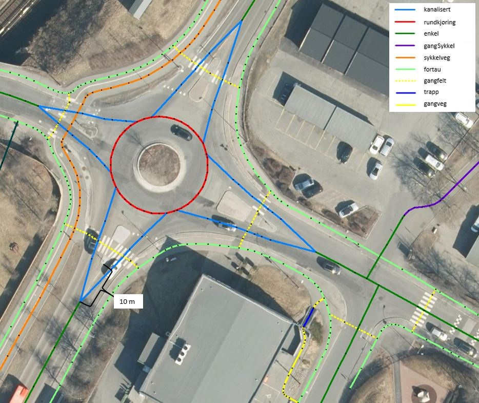

[[Veglenker2]]
.Figuren viser registrering av flere ulike typer veg i et fullkanalisert T-kryss med svingefelt. I de aller fleste tilfeller vil topologien i slike kryss være etablert og skal da ikke endres ved fotogrammetrisk registrering. Fotogrammetrisk registrering vil i hovedsak gå ut på forbedring av geometri der kriteriene for dette er tilstede.
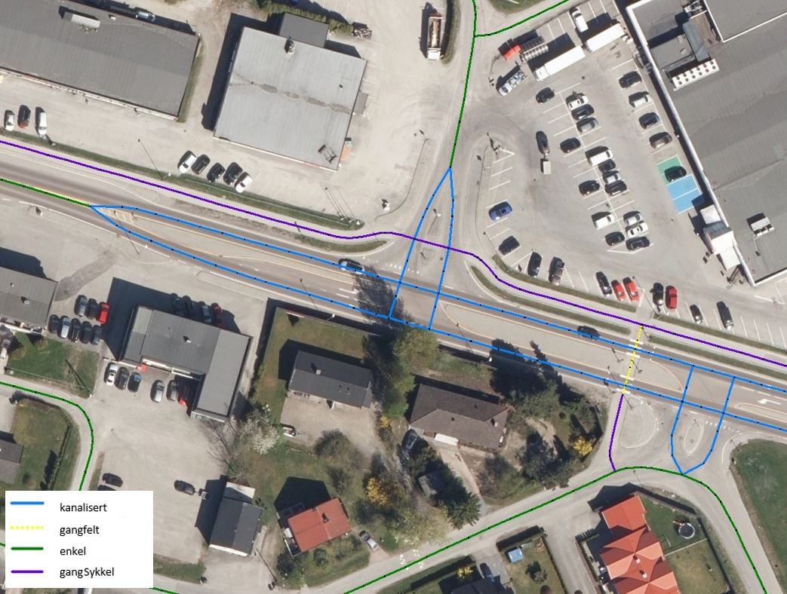

[[Veglenker3]]
.Figuren viser registrering av flere ulike typer veg 
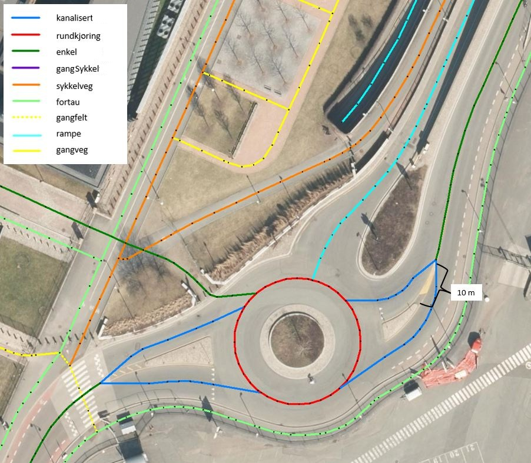

[[veglenker]]
.Eksemplet viser hvordan veglenkene i NVDB Vegnett Pluss skal henge sammen. Det presiseres at ved parallelle lenker forlenges hver lenke (her sykkelveg og fortau) mot nærmest tilstøtende veglenke (her fortau) når fysisk skille mellom veglenker opphører og avstanden er kortere enn 10 meter.
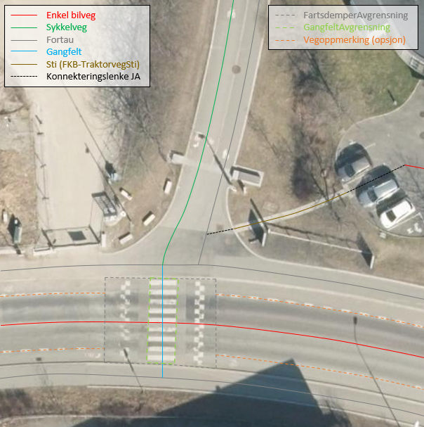

[[gatetun]]
.Venstre skisse viser eksempel på gatetun. Høyre skisse viser gågate 
image::figurer/gatetun.png[]

[[kanalisert]]
.Start- og sluttpunkt for kanalisert veg settes normalt 10 meter før- og etter fysisk hinder 
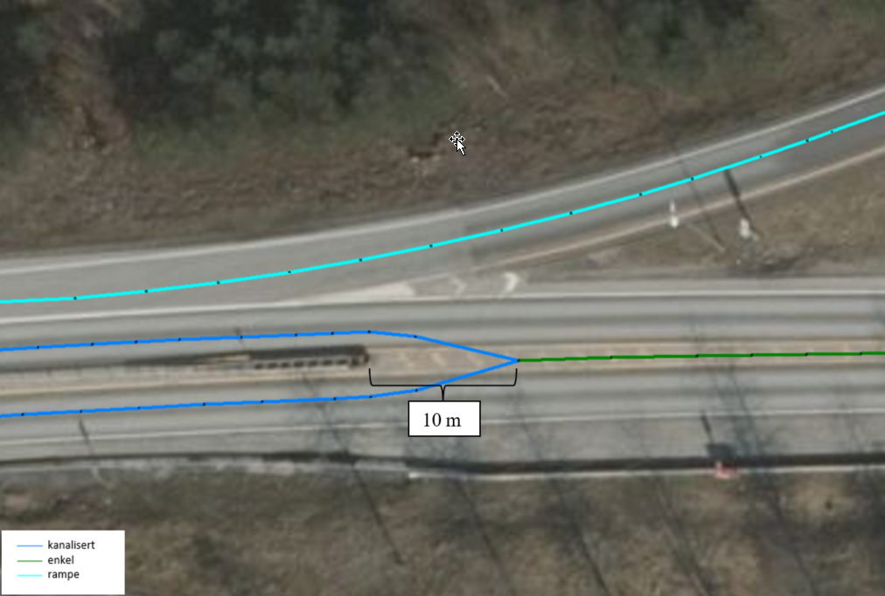

[[plankryss_rampe]]
.Bildet viser eksempel på et planskilt kryss med rampesystem 
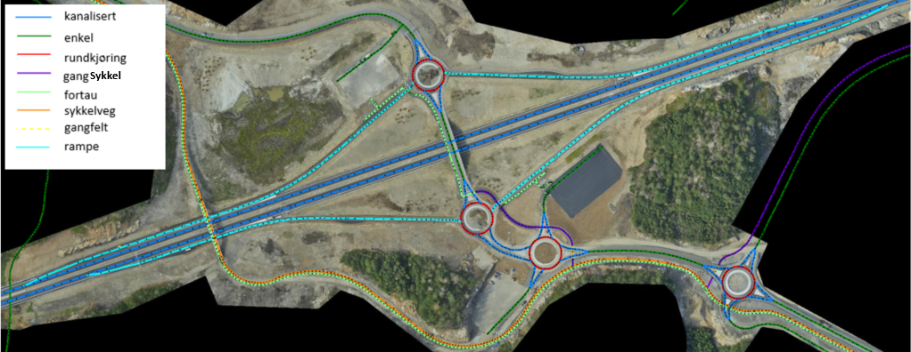

[[rampe]]
.Figuren viser registrering av start og slutt for av- og påkjøringsrampe
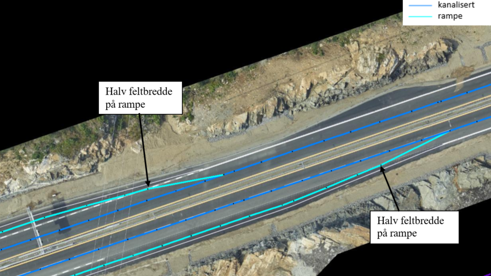

[[busslomme_nyregistrert]]
.Eksempel på start/slutt nyregistrert gangveg ved busslomme. Fysisk adskilt trafikklomme registrert som enkel bilveg. Dette er et eksempel på "lovlig løs ende" i nettverket for gående. 
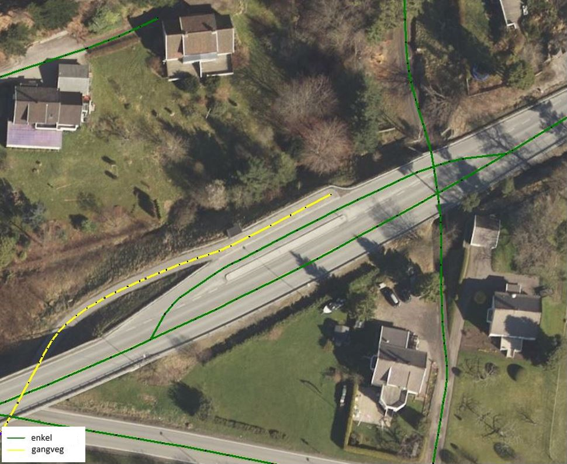

[[busslomme2_eksisterende]]
.Eksempel på start/slutt på eksisterende gang- og sykkelveg ved busslomme. Fysisk adskilt trafikklomme registrert som enkel bilveg. Dette er et eksempel på "lovlig løs ende" i nettverket for gående. 
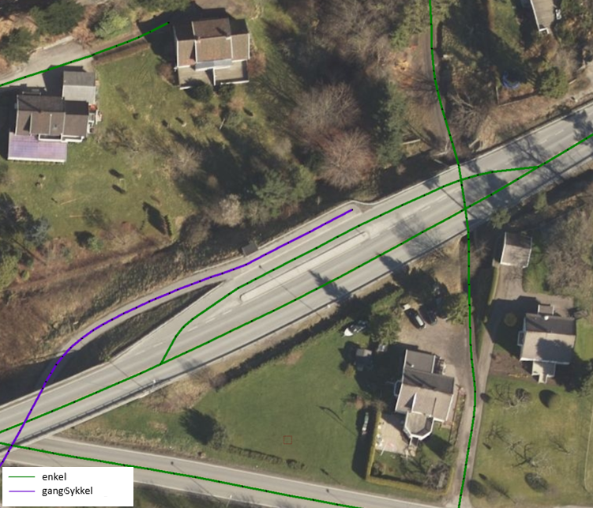

==== Registrering av veglenker for gående/syklende

Under vises et eksempel på registrering av en utydelig typeveg mellom fortau (fra sør) og gangfelt (til venstre) – markert med rødt i figuren). Disse typevegene er meget vanskelige å skille på ved registrering, derfor skal typeveg kodes som gangveg ved fotogrammetrisk nyregistrering og ev. justeres administrativt.

[[veglenke_gangveg]]
.Eksemplet viser registrering av typeveg gangveg.
image::figurer/veglenke_gangveg.png[]

Under vises et eksempel på registrering på registrering av veglenke mellom to gangfelt (markert i rødt i figuren). Hvis lengde er under minstemål for registrering av veglenker (2m) registreres gangfeltet sammenhengende. Hvis lengde er over minstemål registreres veglenken mellom gangfeltene som gangveg fotogrammetrisk og justeres ev. administrativt. Ved eksisterende veglenke (gang- og sykkelveg) over gangfelt kan veglenke splittes opp og gis ny typeveg og endret type E, hvis eksiterende veglenke oppfyller kravene for nøyaktighet.

[[veglenke_gangfelt]]
.Eksemplet viser registrering av veglenke mellom to typeveg gangfelt.
image::figurer/veglenke_gangfelt.png[]

I trapper med avsatser, der avstand mellom trinnene er under 2 meter, skal hele strekningen registreres som trapp. Figuren under viser eksempel på riktig registrering.

[[veglenke_trapp2m]]
.Eksempel på registrering av trapp med kort trappeavsats (<2m). Hele strekningen skal registreres som trapp.
image::figurer/veglenke_trapp2m.png[]

==== Korte (>2m), naturlige forbindelser for gående og syklende
Normalt skal type veg klassifiseres ut fra fysisk utforming for strekningen veglenken representerer. Ferdselsområder for gående og syklende hvor type veg er vanskelig å bestemme fotogrammetrisk, men som er nødvendig for et topologisk sammenhengende nettverk, registreres med type veg gangveg. Eventuelle synlige kontraster/detaljer i bildet legges til grunn ved registreringen.

Disse veglenkene skal registreres fotogrammetrisk (ikke konnekteringslenke).

[[korte_veglenker1]]
.Et eksempel på kortere veglenke (>2m) som danner topologi mellom gangfelt og gang- og sykkelveg, på begge sider om bilvegen.
image::figurer/korte_veglenker1.png[]

[[korte_veglenker2]]
.Et eksempel på kortere veglenke (>2m) som danner topologi mellom to gang- og sykkelveger.
image::figurer/korte_veglenker2.png[]

Manglende «nettverk» ved trapper.

[[korte_veglenker3]]
.Når avstanden er kortere enn 2m skal trapp forlenges mot nærmeste veglenke. Når avstanden er over 2m skal egen veglenke registreres, fortrinnsvis med typeveg gangveg mellom trapper og/eller mot tilgrensende veglenker for gående (se bildeeksempel til høyre).
image::figurer/korte_veglenker3_trapper.png[]

==== Lengre, naturlige forbindelser for gående og syklende
Normalt skal type veg klassifiseres ut fra fysisk utforming for strekningen veglenken representerer. Ferdselsområder for gående og syklende hvor type veg er vanskelig å bestemme fotogrammetrisk, men som er nødvendig for et topologisk sammenhengende nettverk, kan registreres etter manus fra oppdragsgiver. Dersom ikke annet er oppgitt i manuset, registreres veglenke med type veg gangveg. Dersom manuset beskriver etablering av nytt nettverk der trapper, gangfelt eller andre type veg inngår, registreres disse med riktig type veg.

Disse veglenkene kan registreres fotogrammetrisk etter manus (ikke konnekteringslenke).

[[lengre_veglenker_manus1]]
.Eksempelet viser en veglenke som kan registreres (med typeveg gangveg) etter manus. Denne skal knyttes sammen mot fortau i nord og mot fortau (manglende veglenke for trapp og veglenke videre fra trapp mot fortau vises også i blått i bildet) i sørøst.
image::figurer/lengre_veglenker_manus1.png[]

[[lengre_veglenker_manus2]]
.Eksempelet viser en veglenke som kan registreres (med typeveg fortau) etter manus. Denne skal knyttes sammen mot bilveg i nordvest og mot fortau i sørøst.
image::figurer/lengre_veglenker_manus2.png[]

Veglenkene i eksemplene under bør kunne registreres fotogrammetrisk uten manus (ikke konnekteringslenke). De har enten tydelige eksisterende avgrensningslinjer og/eller nærliggende nyregistrerte veglenker (med løse ender) som det er naturlig å knytte disse til.

[[lengre_veglenker3]]
.Eksempelet viser en veglenke som går over en litt lengre strekning men som samtidig har tydelige avgrensingslinjer (kaibryggekant/bru). Derfor skal denne typen veglenker registreres fotogrammetrisk. Veglenke skal registreres med typeveg gangveg som knyttes sammen med gangveg i øst (manglende veglenke for trapp og videre mot gangveg, vises også i blått i bildet) og i vest.
image::figurer/lengre_veglenker3.png[]

[[lengre_veglenker4]]
.Eksempelet viser en veglenke som går over en litt lengre strekning men som samtidig har nyregistrerte veglenker i begge ender (med typeveg fortau). Derfor skal denne typen veglenker registreres fotogrammetrisk. Veglenke skal registreres med typeveg fortau som knyttes sammen med nyregistrerte fortau i både nordøst og sørvest. Eksempelet viser også en manglende veglenke fra gangfelt til eksisterende gang- og sykkelveg, som kan beskrives som en kortere veglenke som skal registreres fotogrammetrisk, se kapittel "Korte (>2m), naturlige forbindelser for gående og syklende".
image::figurer/lengre_veglenker4.png[]

==== Registrering av Typeveg gangveg
Gangveger benyttes typisk i parkområder, på gravplasser og til gangareal (tilknytningsveger for gående) i forbindelse med blokkbebyggelse og offentlige bygg.
Ved enkelte situasjoner, som parker eller gravplasser med mange gangveger i området, streves det kun etter å registrere «hovedvegene» som ruter gående og syklende gjennom parken eller gravplassen. Øvrige gangarealer kan registreres som sti.

I utmarksområder benyttes gangveg for veger med fast dekke som 
ikke er åpen for motorisert ferdsel, f. eks. rulleskiløyper.

I flere tilfeller vil det være lang avstand mellom aktuell gangveg og eksisterende nettverk. Typiske eksempler på dette er over åpne plasser og parkeringsplasser. I slike tilfeller skal det brukes konnekteringslenke ja for å knytte gangvegen sammen med nettverket og det vil derfor ikke være aktuelt for fotogrammetrisk registrering.

Eksisterende veglenker med konnekteringslenke ja skal bare slettes dersom veglenka den skaper forbindelse til også slettes.
Eksisterende veglenker med konnekteringslenke ja skal geometriforbedres dersom tilstøtende veglenker geometriforbedres.

Det presiseres at gangveger som ikke er til felles anvendelse (eksempler kan være inne på områder til barnehager eller eldresenter) eller som blir liggende som løst nettverk ikke skal registreres. Det skal heller ikke registreres gangveger i forbindelse med eneboliger eller på inngjerdet område av privat karakter.

[[Gangveg1_Veg]]
.Eksempel på hvordan "hovegangvegene" kan registreres på en gravplass.
image::figurer/Gangveg1_Veg.png[alt="Bilde av gangveger"]

[[Gangveg2_Veg]]
.Eksempel på gangveger som ikke skal registreres, i dette fallet gangareal som er innegjerdet i en barnehage.
image::figurer/Gangveg2_Veg.png[alt="Bilde av gangveger"]

[[Rulleskiloype]]
.Eksempel på rulleskiløype som skal registeres som gangveg.
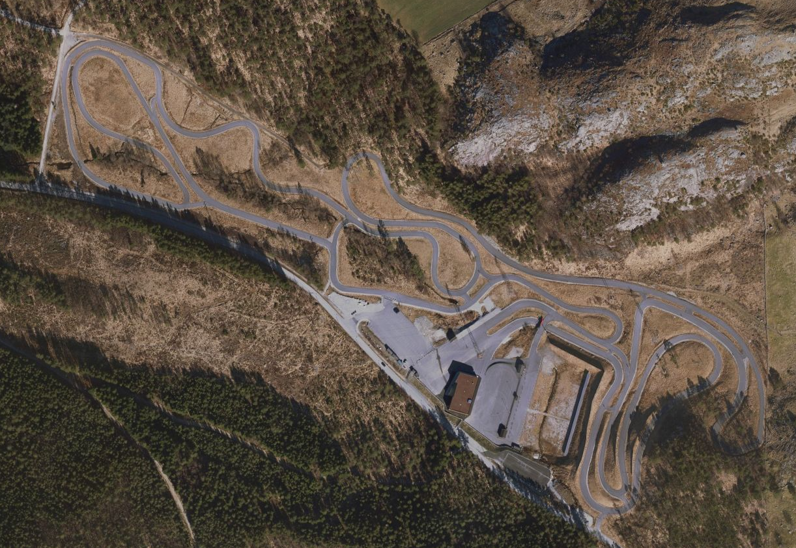

==== Sykkelfelt i vegbanen
Sykkelfelt er kjørefelt bestemt for syklende. Disse ligger som en del av vegbanen, og er skilt fra andre kjørefelt med langsgående oppmerking og ofte også rød farge på vegdekket. Sykkelfelt er oftest plassert i ytterkant av vegbanen (sideplassert), men kan også være midtplassert. <<typeveg_sykkelfelt>> og <<sykkelfelt2>> viser eksempler på registrering av sykkelfelt.

[[typeveg_sykkelfelt]]
.Eksempel på registrering av sykkelfelt i vegbanen.
image::figurer/typeveg_sykkelfelt.png[]

[[sykkelfelt2]]
.Eksempel på registrering av sykkelfelt i vegbanen, inkludert registrering av omkringliggende objekter i NVDB Vegnett Pluss og FKB-Veg. For beskrivelse av objekttyper og typeveg, se bilde.
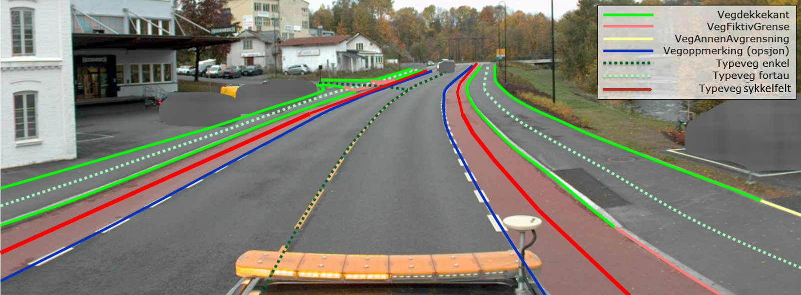

==== Registrering av veglenker for kjørende
Under vises et eksempel på registrering av et svingefelt (høyresvingefelt – markert med rødt i figuren). Svingefelt skal registreres med typeveg kanalisert veg. Ellers gjelder teksten fra <<Veglenker2>> i Fotogrammetrisk registreringsinstruks for NVDB Vegnett Pluss: "I de aller fleste tilfeller vil topologien i slike kryss være etablert og skal da ikke endres ved fotogrammetrisk registrering. Fotogrammetrisk registrering vil i hovedsak gå ut på forbedring av geometri der kriteriene for dette er til stede".

[[veglenke_kanalisert_veg]]
.Eksemplet viser registrering av veglenke med typeveg kanalisert veg for svingefelt.
image::figurer/veglenke_kanalisert_veg.png[]

==== Registrering av veglenker uten tydelig tilknytning
Veglenker som ikke har noen tydelig tilknytning men som har en naturlig rutefunksjon (typisk stop i busslomme, som vist i bildeeksempelet under) skal registreres og «forlenges» mot nærmeste veglenke for gående og syklende, eller kjørende der denne utgjør eneste mulighet for ruting videre.

Eksisterende veglenker med konnekteringslenke ja skal bare slettes dersom veglenka den skaper forbindelse til også slettes.
Eksisterende veglenker med konnekteringslenke ja skal geometriforbedres dersom tilstøtende veglenker geometriforbedres.

[[Forlengelse1_NVDB Vegnett Pluss]]
.Eksempel på veglenke som skal forlenges (rød pil i bildet) mot nærmest annen veglenke for ruting for gående til/fra et busstopp.
image::figurer/Forlengelse1_Elveg.png[alt="Bilde av forlenget veglenke"]

==== Mindre flater/arealer uten veglenke
Selv om kravet for konsekvensretting mellom veglenke og vegflate er +-10 meter skal kortere veglenker registreres for mindre flater/arealer der eneste naturlige ruting for gående og syklende er over veg (for kjørende) for å komme seg videre.

[[Manglende1_NVDB Vegnett Pluss]]
.Eksempel på veglenke (rød pil i bildet) som skal registreres over mindre flater/arealer for ruting videre for gående og syklende.
image::figurer/Manglende1_Elveg.png[alt="Bilde av mindre flater/areal uten veglenke"]